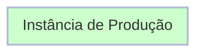
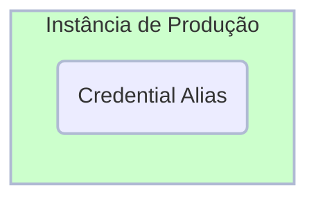

# Exercício: Criar um Credencial Alias

##### Tempo Estimado para Conclusão: 5 minutos

## Visão Geral

Um **<a href="https://docs.servicenow.com/csh?topicname=create-pipeline-credentials.html&version=latest" target="_blank">Credential Alias ↗</a>** é um nome de usuário e senha usados pelo ServiceNow para acessar um sistema remoto.

Neste caso, será usado pela instância Controladora (Prod) para acessar outros Ambientes ServiceNow como Dev, Test, QA, etc.

Você criará o Credential Alias com uma conta de usuário que já foi criada para você.


### Antes do Exercício


### Após o Exercício



## Instruções

:::caution
Para este exercício, o Escopo da Aplicação específico não é crítico - Global é aceitável. Sempre verifique com seu Administrador da Plataforma qualquer política da empresa sobre **<a href="https://docs.servicenow.com/csh?topicname=connection-alias.html&version=latest" target="_blank">Alias de Conexão e Credencial ↗</a>**.
:::

:::warning
**Complete esta seção em PROD.**
:::

1. Faça login em **PROD**.


2. Navegue para **Todos** >> digite **Connection & Credential Aliases** >> clique em **Connection & Credential Aliases** .
    


3. Clique em **New** no canto superior direito para criar um novo registro de Credential Alias. 
    


4. Defina **Type** para **Credential**. 
     


5. Defina **Name** para 'Pipeline Credentials' e clique em **Submit**.

    ```jsx title="Name"
    Pipeline Credentials
    ```
    
    


6. Clique em **Pipeline Credentials** para abrir o registro. 
     


7. Navegue até a Lista Relacionada **Credentials** e clique em **New** para adicionar uma credencial. 
    


8. Selecione **Basic Auth Credentials**.
    

:::info
Agora você inserirá as credenciais para que a AEMC faça login em uma instância do ServiceNow.

A senha para esta conta de usuário remoto está pré-configurada.

Ocorrerão erros se você não usar a senha especificada abaixo.
:::

9. No formulário **Credenciais de Autenticação Básica**, preencha os seguintes valores e clique em **Submit**.

    :::info
    Lembre-se de usar o botão de copiar para copiar o texto abaixo.
    :::

    ```jsx title="Name"
    Pipeline Service Account
    ```

    ```jsx title="User name"
    svc_pipeline
    ```

    ```jsx title="Password"
    ILoveHyperAutomationTimes500!
    ```

    

    :::note
    Os pontos no campo de senha serão menores após você salvar a senha. Isso é normal.
    :::

## Lições Aprendidas

Ao completar este exercício, você alcançou os seguintes marcos:

- Adquiriu experiência em criar e gerenciar Aliases de Conexão e Credencial no ServiceNow.

- Familiarizou-se com a configuração de Credenciais de Autenticação Básica.
