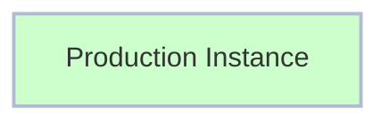
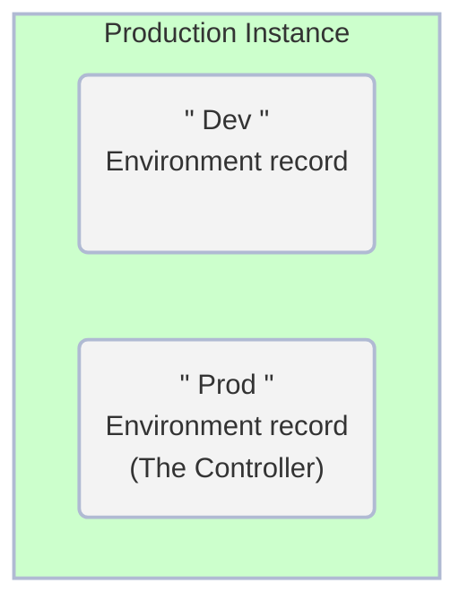

# Exercício: Criar Ambientes

##### Tempo Estimado para Conclusão: 10 minutos

## Visão Geral

[Ambientes ↗](https://docs.servicenow.com/csh?topicname=config-pipeline-environments.html&version=latest) contêm informações sobre uma instância do ServiceNow e como acessá-la.

A seguir, você criará um registro de Ambiente para "Produção" e "Desenvolvimento" na instância Controller onde o AEMC está instalado.

### Antes do Exercício

### Depois do Exercício

## Instruções

1. Faça login em **Prod**.

2. Clique em **Todos** >> digite **environment** >> clique em **Environments**  
    

3. Clique em **New** no canto superior direito.  
    

4. Preencha o formulário conforme abaixo.

    |Field | Value 
    |---|---
    |**Name** | Dev
    |**Instance Type** | Development 
    |**Dev Instance URL** | 
    |**Instance credential** | Pipeline_Credentials 
    |**Is Controller?** | **NÃO**
    |**Instance Id** | Será automáticamente populado ao clicar em **"Validate"**

5. Clique em **Validate**  
    

    

6. Clique em **Submit** para finalizar a criação do registro de ambiente.  
    

7. Clique em **New** no canto superior direito.  
    

8. Preencha o formulário conforme abaixo.

    |Field | Value 
    |---|---
    |**Name** | Prod 
    |**Instance Type** | Production 
    |**Prod Instance URL** | 
    |**Instance credential** | Pipeline_Credentials 
    |**Is Controller?** | **SIM**
    |**Instance Id** | Será automáticamente populado ao clicar em **"Validate"**

9. Clique no botão "Validate".  
    

    

10. Clique em **Submit** para finalizar a criação do registro de ambiente.  
    

## Lições Aprendidas

Neste exercício, você:

- Compreendeu a função e a importância dos registros de Ambiente na plataforma ServiceNow.

- Adquiriu conhecimento sobre como validar esses registros de Ambiente.

- Configurou com sucesso os registros de Ambiente para as instâncias de Desenvolvimento e Produção em seu ambiente Prod.