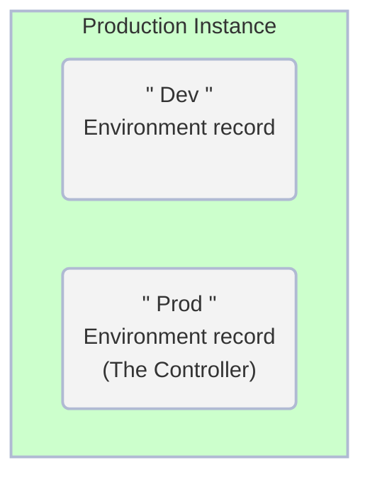
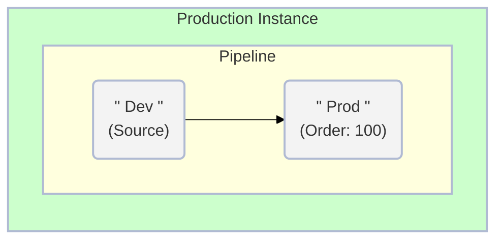
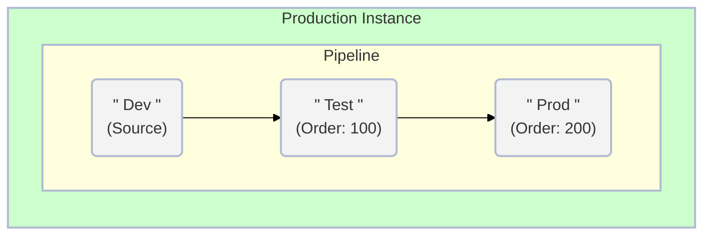

# Exercício: Configurar Pipeline em Prod

##### Tempo Estimado para Conclusão: 15 minutos

## Visão Geral

[Pipelines ↗](https://docs.servicenow.com/csh?topicname=config-pipeline.html&version=latest) estabelecem o caminho que um aplicativo percorre do Desenvolvimento até a Produção.

Isso facilita a capacidade dos administradores de transferir aplicativos de forma eficiente entre diferentes instâncias no App Engine Management Center.

O processo envolve a configuração e ajuste do seu pipeline, especificando os [Ambientes ↗](https://docs.servicenow.com/csh?topicname=config-pipeline-environments.html&version=latest) a serem incluídos e determinando sua posição no pipeline.

O Pipeline é exclusivo para o Ambiente Controller, que neste caso é a instância de Produção.

### Antes do Exercício

### Depois do Exercício

### Exemplo de um Pipeline Dev->Test->Prod

:::info  
Neste Laboratório, você apenas configurará Dev e Prod no Pipeline.

Os registros de Pipeline são configurados apenas em Prod.  
:::

## Instruções

:::info  
Complete este exercício no escopo Global.  
:::

1. Clique em **All** >> digite **pipelines** >> clique em **Pipelines**.  
    

2. Inicie um novo pipeline: Clique em **New** no canto superior direito.  
    

3. Preencha o formulário conforme abaixo:

    |#|Field | Value                     
    |--|--|--
    |1|**Name** | Main Pipeline
    |2|**Pipeline Type** | Application Deployment
    |3|**Source Environment** | Dev                     
    |4|**Active** | **Checked**

    

4. Envie o formulário.  
    

5. Abra o registro recém-criado **Main Pipeline**.  
    

6. Clique em **New** na lista relacionada **Pipeline Environments Order**.  
    

7. Complete o novo formulário conforme mostrado abaixo e clique em **Submit** quando terminar.

    |#| Field       | Value           
    |-|-|-
    |1| **Pipeline**    | Main Pipeline
    |2| **Environment** | Prod
    |3| **Order**       | 100

    

8. Clique em Enviar.

    * Seu registro de Pipeline concluído ficará assim:

     

:::warning  
Certifique-se de que a configuração do seu Pipeline corresponda à captura de tela acima.

NÃO adicione Dev à lista relacionada **Ordem dos Ambientes do Pipeline**.

Ele é o **Ambiente de Origem** e não deve ser adicionado à lista de ambientes adicionais.  
:::

## Lições Aprendidas

Neste exercício, compreendemos a importância de configurar corretamente o Pipeline na instância de Produção.