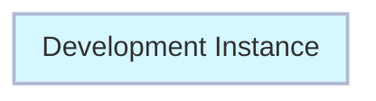
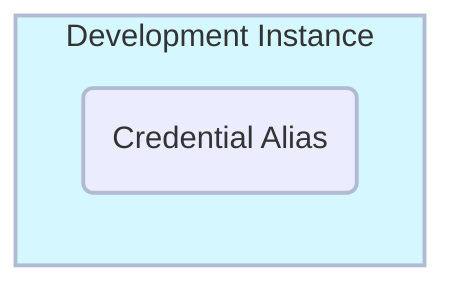

# Exercício: Create Credential Alias

##### Tempo Estimado de Conclusão: 10 minutos

## Visão Geral

Um **<a href="https://docs.servicenow.com/csh?topicname=create-pipeline-credentials.html&version=latest" target="_blank">Credential Alias ↗</a>** é um nome de usuário e senha usados pelo ServiceNow para fazer login em um sistema remoto.

Neste caso, ele será usado pelo App Engine Studio para acessar a Instância do Controller.

Você criará o Credential Alias com uma conta de usuário que já foi criada para você.


### Antes do Exercício


### Depois do Exercício


## Instructions

:::caution
Para este exercício, o Escopo da Aplicação específico não é crítico - Global é aceitável. Sempre verifique com seu Administrador de Plataforma sobre quaisquer políticas da empresa em relação a **<a href="https://docs.servicenow.com/csh?topicname=connection-alias.html&version=latest" target="_blank">Connection and Credential Aliases ↗</a>**.
:::

:::warning
Complete esta seção em **DEV**.
:::

1. Faça login em **DEV**.


2. Navegue para **All** >> digite **Connection & Credential Aliases** >> clique em **Connection & Credential Aliases**.


3. Clique em **New** no canto superior direito para criar um novo registro de Credential Alias.


4. Defina o **Type** como **Credential**.


5. Defina o **Name** como 'Pipeline Credentials' e clique em **Submit**.


```
Pipeline Credentials
```


6. Clique em **Pipeline Credentials** para abrir o registro.


7. Navegue até a lista relacionada **Credentials** e clique em **New** para adicionar uma credencial.


8. Selecione **Basic Auth Credentials**.


:::caution
Você agora irá inserir credenciais para o AES fazer login na Controller instance.

A senha para esta conta de usuário remoto está pré-configurada.

Erros ocorrerão se você não usar a senha especificada abaixo.
:::

9. No formulário **Basic Auth Credentials**, preencha os seguintes valores e clique em **Submit**.

:::info
Lembre-se de usar o botão de copiar para copiar o texto abaixo.
:::


```jsx title="Name"
Pipeline Service Account 
```

```jsx title="Username"
svc_pipeline
```

```jsx title="Password"
ILoveHyperAutomationTimes500!
```


:::note
Os pontos no campo de senha serão mais curtos depois que você salvar a senha. Isso é normal.
:::

## Lições Aprendidas

Ao completar este exercício, você alcançou com sucesso os seguintes marcos:

- Adquiriu experiência em criar e gerenciar Connection & Credential Aliases no ServiceNow.

- Familiarizou-se com a configuração de Basic Authentication Credentials.
