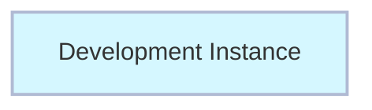
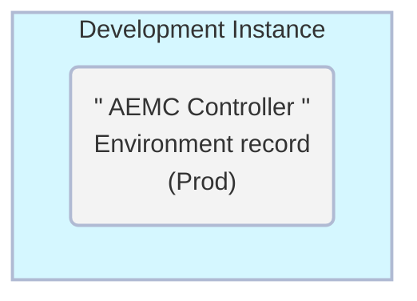

# Exercício: Criar Ambiente Controller 

##### Tempo Estimado de Conclusão: 10 minutos

## Overview

Em seguida, você adicionará um registro de "Controller" Environment à sua instância Dev.

Ele conterá os detalhes para que o Dev acesse o Controller Environment, que é a instância Prod.

A Produção é considerada o "Controller" Environment, pois é onde o App Engine Management Center está instalado e orquestra as atividades.

### Antes do Exercício

### Depois do Exercício

## Instructions

1. Faça login em **DEV**.

2. Clique em **All** >> digite **environment** >> clique em **Environments** 

3. Clique em **New** no canto superior direito.

4. Complete o formulário usando as informações abaixo. 

|Campo | Valor 
|:---|:---
|**Name** | AEMC Controller 
|**Instance Type**| Production 
|**Prod Instance URL** | 
|**Instance credential** | Pipeline_Credentials 
|**Is Controller?** | **MARQUE A CAIXA**
|**Instance Id** | Isso será preenchido automaticamente após clicar em Validate.

5. Clique em **Validate**.

6. Clique em **Submit** para finalizar a criação do registro de **Prod** environment.

## Lições Aprendidas

 **Importância do Controller Environment**
 
 Configurar o Controller Environment é crucial para a operação do App Engine Management Center. Este exercício enfatiza o papel vital da instância de Produção, pois é onde o AEMC está instalado e de onde ele orquestra as atividades.
