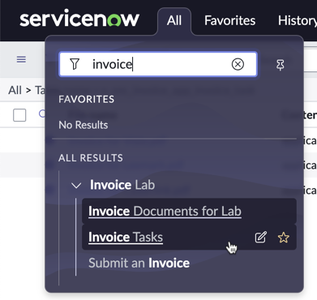
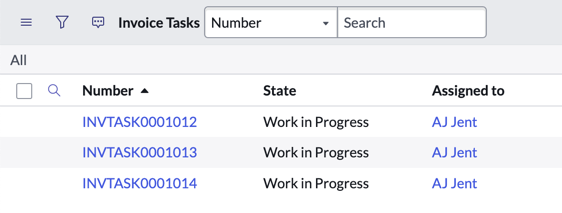

As tabelas já estão criadas na instância com fluxos básicos.

- **Invoice Task:** `x_snc_invoice_app_invoice_task`
- **Invoice Line Item:** `x_snc_invoice_app_invoice_line_item`

**Roles:**

- **Invoice Admin:** `x_snc_invoice_app.Invoice Admin` – acesso a todos os registros de fatura (criar, ler, editar, excluir)
- **Invoice Manager:** `x_snc_invoice_app.Invoice Manager` – acesso aos registros de fatura atribuídos (criar, ler, editar)
- **Invoice Requester:** `x_snc_invoice_app.Invoice Requester` – acesso aos itens de catálogo e aos próprios registros de fatura (criar, ler)

**Usuários:**

- **Pros Ono:** Process Owner
  - Roles: Invoice Admin, `sn_docintel.manager`
- **Ed Min:** Admin
  - Roles: admin, `sn_docintel.admin`
- **AJ Jent:** Fulfiller/Agent/Domain Expert
  - Roles: Invoice Manager, `sn_docintel.creation_agent`
- **Rick Ester:** Requester
  - Roles: Invoice Requester

## Verificação do Lab

No menu de navegação, abra o menu **Invoice Tasks**.

Verifique se você vê algumas tarefas de fatura atribuídas a AJ Jent.

## Verificação de Conhecimento

Qual é o nome da tabela para a tarefa de fatura? Clique no registro de **Invoice Task**. Os registros de qual tabela estão na lista relacionada? Quais papéis AJ Jent possui?
