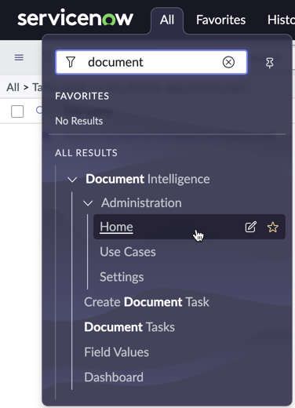
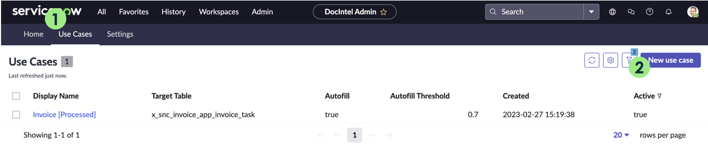
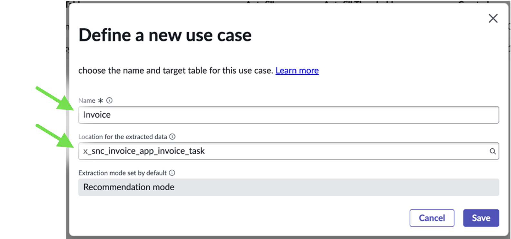
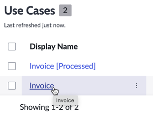
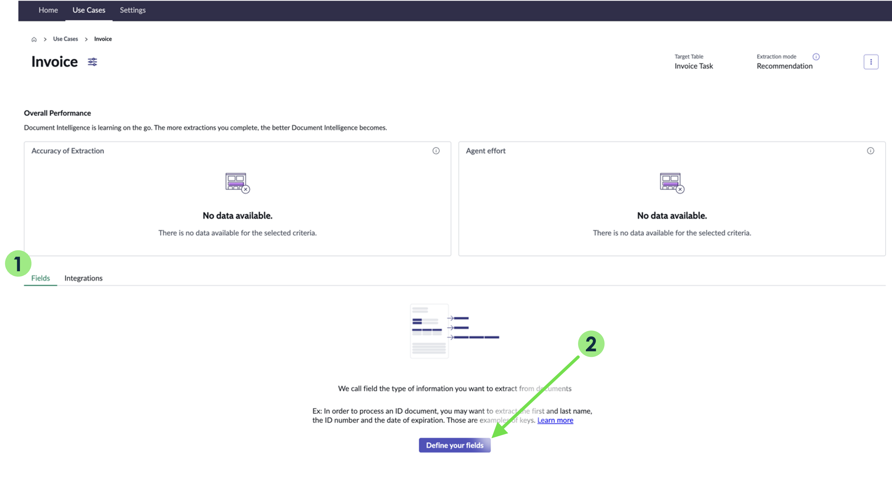
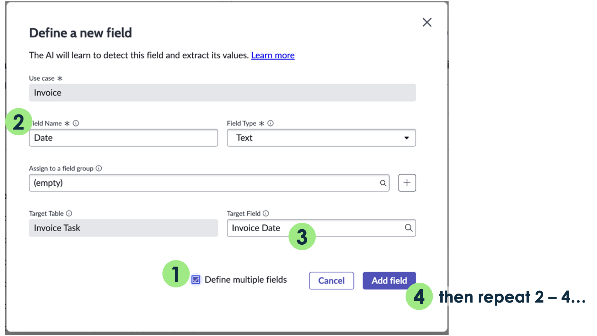
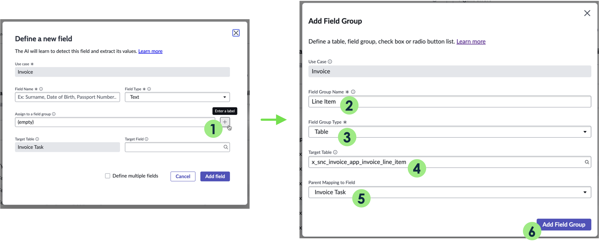
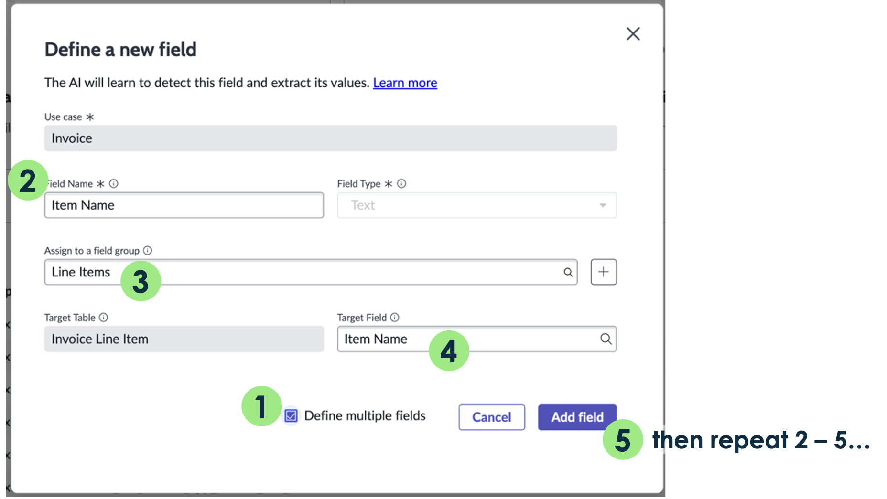
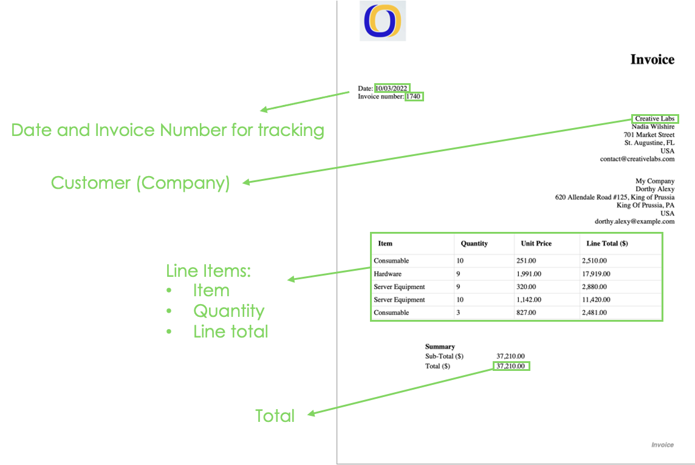

1. Navegue para **Document Intelligence > Administration > Home**.

    

   - Nota: A página será aberta em uma nova aba do navegador. Se isso não acontecer, verifique se o seu navegador não está bloqueando a abertura.
2. Vá para a aba **Use Cases** e selecione **New use case**.

       

   - Preencha o formulário:

    | Campo                        | Valor                                      |
    |------------------------------|--------------------------------------------|
    | **Name**                     | Invoice                                    |
    | **Location for the extracted data** | `Invoice Task [x_snc_invoice_app_invoice_task]` |

    

   - Por padrão, o "Recommendation mode" é selecionado como o modo de extração.
   - Clique em **Save**.

3. Abra o Use Case na lista.
    
    - Na aba **Fields**, selecione **Define your fields**.

    

1. Crie 4 campos (Date, Number, Customer, Total) conforme mostrado abaixo:
    :::tip
    Selecione a opção “Define multiple fields” para manter a janela pop-up aberta após cada campo ser adicionado.
    :::
   
    | Field Name  | Target Field  |
    |-------------|---------------|
    | **Date**    | `Invoice_date`|
    | **Number**  | `Invoice_number`|
    | **Total**   | `Invoice_total`|
    | **Customer**| customer      |

    

2. Crie um Field Group clicando no sinal de “+” ao lado do campo de grupo de campos.
     - Preencha o formulário:

    | Campo              | Valor                                      |
    |--------------------|--------------------------------------------|
    | **Field Group Name** | Line Item                                |
    | **Field Group Type** | Table                                    |
    | **Target Table**    | `Invoice Line Item [x_snc_invoice_app_invoice_line_item]`|
    | **Parent Mapping to Field** | Invoice Task                    |

    

     - Clique em **Add Field Group**.

3. Crie 3 campos (Item Name, Quantity e Total), atribuídos ao Field Group **Line Items**, conforme mostrado abaixo:

    :::tip
    Selecione a opção “Define multiple fields” para manter a janela pop-up aberta após cada campo ser adicionado.
    :::
   
    | Field Name  | Assign to a field group | Target Field |
    |-------------|-------------------------|--------------|
    | **Item Name** | Line Items            | `item_name`  |
    | **Quantity**  | Line Items            | `quantity`   |
    | **Line Total**| Line Items            | `total`      |

    

## Verificação do Lab

Verifique se criamos um campo para cada valor que precisa ser extraído de nossas faturas.

