Com o caso de uso aberto na página de administração do **Document Intelligence**:

1. Crie o Flow para criar uma nova tarefa de Documento a partir de uma tarefa de Fatura:
   - Na aba **Integrations**, selecione **Set up your first integration**.

    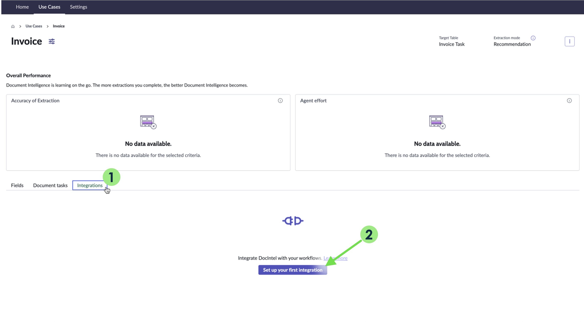

   - Preencha o formulário para criar a integração de Process Task:

    | Campo                       | Valor                         |
    |-----------------------------|-------------------------------|
    | **Name your Integration:**  | Process Invoice Task          |
    | **What type of integrations you want to set?** | Process Task |
    | **Condition:**              | Leave blank                   |
    | **Create Flow:**            | Checked (True)                |

    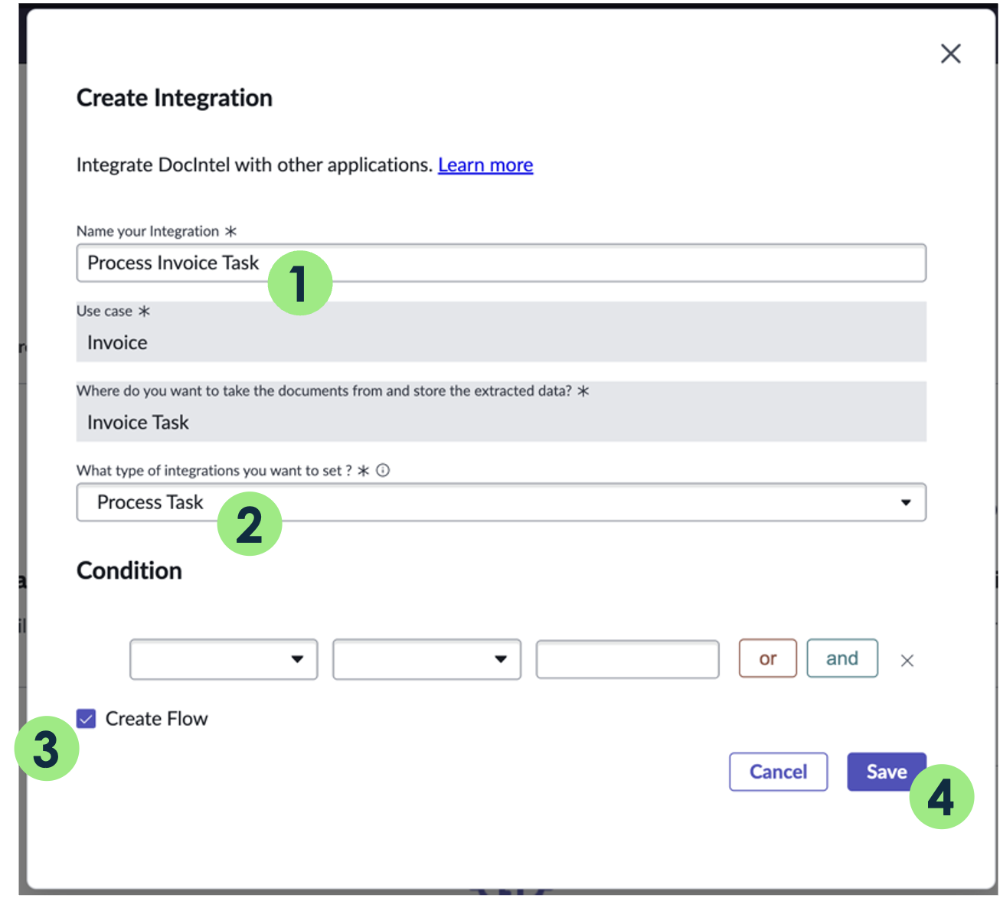
   - Clique em **Save**.
   - Abra no **Flow Designer** (clicando no valor na coluna **Flow**).

    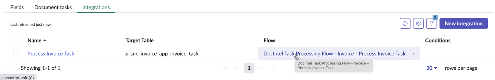  

    :::info
    **Verificação de Conhecimento:** Revise o gatilho do Flow e as Ações: Uma tarefa de Documento será criada quando uma tarefa de Fatura for criada? Como elas estão relacionadas?
    :::
   - Ative o Flow. Em seguida, feche a aba do navegador.

    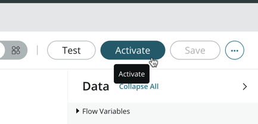

2. Crie o Flow que preenche os campos da tarefa de Fatura uma vez que a tarefa de Documento é concluída:
   - Clique em **New integration**.
    
   - Preencha o formulário para criar a integração de **Extract Values**:

    | Campo                       | Valor                         |
    |-----------------------------|-------------------------------|
    | **Name your Integration:**  | Extract Invoice Task          |
    | **What type of integrations you want to set?** | Extract Values |
    | **Create Flow:**            | Checked (True)                |

    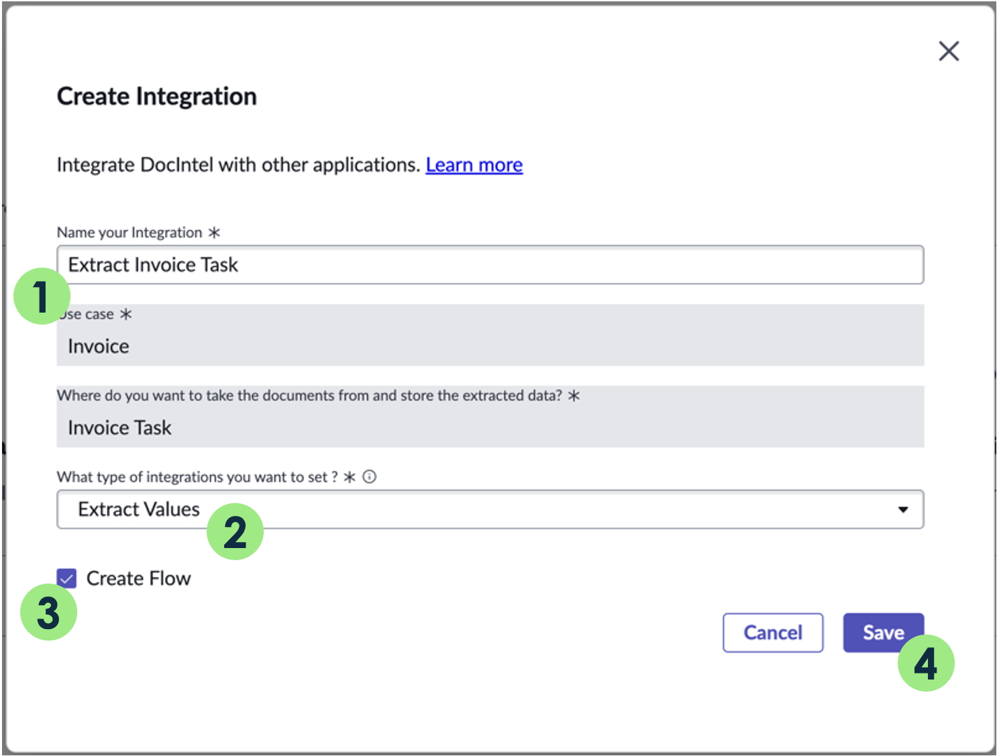
   - Clique em **Save**.
   - Abra no **Flow Designer** (selecionando o valor na coluna **Flow**).
    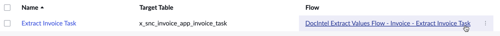
    :::info
    **Verificação de Conhecimento:** Revise o gatilho do Flow e as Ações: Nosso registro de Fatura será atualizado quando uma tarefa de Documento for concluída?
    :::
   - Ative o Flow. Em seguida, feche a aba do navegador.
    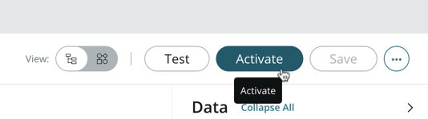

## Verificação do Lab

Usando a outra aba do navegador (no início do Lab 2, abrimos uma nova aba do navegador para configurar o **Document Intelligence**), no menu de navegação, abra o menu **Invoice Tasks**. 

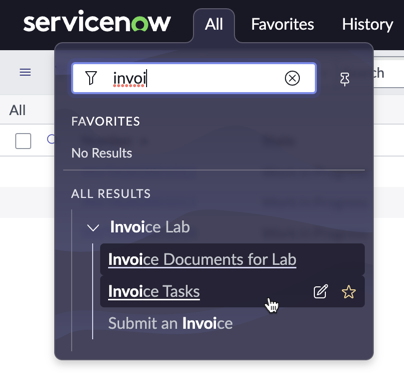

Crie uma nova tarefa de Fatura (clique em **New**). Anexe um dos PDFs que você baixou no início deste laboratório. Clique em **Submit**.

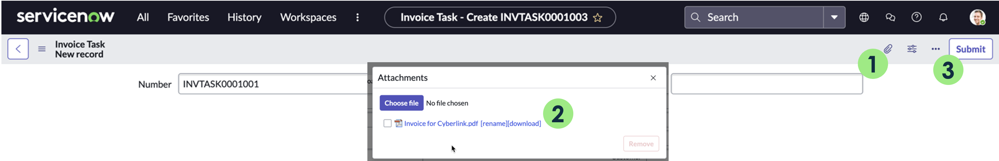

- Observe o Número, neste exemplo `INVTASK0001001`. 
:::note 
Você pode ter um número diferente em sua instância.
:::
- Retorne à aba do navegador com a administração do **Document Intelligence** e atualize a página.
- **Verifique as Ações:** Verifique se foi criada uma nova tarefa de Documento. No campo **Source Record**, você deve ver o número da tarefa de Fatura.

Abra a tarefa de documento e selecione **Open in Document Intelligence**.

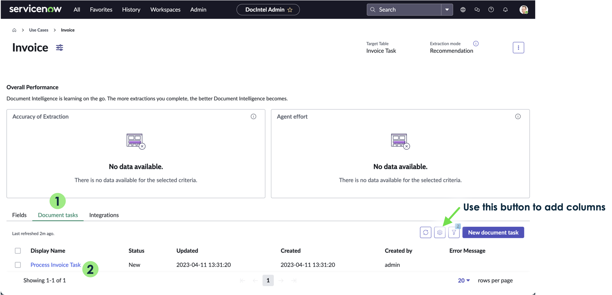
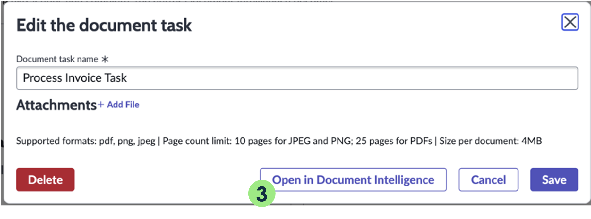

## Verifique as Ações

Verifique se você vê os campos e a tabela. Comece a digitar o valor a ser extraído e observe as sugestões com um nível de confiança (0%). Clique em uma sugestão para selecioná-la como o valor a ser extraído.

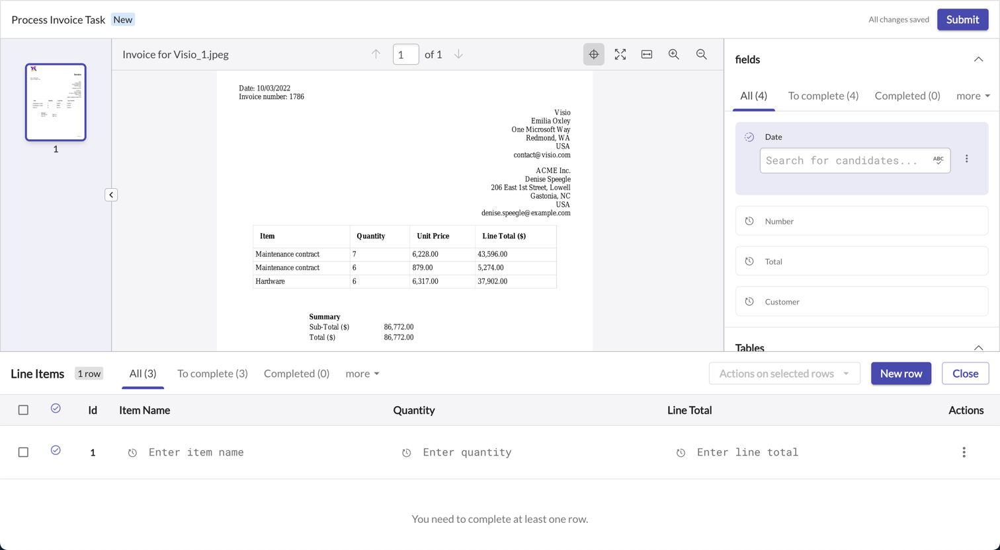

Comece a digitar o valor a ser extraído e observe as sugestões com um nível de confiança (0%). Clique em uma sugestão para selecioná-la como o valor a ser extraído.

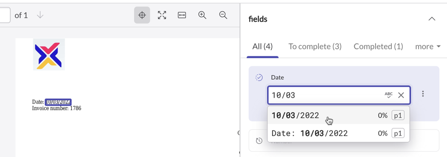

:::info
As sugestões são geradas de forma assíncrona, e pode levar alguns minutos para que o processamento ocorra.
:::

:::info
Caso o processamento não seja concluído, usaremos uma solução alternativa no Lab 3.
:::
