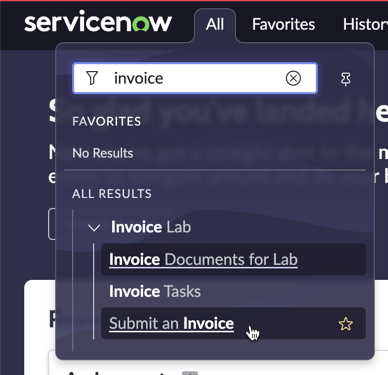
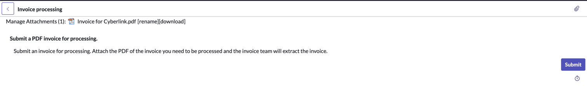
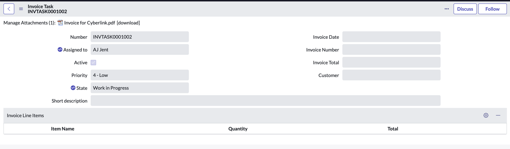
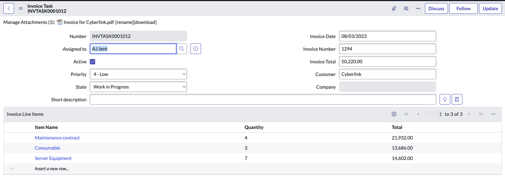

1. Envie uma solicitação para o processamento de fatura:
   - Impersonate Rick Ester (Invoice Requester).
   - Navegue para **Invoice Lab > Submit an invoice** para acessar o Record Producer.
    
   - Anexe um arquivo e envie. Após ser redirecionado para o registro, observe que os campos da fatura estão vazios e não há itens de linha de fatura.
    
    

   - Navegue para **Invoice Lab > Invoice Tasks**, estas são as solicitações que criamos anteriormente que estão prontas para processamento.
   - Abra `INVTASK0001012` e verifique se todos os campos estão vazios.

2. Atenda à solicitação:
   - Impersonate AJ Jent.
   - Navegue para **Document Intelligence > Document Tasks** e abra o registro com **Source Record** = `INVTASK0001012`.
   - Selecione **Show In DocIntel**.
   - Prossiga com a extração, observe o nível de confiança. Envie. Feche a aba do navegador.
   - Recarregue o formulário. Abra o **Source Record**.

## Verificação do Lab 

Verifique se os valores extraídos foram copiados para a tarefa.

