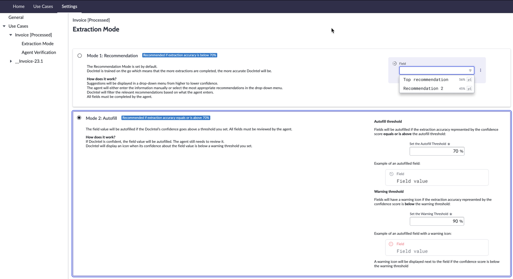

1. Finalize o Impersonation .
2. Em **Document Intelligence Admin**, navegue para a aba **Settings**.

1. Altere o **Extraction Mode** para o caso de uso **Invoice [Processed]** para **Mode 2: Autofill**, adicione o valor para **Autofill Threshold = 70%** e **Warning Threshold = 60%**.

1. Atenda à solicitação:
   - Impersonate AJ Jent.
   - Navegue para **Document Intelligence > Document Tasks** e abra o registro com **Source Record** = `INVTASK0001013`.
   - Selecione **Show In DocIntel**.
   - Observe que alguns campos são preenchidos automaticamente. Preencha os valores dos outros campos. Envie. Feche a aba do navegador.

## Verificação do Lab

Os valores foram preenchidos automaticamente com base nos limites selecionados.

À medida que mais documentos são processados, o modelo de IA aprende, o que resulta em mais valores preenchidos automaticamente. Quando o modelo puder preencher automaticamente todos os campos de um documento, você pode considerar o **Straight Through Processing**.

## Conclusão

🎉 **Parabéns! Você concluiu este laboratório.** 🎉

Caso deseje contiuar, conclua a atividade adicional na próxima página.