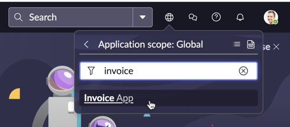
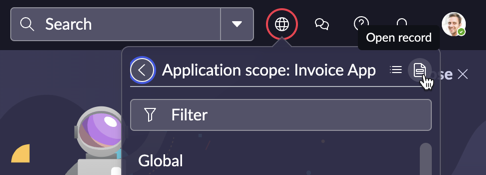
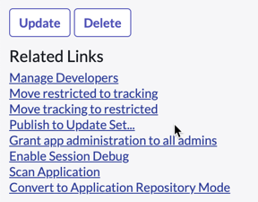

:::info
OPCIONAL: Laboratório com atividade adicional para aprimorar seus conhecimentos.
:::

Se você quiser continuar explorando a solução e testá-la mais extensivamente em sua própria instância, convidamos você a exportá-la seguindo os passos abaixo.

1. Exporte o “Invoice App” do escopo:
   - Abra o **scope navigator** e selecione o escopo **Invoice App**.
    
   - Abra o registro.
    
   - Selecione **Publish to Update Set** nos **Related Links** e depois baixe o **Update Set**.
    
2. Exporte o **Document Intelligence Use Case** e componentes adicionais. Siga os passos deste artigo da Community. Os passos detalhados no artigo podem ser resumidos da seguinte forma:
   - Execute o Script em **Script – Background**.
   - Navegue até **Local Update Sets** e baixe os **Update Sets**.
   - Importe os **Update Sets** na sua instância de destino.

Exportar todos os componentes da solução permitirá que você a teste em sua instância para diferentes casos de uso.
