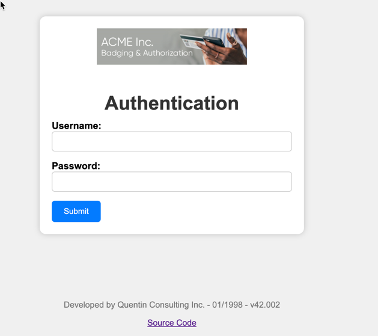
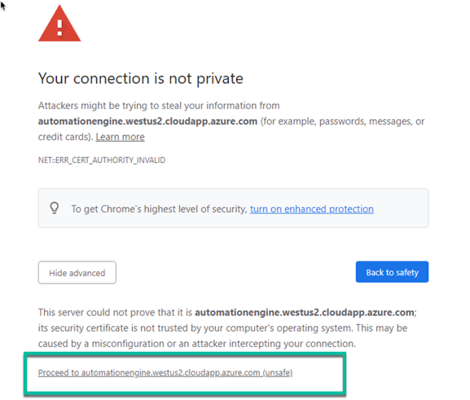
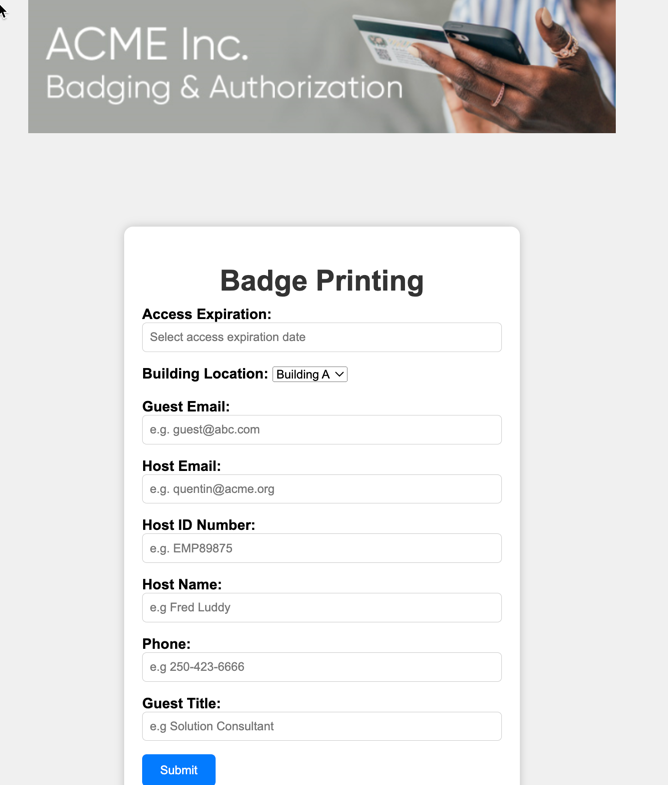

De um navegador da web, abra este [Link](https://automationengine.westus2.cloudapp.azure.com) para acessar o aplicativo de badging baseado na web. Depois disso, você deve ver a tela de autenticação abaixo.

Você pode encontrar avisos de segurança, pois o aplicativo web usa um certificado raiz que não é confiável pelo navegador nesta VM. Clique em Avançado

Em seguida, clique em **Prosseguir para automationengine.westus2.cloudapp.azure.com (não seguro)**

> Não se preocupe com esses avisos; desenvolvemos esse aplicativo de badging 'dummy' exclusivamente para fins de laboratório e não transmitimos dados sensíveis de forma alguma.

Digite essas credenciais para autenticar e clique em Enviar:

| Campo | Valor |
|-------|-------|
| Username | badgeadmin |
| Password | badgeadmin |

Você deve ver a página que o Agente de Segurança usa para imprimir crachás abaixo.

No nosso projeto de automação RPA, vamos automatizar todas essas etapas: abrir o navegador da web, autenticar, realizar a entrada de dados e enviar o formulário.
