Na próxima etapa, realizaremos algumas tarefas administrativas dentro do Espaço de Trabalho do RPA Hub para ajudá-lo a se familiarizar com as várias configurações disponíveis. Faça login na instância atribuída a você usando as credenciais de administrador que recebeu ao reivindicar essa instância.

Clique em **Todos** (1), depois digite **RPA Hub** no filtro de navegação (2) e clique em **Espaço de Trabalho do RPA Hub**

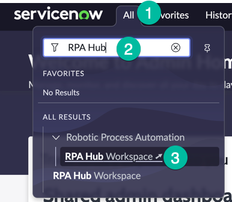

O Espaço de Trabalho do RPA Hub é onde você pode governar, gerenciar e supervisionar sua força de trabalho digital, tudo em um só lugar.

No canto superior esquerdo, clique no ícone 'hambúrguer' para acessar as listas disponíveis

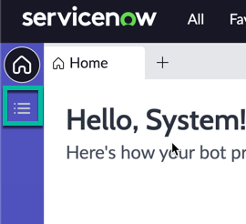

Clique em **Processo do Bot** (1), depois vá para **Atribuir Configuração** (Clique na pequena seta ao lado de **Criar Configuração**).

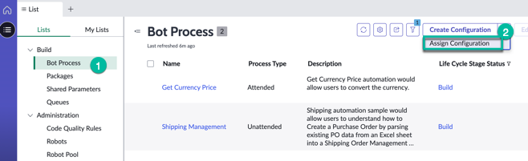

Estamos agora criando um novo **Processo do Bot** a partir de uma **configuração do processo do bot** existente e, em seguida, preencheremos os campos restantes necessários

Marque a caixa (1) para selecionar o registro de **Configuração do Processo do Bot de Impressão de Crachás** e clique em **enviar** (2)

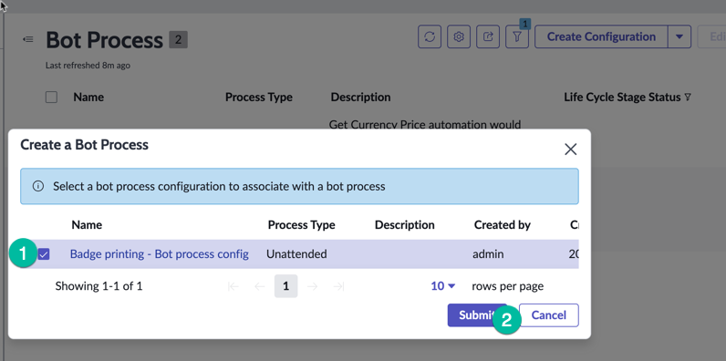

> O registro de Configuração do Processo do Bot de Impressão de Crachás foi pré-carregado nessas instâncias de laboratório para economizar tempo, permitindo-nos nos concentrar rapidamente na construção do robô. Esses registros de configuração são valiosos para clientes com várias instâncias que precisam exportar configurações de uma instância para outra.

Esta aba deve abrir no espaço de trabalho, mostrando o registro do processo do bot. Atualize o campo **Nome** (1) para renomear o Processo do Bot, remova a configuração e clique em **Salvar** (2)

Você deseja que o campo **nome** do Processo do Bot fique conforme mostrado:

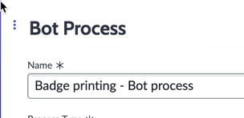

Agora que temos o novo registro do Processo do Bot de Impressão de Crachás criado, vamos preencher alguns campos importantes. Clique na aba **Aplicações de Negócio**

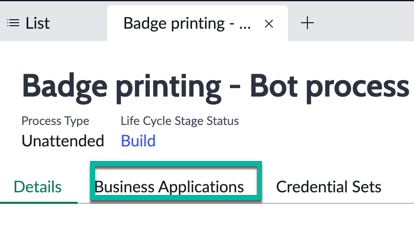

> Nota: Este aspecto da configuração é de extrema importância. Na aba Aplicação de Negócio, estabelecemos uma relação entre o Processo do Bot e a automação RPA que estamos criando, conectando-o à Aplicação de Negócio específica que estamos automatizando. Essa configuração é armazenada no CMDB (Banco de Dados de Gerenciamento de Configuração), permitindo que os clientes mantenham sua equipe de Automação informada ao planejar mudanças nessas aplicações de negócios. Considere um cenário onde uma equipe está modificando a IU do Aplicativo de Badging enquanto outra equipe está automatizando-o. Outra vantagem de manter essa relação no CMDB é que, quando ocorre um incidente nesse aplicativo, ele pode ser correlacionado com erros potenciais na automação. Imagine se o aplicativo de negócios falhar; os robôs RPA podem parar de funcionar. Ter visibilidade sobre possíveis causas raiz pode ser extremamente valioso."

Clique em **Adicionar** para mapear a Aplicação de Negócio existente (do CMDB) para o Processo do Bot

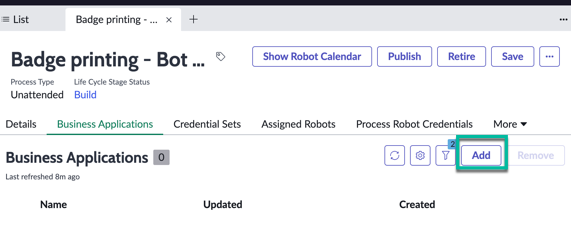

Selecione a **Impressão de Crachás** (1) Aplicação de Negócio e clique em **Adicionar** (2)

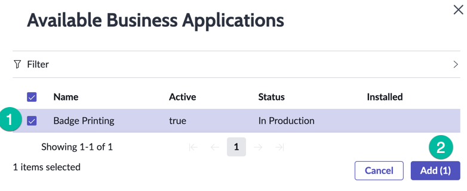

Se você não ver a Aplicação de Negócio após adicioná-la, clique no botão de Atualizar conforme mostrado

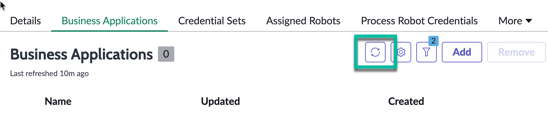

e você deve vê-la na aba Aplicação de Negócio conforme mostrado

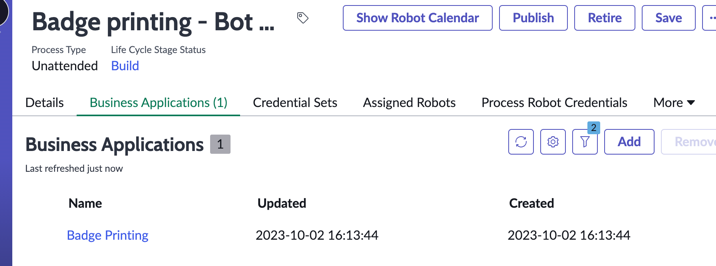

Vamos continuar com a configuração do processo do bot. Clique na aba **Conjunto de Credenciais** (1), depois clique em **Novo** (2)

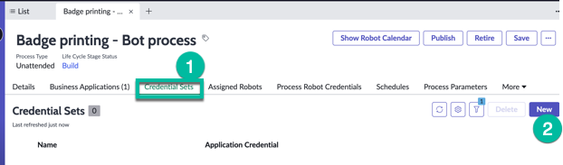

Mantenha essa aba aberta; precisamos recuperar informações adicionais que usaremos nesses campos

Precisamos obter o hostname da Máquina Virtual Windows que foi atribuída a você. Curiosamente, é a mesma máquina que o MID Server implantado com sua instância

Clique em **Todos** (1), depois digite **mid** (2) no filtro de navegação, passe o mouse sobre **Servidores** e clique com o botão direito em **Abrir Link em uma nova Aba** (apenas para manter a página do processo do bot aberta)

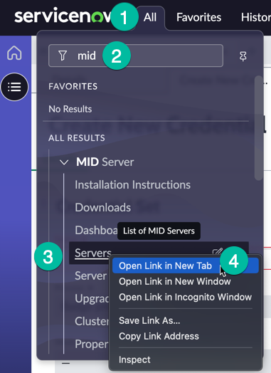

Na nova aba, copie o valor que você vê na coluna **Nome do Host** como mostrado para sua área de transferência. Além disso, anote o hostname, pois usaremos esse valor ao criar o registro do Robô.

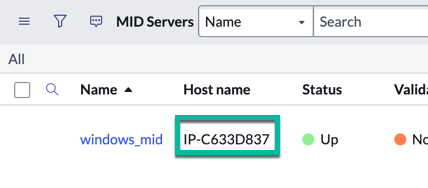

Então, volte para a guia **Credentials Set** no espaço de trabalho RPA.

No campo **Name**, cole o valor copiado anteriormente (nome do host do MID Server), e também no campo **Windows Username**, cole o valor do nome do host seguido de \Administrator.

No campo **Windows Password**, insira a senha fornecida quando você requisitou essa instância de laboratório e clique em **Save**.

Você deve ver uma tela como esta, com uma guia **Application Credentials** onde você define as Credenciais de Aplicativo usadas para o processo. (Aqui é onde armazenamos as credenciais para o robô se autenticar na interface do aplicativo de crachá.)

Clique em **Application Credentials**.

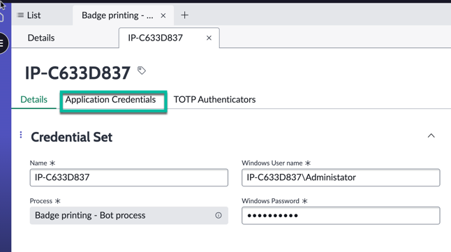

Em seguida, clique em **New**.

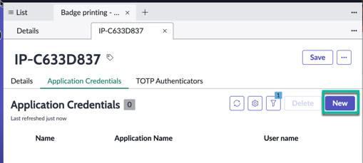

No formulário Criar Novas Credenciais de Aplicativo, use os seguintes valores e clique em **Save**:

| Campo | Valor |
|-------|-------|
| Name | Badging App Creds |
| Application Name | Badge Printing |
| User name | badgeadmin |
| Password | badgeadmin |

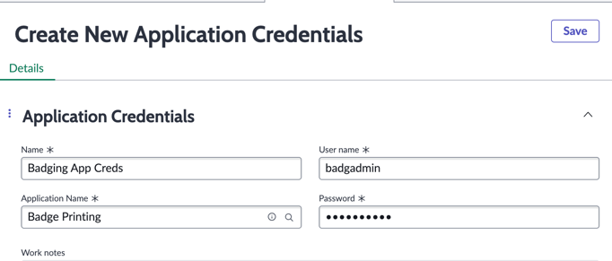

Precisamos criar um registro de Robô antes de continuar a configuração do processo de bot (normalmente você teria um pool existente de Robôs que pode atribuir a um processo de Bot, neste laboratório criamos o registro do Robô manualmente).

Clique no ícone de hambúrguer (1), depois clique em **Robots** (2) e clique em **New** (3).

> Nota: Na terminologia RPA do ServiceNow, o registro de Robô corresponde à máquina Windows na qual o agente de software RPA do ServiceNow executa um processo de bot. Ao definir o Robô no Processo de Bot, estamos configurando qual Máquina Virtual executará a automação.

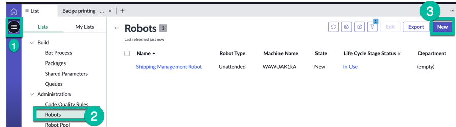

No formulário, preencha os campos com os seguintes valores e clique em **Save**:

| Campo | Valor |
|-------|-------|
| Name | Badge Printing Robot |
| Machine Name | Nome do host copiado do registro do MID Server no passo anterior |
| Department | IT |
| Robot Type | Unattended |

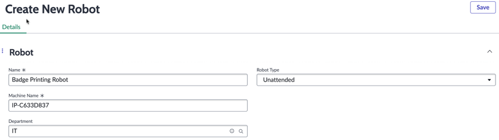

> Nota: O campo Department permite segmentar todos os Relatórios RPA por departamento.

Volte para a página do Processo de Bot clicando na guia **Detail**.

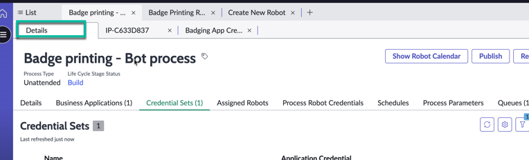

Depois, clique na guia **Assigned Robots** (1) e clique em **Add** (2).

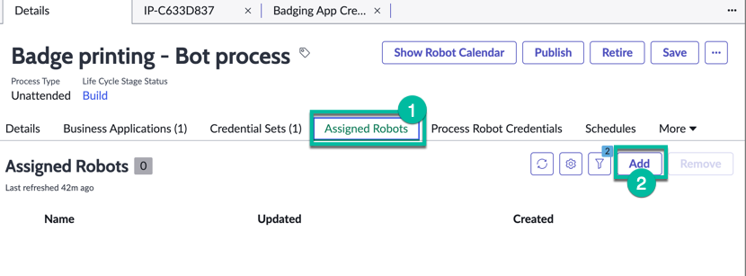

Selecione o registro **Badge Printing Robot** (1) e clique em **Add** (2).

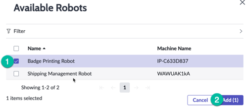

Clique no botão de atualizar.

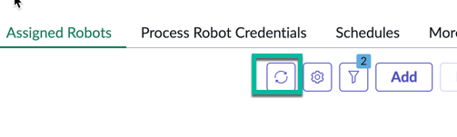

e certifique-se de que o registro do robô aparece como mostrado na guia **Assigned Robots**.

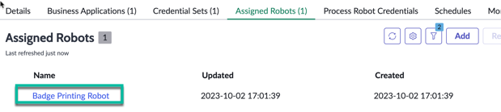

Agora, configure as Credenciais de Robô do Processo, que estão vinculadas ao conjunto de credenciais criado anteriormente no registro do Robô. Isso permite flexibilidade, acomodando diferentes robôs com conjuntos de credenciais distintos, embora alguns robôs também possam compartilhar as mesmas credenciais.

Clique em **Process Robot Credentials** (1) e depois em **New** (2).

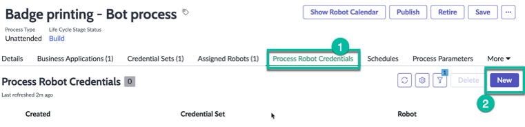

No formulário **Create New Process Robot Credential**, no campo **Credentials Set** (1), comece a digitar 'IP-' deve retornar o nome do registro de Conjunto de Credenciais que criamos anteriormente, selecione-o (no caso, é o nome do seu servidor MID, na vida real podemos precisar encontrar uma melhor convenção de nomenclatura :-) ), em seguida, no campo **Robot** (2) procure por 'Badge Printing robot' e selecione-o e clique em **Save** (3).

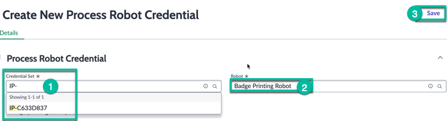

Volte para a guia **Detail** para retornar aos detalhes do processo de bot, depois clique na guia **Queue**, se você não a vê, clique no botão **More**.

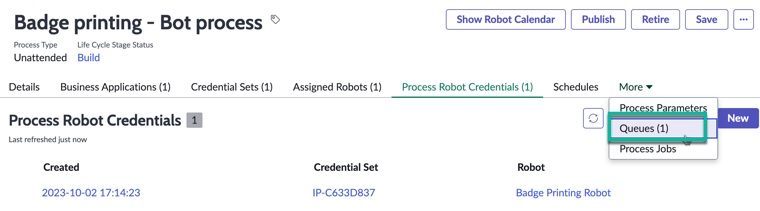

> Uma Queue é um repositório que pode conter um número ilimitado de itens de trabalho. Itens de trabalho podem armazenar múltiplos tipos de dados, como informações de transações, detalhes de clientes ou informações de um documento. As Queues são usadas em automações para distribuir dados transacionais ou a carga de trabalho entre diferentes robôs.

> Sua instância veio pré-configurada com uma Queue de Trabalho existente chamada 'Badge Printing'. Neste caso de uso, sempre que um visitante é pré-registrado e aprovado para receber um crachá, um fluxo sem código (no Flow Designer) adiciona um Item de Queue de Trabalho aqui para passar os metadados e informações que o robô precisará para enviar a solicitação de impressão de crachá.

Clique no registro de Queue de Trabalho **Badge Printing** para abrir e inspecionar.

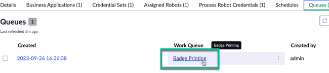

Quando estiver no registro de Queue de Trabalho, clique na guia **Work Items** (1).

> Isso exibe os trabalhos pendentes, bem-sucedidos ou falhados. Itens de trabalho podem ser atribuídos a robôs por meio de um fluxo, ou você pode projetar sua automação RPA para agendar verificações regulares da queue para itens de trabalho pendentes, que são então atribuídos a robôs específicos.

Clique no registro de Item de Trabalho **VIS0001016** (2) para inspecionar.

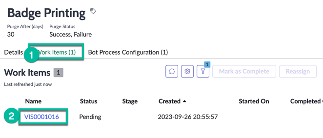

Revise as diferentes informações disponíveis nesse registro, observe as Ações UI 'Mark as complete' ou 'Reassign', não clique nesses botões, por favor.

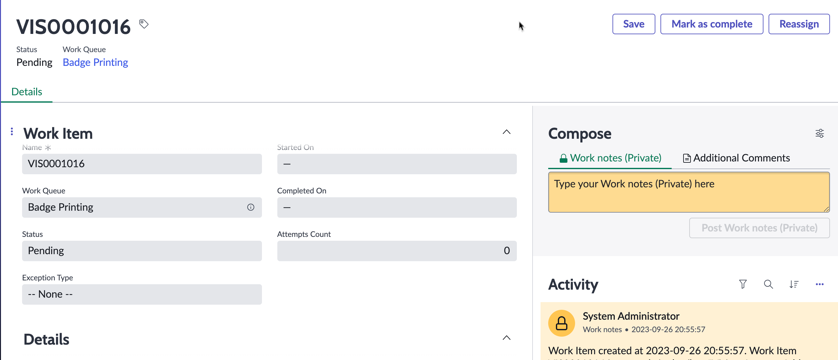

Role para baixo até ver o campo 'Request Content'. Este campo contém os metadados necessários pelo Robô para entrada de dados no aplicativo web de Badging. Neste caso de uso, um desenvolvedor do ServiceNow cria este item de trabalho a partir de um fluxo e inclui os metadados. Preste atenção no 'Response Content'; o Robô pode fornecer uma resposta ou informação que pode ser lida por um fluxo na plataforma.

Quando estivermos construindo a automação RPA, um dos primeiros passos será selecionar esse item da queue e recuperar os metadados.

Terminamos de configurar o Processo de Bot RPA no RPA Hub; agora, precisamos construir a automação RPA associada a esse Processo de Bot.
