Uma Máquina Virtual (VM) Windows é necessária para completar este laboratório. O endereço IP e as credenciais de login foram fornecidos durante a inscrição. Se você estiver usando um laptop Mac, certifique-se de que o Microsoft Remote Desktop App esteja instalado como pré-requisito para este laboratório.

 1. Se estiver usando um Mac, conecte-se à VM do laboratório abrindo o Microsoft Remote Desktop e clicando no **sinal de mais** e depois clicando em **Adicionar PC**. Se estiver usando um laptop com Windows, vá para o **Passo 6** para conectar-se à VM usando o RDP do Windows.

     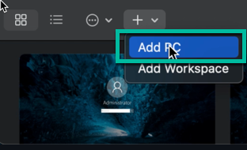

 2. Copie o **endereço IP** da página de registro e insira-o em **Nome do PC** (1) e insira **Lab VM** em **Nome Amigável** (2). Em seguida, clique em **Adicionar** (3).

       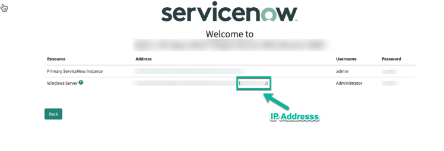
       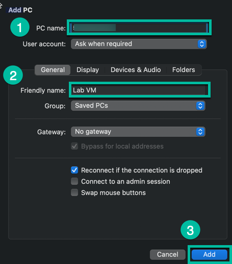

    > O **endereço IP** é apenas o valor dentro dos colchetes **[]** na linha do Windows Server.

 3. Clique duas vezes na nova VM que foi adicionada ao RDP.

    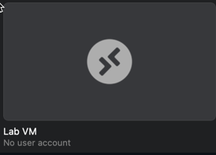
    
    Em seguida, clique em **Continuar**.

 4. Insira as credenciais de login do Windows Server fornecidas durante o registro em **Nome de usuário** (1) e **Senha** (2) e depois clique em **Continuar** (3).

    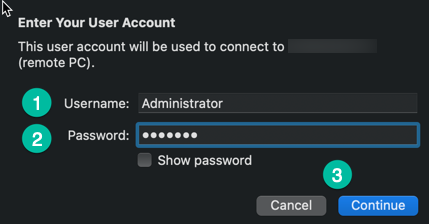

    > Clique em **Mostrar Senha** para garantir que a senha inserida está correta.
    
 5. Clique em **Continuar** mais uma vez para conectar à VM. Após conectar-se à VM, vá para o **Passo 11** para concluir a configuração inicial.

    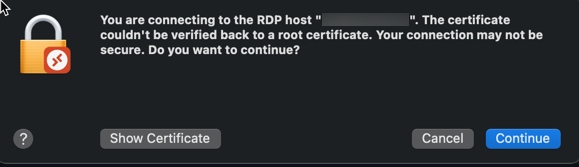

 6. Se estiver usando um laptop com Windows, abra o Remote Desktop Protocol (RDP). Em seguida, copie o **endereço IP** da página de registro e insira-o em **Computador** (1) e clique em **Conectar** (2).

    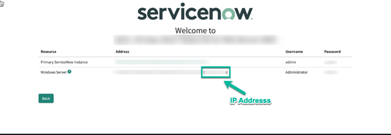

    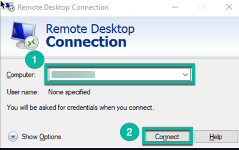
    > O **endereço IP** é apenas o valor dentro dos colchetes **[]** na linha do Windows Server.

 7. Clique em **Mais opções**.

    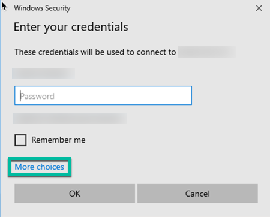

 8. Clique em **Usar uma conta diferente**.

    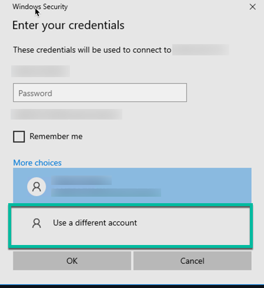

 9. Digite **Administrador** para Nome de usuário (1) e a **senha do laboratório** para Senha (2). Em seguida, clique em **OK** (3).

    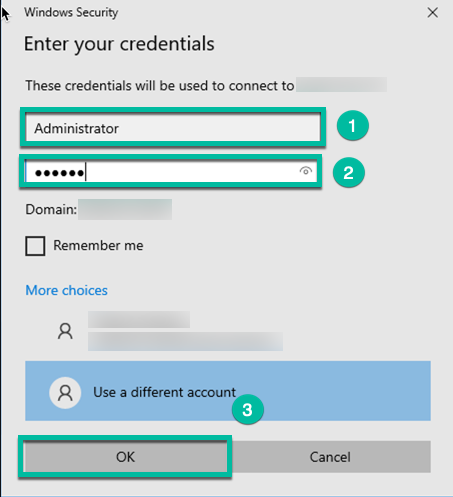

 10. Clique em **Sim** para confirmar a conectividade com a VM.

    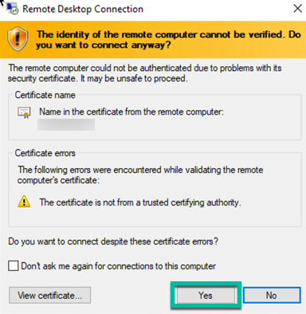

Uma vez conectado à VM do laboratório, observe que o software RPA já está pré-instalado e acessível na Área de Trabalho. Se você não ver o ícone do RPA Desktop Design Studio, por favor, informe seu instrutor, pois você precisará disso para construir a automação RPA.

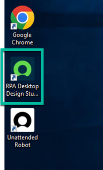

Antes de começar, é recomendado alterar o navegador padrão para o Chrome. Isso pode ser feito digitando **Navegador Padrão** (1) na Barra de Pesquisa do Windows e clicando em **Escolher um navegador da web padrão** (2).

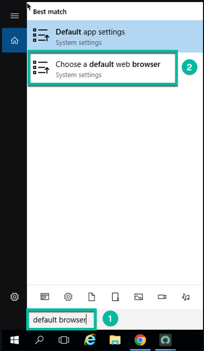

 Clique em **Internet Explorer** sob **Navegador da Web** e selecione **Google Chrome**. Em seguida, feche a janela.

 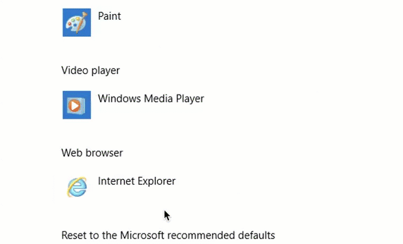
