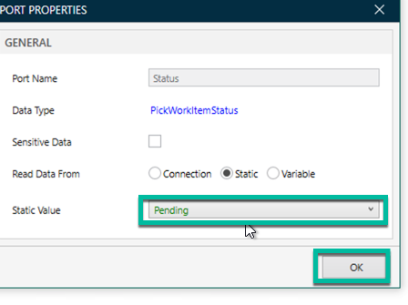

O Robotic Process Automation (RPA) Desktop Design Studio é um Ambiente de Desenvolvimento Integrado (IDE) low-code onde você pode projetar ou configurar fluxos de trabalho de automação RPA arrastando e soltando componentes na superfície de design. O RPA Desktop Design Studio é um aplicativo nativo do Windows.

Dê um duplo clique no ícone do RPA Desktop Design Studio na área de trabalho do Windows

Na janela pop-up **Connection Manager**, preencha os campos com as informações abaixo

 | Campo | valor |
   |-------|-------|
   | Nome | Minha Instância de Laboratório |
   | URL | Digite a URL da sua instância de laboratório, incluindo http:// |
   | Marcar como Padrão | Marque a caixa |
   | Abrir no navegador padrão | Marque a caixa |

Depois clique em **Proceed** (5)

Na primeira vez que o Studio é aberto, pode levar um minuto para carregar todos os componentes necessários

Quando você ver esta tela de boas-vindas, clique em **Unattended Automation**

Use os valores abaixo na tela **New Unattended Project**

 | Campo | valor |
   |-------|-------|
   | Nome (1) | Automação RPA Impressão de crachá |
   | Descrição (2) | Automatizar a entrada de dados no aplicativo web de impressão de crachá |

Depois clique em **OK** (3)

Vamos abrir o Google Chrome e garantir que podemos acessar o aplicativo de crachá dessa VM.

Clique no menu Iniciar do Windows (1), depois dê um duplo clique em **Google Chrome** (2) para abri-lo

Na barra de URL copie/cole essa URL https://automationengine.westus2.cloudapp.azure.com e pressione Enter

Você pode encontrar avisos de segurança, já que o aplicativo web usa um certificado raiz que não é confiável pelo navegador nesta VM. Clique em Avançado

Depois clique em **Proceed to automationengine.westus2.cloudapp.azure.com (unsafe)**

> Não se preocupe com esses avisos; desenvolvemos esse aplicativo web 'dummy' apenas para fins de laboratório e não transmitimos dados sensíveis.

Você deve ver a tela de autenticação abaixo, confirmando que este Robô tem acesso ao aplicativo web:

Antes de fechar o Google Chrome, digite 'chrome://extensions' na barra de URL e pressione Enter. Certifique-se de que a extensão ServiceNow RPA Chrome esteja habilitada; é necessária para que o Robô interaja com o Google Chrome

Se você não ver a Extensão ServiceNow RPA Chrome, vá para a loja do Google Chrome e instale-a como mostrado abaixo:

Volte ao RPA Desktop Design Studio.

Vamos usar nosso Conector Universal App para iniciar o Google Chrome e abrir a URL do aplicativo de crachá. Para isso, expanda a seção **Connectors** (1), arraste o **Universal App Connector** (2) e solte-o sob os **Global Objects** (3).

Expanda os **Global Objects** para mostrar o **Universal Application** conforme mostrado.

Dê um duplo clique em **UniversalApplication** (1) para expor o método **Start** (2) disponível no explorador de objetos no lado esquerdo.

Arraste e solte o método **Start** para o canvas conforme mostrado.

Conecte o objeto **Start** ao componente **UniversalApplicaton**, depois conecte o componente **UniversalApplication** ao objeto **End** conforme mostrado.

Dê um duplo clique no campo **AppType**.

Selecione **Chrome** e depois clique em **OK**.

Dê um duplo clique em **StartParams**.

E cole esta URL https://automationengine.westus2.cloudapp.azure.com.

Clique com o botão direito no componente **UniversalApplication** e clique em **Run from here**.

> Nota: Fazemos isso para testar um passo. Deve abrir automaticamente o navegador da web e navegar para o aplicativo web de crachá (mantenha o navegador aberto nessa página; você pode minimizá-lo).

O componente está em verde, indicando que foi executado com sucesso.

No RPA Design Studio, no canto superior esquerdo, clique no botão **Launch Recorder**.

Depois maximize a janela do Google Chrome.

Agora é hora de pressionar o botão **record** e começar a gravar o passo de entrada de dados no aplicativo web de crachá. O gravador capturará os passos e criará uma nova atividade contendo os componentes necessários para a automação.

Passar o mouse sobre o campo **Username** deve expor essa opção **Set Text**.

Clique em **Set Text**.

Digite o valor **badgeadmin** (1) e depois clique em **Record**(2).

Passe o mouse sobre o campo **Password** e clique em **Set Text**.

No campo (1), digite a senha 'badgeadmin', depois marque a caixa **Mark Data as sensitive** (2) e clique em **Record** (3).

Passe o mouse sobre o botão **Submit** e clique em **Click**.

Isso deve redirecioná-lo para o formulário de Impressão de Crachá conforme mostrado:

Passe o mouse sobre o campo **Access Expiration** (1) e clique em **Set Text** (2), digite o valor 2023-12-28 (3) e depois clique em **Record** (4).

Passe o mouse sobre o campo da lista **Building Location** (1), depois clique em **Select Item** (2), digite o valor **Building B** (3) e depois clique em **Record** (4).

Continue fazendo o mesmo para os seguintes campos usando esses valores:

 | Campo | valor |
   |-------|-------|
   | Guest Email | visitor@abc.com |
   | Host Email | fred@acme.com |
   | Host ID Number | EMP12345 |
   | Host Name | Fred Luddy |
   | Phone | 250-123-6666 |
   | Guest Title | Solution Consultant |

Depois de capturar todos os campos de texto, passe o mouse sobre o botão **Submit** e clique na ação **Click**.

Isso deve retornar uma mensagem dizendo **Badge Printed** conforme mostrado.

Terminamos de capturar as ações com o gravador; clique no botão **Pause recording** conforme mostrado abaixo:

O gravador deve ter capturado 12 etapas; clique em **Save Recording**.

No campo **Save Recording as**, digite **Data Entry** (1) e **BadgePrinting** para o **Global Object Name** (2), depois clique em **Save Recording**(2).

Agora você deve ver a nova atividade no estúdio criada pelo gravador; ela contém todos os componentes necessários para automatizar a entrada de dados para o aplicativo web de impressão de crachá.

Vamos testar se a automação criada com o gravador funciona!

Feche o Google Chrome se ainda estiver aberto.

No Studio, clique na aba **Main** para mostrar a **Main Activity**.

Uma vez na atividade Main, localize a **Data Entry Activity** no explorador de projetos, depois arraste-a para o canvas e conecte-a conforme mostrado abaixo, entre o componente **UniversalApplicaton** e o componente **End**.

Agora podemos testar a atividade principal. Se o botão **Run** estiver desativado, clique no botão **Clear log**.

Depois clique em **Run**.

> Isso é como você testa sua automação enquanto adiciona novos passos ao seu projeto. Pense nisso como um depurador.

Você deve ter visto o navegador abrindo automaticamente, a tela de autenticação e o formulário sendo preenchido automaticamente. Os componentes devem estar todos em verde, mostrando que cada passo foi executado com sucesso.

Agora que sabemos que os componentes estão funcionando, precisamos recuperar valores do Item da Work Queue. Até agora, os passos na atividade **Data Entry** estão usando valores codificados. Queremos tornar a automação dinâmica obtendo os metadados do Item da Work Queue na Queue dentro do RPA Hub.

Para recuperar um item da work queue da instância, precisamos conectar o Studio à sua instância. Clique no ícone **Connect to Instance**.

Uma nova sessão do navegador Google Chrome deve abrir automaticamente, digite suas credenciais de instância e clique em **Log in**.

Clique em **Allow** na próxima tela para autorizar o Studio a autenticar com sua instância.

Selecione a caixa de seleção e clique em **Open ULT.RPA.HOST**.

Quando o Studio estiver conectado com sucesso à sua instância, você deverá ver um ponto verde ao lado da URL da instância na parte inferior da tela.

 No Studio, clique na aba **Toolbox** (1), depois expanda a seção **RPA Hub** e arraste o componente **Queue** (3) para a área sob **Global Objects** no Project Explorer, conforme mostrado:

No Project Explorer, clique no componente **Queue** sob **Global Objects** e digite o nome 'Badge Printing'.

Este é o nome do Work Queue no RPA Hub na instância.

Dê um duplo clique no objeto Queue em **Global Objects** no Project Explorer para expor os métodos disponíveis no Object Explorer do lado esquerdo. Arraste o componente **PickWorkitem** (2) e solte-o no canvas entre o objeto Start e os componentes UniversalApplication, conforme mostrado. Certifique-se de conectar os componentes conforme indicado:

No componente Queue no canvas, dê um duplo clique no campo Status (1), depois selecione Static (2) na opção **Read Data From** (3):

Selecione **Pending** e clique em **OK**:

Estamos usando este componente para recuperar metadados da instância. Queremos selecionar apenas o item da fila de trabalho com o status 'Pending'. No final da automação, atualizaremos esse item da fila de trabalho para 'Success'.

Passe o mouse sobre o componente **Queue** para exibir o ícone de engrenagem e clique nele:

Clique em **JSON PROPERTIES** (1) e depois clique no ícone + (2) oito vezes para adicionar oito propriedades:

.png)

Copie/cole cada um dos valores da tabela abaixo nos campos de propriedade, conforme mostrado, e clique em OK:

| Propriedade: |
|--------------|
| BuildingLocation |
| AccessExpirationDate |
| guestemail |
| HostEmail |
| HostIdNumber |
| HostName |
| phone |
| Guest Title |

Isso extrai cada valor individualmente do campo 'Request Content' no Work Queue Item, tornando-os disponíveis como valores na RPA para usar durante a automação de entrada de dados.

Agora, criaremos uma nova variável global e atribuiremos os valores das propriedades que acabamos de criar.

No Project Explorer, clique com o botão direito em **global Objects** e depois em **Create a Variable**:

Role para baixo para exibir o objeto **Variable**, selecione-o e, em **Properties**, defina o campo Name para **BuildingLocation** ao invés de Variable:

Repita esse processo para criar oito variáveis globais e use esses valores como seus nomes (note que você já criou a variável nomeada BuildingLocation).

| Propriedade: |
|--------------|
| BuildingLocation |
| AccessExpirationDate |
| guestemail |
| HostEmail |
| HostIdNumber |
| HostName |
| phone |
| Guest Title |

Você deverá terminar com essas oito variáveis, conforme mostrado abaixo:

Agora queremos atribuir os valores que extraímos do Work Queue Item a essas variáveis.

No componente Queue no canvas, passe o mouse sobre a porta de saída de dados (ponto laranja/amarelo) no campo buildingLocation, clique com o botão direito e selecione Port Properties:

No campo Write Data To, selecione **Variable** (1), depois clique em **Select** (2):

.png)

Selecione **Global** e, em seguida, selecione a variável **BuildingLocation** e clique em **OK** (3):

Repita esse procedimento para os sete objetos restantes:

O componente Queue deve ficar assim:

Agora vamos modificar os passos na **Data Entry** Activity para usar essas variáveis globais. Dê um duplo clique na atividade Data Entry para abri-la:

Primeiro, queremos que o Robô recupere dinamicamente as credenciais do Badging App da instância. Na Toolbox, pesquise por 'Credential' e arraste o componente **GetApplicationCredential** (2) para o Canvas e conecte-o entre o componente Start e o componente Authentication, conforme mostrado:

Lembre-se, no início do laboratório, criamos uma Credencial de Aplicação chamada 'Badging App Creds'; é aqui que vamos usá-la.

Dê um duplo clique no campo Name no componente **Credentials** e digite 'Badging App Creds':

Veja que o componente **Credentials** está retornando a senha em um objeto SecureString. Precisamos adicionar outro componente que irá convertê-la para um objeto String, para que possamos usá-la em um componente SetText que aceita apenas o tipo de objeto 'String'.

Na toolbox, pesquise por 'secure' para encontrar o componente SecureStringDecode na pasta Encryption, conforme mostrado:

Então, arraste e solte-o entre o componente Credentials e o componente Authentication, conforme mostrado:

.gif)

Depois, conecte a porta de saída de dados Password do componente Credentials à porta de entrada de dados (secureString) do componente Encryption, conforme mostrado:

.gif)

Remova o valor hardcoded no componente text/SetText que contém o valor "badgadmin" e também o texto criptografado no componente Password1, conforme mostrado:

(1).gif)

Então, conecte a porta de saída de dados 'UserName' do componente Credentials à porta de entrada de dados do componente text/SetText, e conecte a porta de saída de dados do componente **Encryption** à porta de entrada de dados do componente Password1, conforme mostrado:

.gif)

> Nota: O robô agora usará o valor recuperado diretamente da instância ao autenticar a interface web de badging.

Precisamos usar nossas variáveis globais para definir os valores no formulário de impressão de crachás com os valores que estamos recuperando do Work Queue Item na instância.

Localize o componente SetText que possui uma data hardcoded:

Então, remova a data hardcoded e configure essa etapa para usar a variável global **AccessExpirationDate**:

.gif)

Repita esse procedimento para todos os outros passos da automação para atribuir o valor da variável global correspondente.

Depois de concluir, a atividade Data Entry deve ficar assim. Você não deve ver nenhum valor hardcoded nas etapas, mas sim variáveis globais.

Estamos quase terminando a construção da automação. Clique na aba Main para retornar à atividade principal (ou dê um duplo clique na atividade Main na pasta Activities do Project Explorer):

No Project Explorer, sob **global objects**, selecione **Queue**(1). Em seguida, no Object Explorer (no lado esquerdo), arraste o componente **UpdateWorkItem** e solte-o entre a etapa **Data Entry** e a etapa **END** (3), conforme mostrado:

.png)

Certifique-se de que o componente esteja conectado conforme mostrado:

Conecte a porta de saída de dados WorkItemId do componente **Queue/PickWorkItem** à porta de entrada de dados WorkItemId do componente **Queue/UpdateWorkItem**. Em seguida, clique na propriedade 'inProgress' do **Queue/UpdateWorkItem** e selecione o valor estático 'Success'. Isso atualizará o WorkQueueItem na instância como 'Success'. Essa atualização pode eventualmente ser usada para acionar um fluxo no Flow Designer para completar outras etapas do processo.

.gif)

Agora terminamos de construir a automação.

Antes de testá-la, vamos garantir que o Studio esteja conectado à instância seguindo estas etapas. Não se esqueça de atribuir também o processo do Bot, conforme mostrado:

.gif)

Clique no botão **Run** no Studio para testá-la!

.gif)

Se você se conectar ao espaço de trabalho RPA Hub e inspecionar o Work Item da fila, você deverá ver seu status como 'Success'. Seu desenvolvedor ServiceNow pode então aproveitar essa atualização como um gatilho no Flow Designer para acionar outras etapas do processo, mas a entrada de dados na aplicação de badging legada agora está automatizada com o RPA Hub!

.gif)

Você concluiu com sucesso o laboratório!
