## Visão Geral

Lidar com integrações muitas vezes não é tão simples quanto este laboratório pode sugerir. Na seção anterior do laboratório, os dados foram enviados para a API no mesmo formato que estavam no ServiceNow. No entanto, neste cenário, estamos enviando dados para uma API que espera que os dados estejam em um formato específico. Neste laboratório opcional, exploraremos como aplicar a transformação de dados no Flow Designer antes de enviar os dados para a API externa.

## Instruções 

1. Em sua instância, vá até o menu **All** (1) e no filtro de navegação (2), digite "x_snc_visitoracc_0_visitors_list.do" e pressione Enter para abrir essa tabela personalizada.
   

Neste caso de uso, uma tabela personalizada é utilizada por um aplicativo ServiceNow desenvolvido pela ACME Inc. Quando um visitante se registra na recepção do prédio, ele pode escanear seu documento de identidade. Usando nossa capacidade DocIntel, um novo registro é gerado nessa tabela para o visitante. Informações como o Primeiro Nome, Sobrenome e Data de Nascimento do visitante são então extraídas do documento de identidade e armazenadas nessa tabela. Na seção seguinte, nos concentraremos em criar o fluxo que pegará esses dados, os transformará e os utilizará com o novo spoke que criamos anteriormente neste laboratório.

Observe os seguintes detalhes: os valores de Primeiro Nome e Sobrenome do Visitante (1) estão em maiúsculas. Além disso, observe a Data de Nascimento (2), que está no formato MM/DD/YYYY.

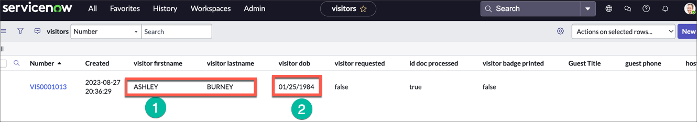

A API externa para a qual criamos anteriormente uma nova ação de spoke não reconhecerá esses valores nesse formato. A API espera o formato como Primeiro Nome, Sobrenome e uma data no formato YYYY-MM-DD.

Agora, vamos criar o fluxo que irá consultar a API para verificar se o usuário tem a autorização necessária para acessar o prédio. Usaremos um Data Transform e nossa nova Spoke Action para isso.

2. Abra o Flow Designer 
   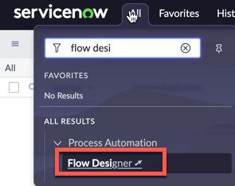


3. Clique em **Create new** (1) e depois em **Flow** (2)
   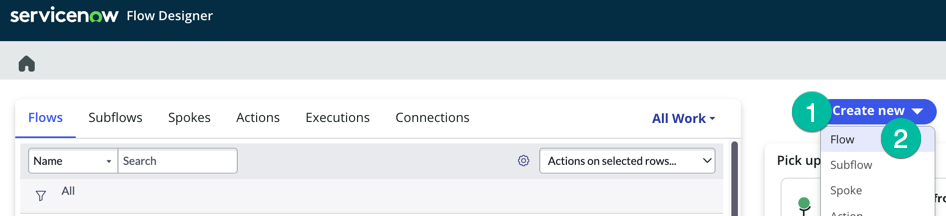


4. Digite o valor **Verify Access Request** no campo **Flow Name** (1) e depois clique em **Submit** (2)
   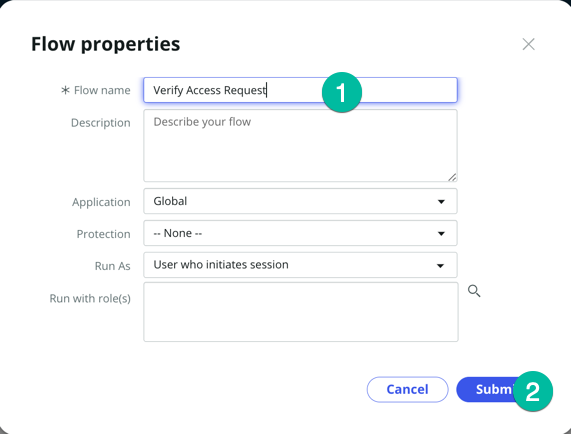


5. Se você receber essa mensagem, clique em **Skip tour** 
   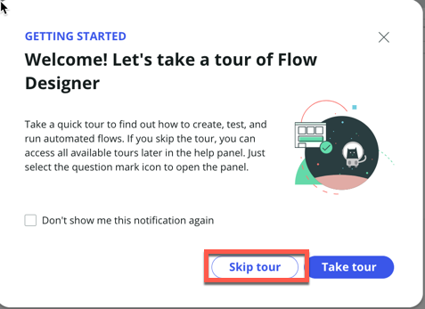


6. Clique em **Add a trigger** (1) para definir a condição que acionará esse fluxo.
   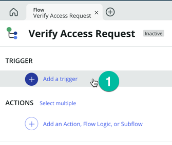


7. Selecione **Record** (1) e depois clique em **Updated** (2). 
   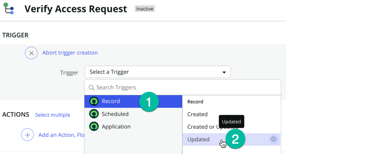


8. Selecione a tabela **visitors** (1) da lista e clique em **Add Filters** (2). Defina a condição conforme mostrado abaixo
   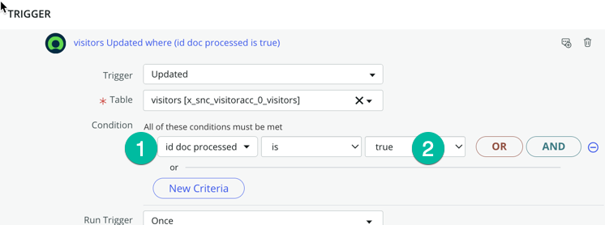

:::note
Com a condição que estamos definindo acima, o fluxo será acionado assim que o DocIntel extrair dados do documento de identidade do visitante e atualizar o registro do visitante associado a esse visitante.
:::

Agora precisamos adicionar ao nosso fluxo a ação de spoke que criamos anteriormente neste laboratório.

9. Na seção **Actions**, clique em **Action** (1), digite **visitor access** (2) e depois selecione **Visitor Access** na lista de **INSTALLED SPOKES** (3) e clique em **Check if a user exists** (4) 
   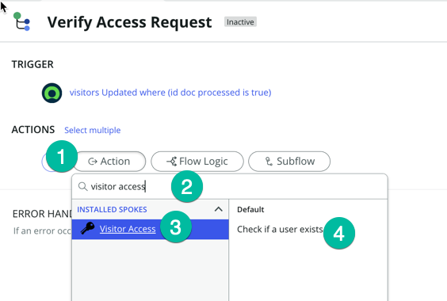


Você deve ver uma tela como a mostrada abaixo

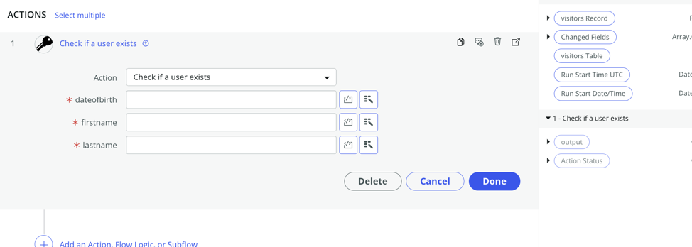

Precisamos passar os dados do registro para essa etapa de Ação.

10. Expanda a seção Visitors Record nos data pills conforme mostrado abaixo: 
   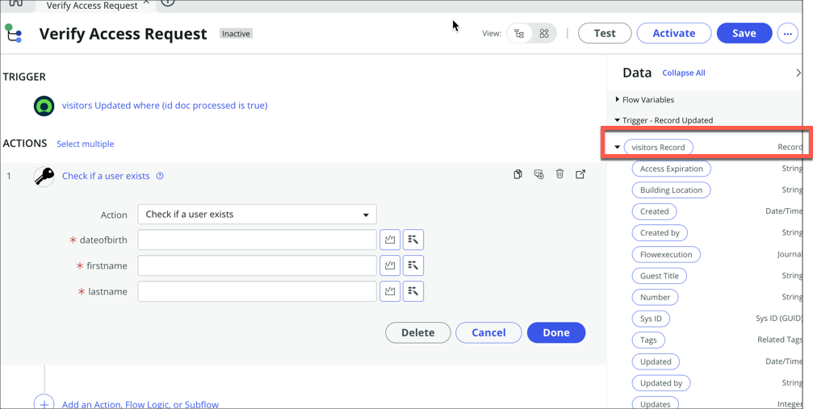


11. Em seguida, role para baixo para ver os campos que precisamos: **visitor dob**, **visitor lastname**, **visitor firstname**.


12. Pegue esses campos de dados e arraste-os para as entradas da nossa ação conforme mostrado abaixo:

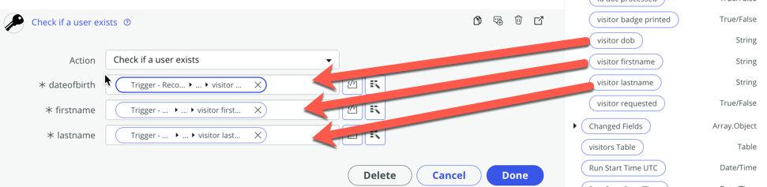

Lembre-se, a API externa não aceitará o formato desses dados. Precisamos aplicar uma transformação de dados para enviar os dados no formato esperado. No Flow Designer, podemos usar 'Transforms' para modificar dinamicamente os dados nos campos.

Vamos começar com a formatação da data de nascimento. Lembre-se de que no registro do ServiceNow, o formato da data é MM/DD/YYYY, mas precisamos enviá-lo para a API no formato YYYY-MM-DD.

13. Se você clicar no valor no campo **dateofbirth**, será exibido um ícone **fx**. Clique nele e depois digite **Replace** (2), em seguida, selecione **Replace String** (3). Com os Transforms, podemos usar uma expressão regular simples para corresponder à string a ser substituída.
   
   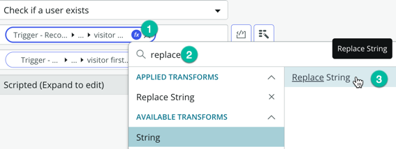


14. No campo **Regex** (1) digite este valor **(\d{2})/(\d{2})/(\d{4})** e no campo **Replace String** (2) digite este valor **$3-$1-$2**
   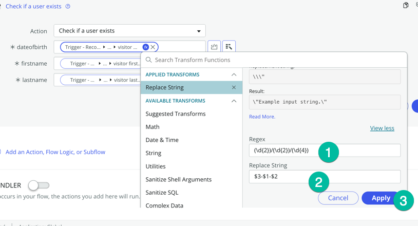

:::tip Leitura adicional, se você estiver interessado em aprender mais sobre expressões regulares, caso contrário, pule isso.

O padrão regex `(\d{2})/(\d{2})/(\d{4})` é usado para corresponder e capturar strings de data no formato MM/DD/YYYY. 

Aqui está o que cada parte do padrão faz:

1. `(\d{2})`: Esta parte captura dois dígitos (0-9) e os coloca entre parênteses para criar um grupo de captura. É usado para corresponder à parte do mês da data (MM). `\d` representa qualquer dígito, e `{2}` especifica que exatamente dois dígitos devem ser correspondidos.


2. `/`: Esta parte corresponde ao caractere barra (/) literalmente. É usado para separar as partes do mês, dia e ano da data.


3. `(\d{2})`: Semelhante à primeira parte, isso captura dois dígitos (0-9) para corresponder à parte do dia da data (DD).


4. `/`: Outra barra para separar o dia e o ano.


5. `(\d{4})`: Isso captura quatro dígitos (0-9) para corresponder à parte do ano da data (YYYY).

Assim, quando você aplica esse padrão regex a uma string, ele captura strings de data no formato MM/DD/YYYY e armazena as partes do mês, dia e ano como grupos de captura separados, permitindo que você extraia e trabalhe com esses componentes individualmente.

No campo de string de substituição digitamos **$3-$1-$2**

$3 refere-se ao conteúdo do grupo de captura 3, que é o ano "2023."
$1 refere-se ao conteúdo do grupo de captura 1, que é o mês "12."
$2 refere-se ao conteúdo do grupo de captura 2, que é o dia "31."

Isso nos permite formatar a data como desejado, embora possa haver outras maneiras de conseguir isso também.

:::

Agora, vamos realizar uma transformação de dados para os campos Primeiro Nome e Sobrenome. Eles chegam em maiúsculas do ServiceNow, mas a API externa espera esses valores com apenas a primeira letra do primeiro nome e a primeira letra do sobrenome em maiúsculas. Portanto, precisamos transformar os dados para torná-los compatíveis. Podemos usar os Transforms existentes para isso, mas queremos introduzir outro método para uma transformação de dados mais avançada. Você pode usar o recurso de script inline no campo para transformar os dados.

15. Ao lado do campo firstname, clique no ícone Toggle Scripting conforme mostrado abaixo 
   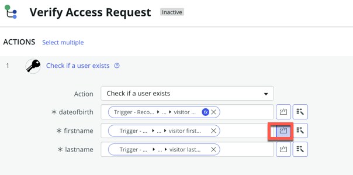

   adicione este código: 
      
      ```js
      // Acesse o valor que você deseja transformar
      var inputString = fd_data.trigger.current.visitor_firstname; // Substitua 'your_field_name' pelo nome real do campo

      // Verifique se o inputString não está vazio
      if (inputString) {
         // Converta a string para
