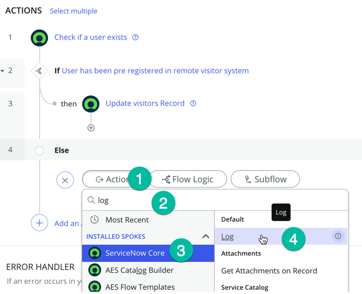

## Visão Geral 

É hora de testar se nossas transformações funcionam.

## Instruções

1. Clique em **Test** para testar seu fluxo
   

2. Escolha um registro da lista (1) e clique em **Run Test** (2)
   

3. Clique em **"Seu teste foi concluído. Veja os detalhes da execução do fluxo"**
   

4. Na seção **TRIGGER**, no lado direito, clique em **Open Current record** para inspecionar os valores desse registro
   

5. Role para baixo para ver os valores de firstname do visitante, lastname do visitante e dob do visitante
   

6. Observe que os valores estão todos em maiúsculas no ServiceNow e a data de nascimento não está no formato que o endpoint da API deseja. Agora vamos ver se nossas transformações funcionaram.

7. Clique no passo **Check if a user exists** (1) para verificar se os valores foram transformados corretamente:
   

8. Se continuar rolando para baixo, você deve ver a saída que contém a resposta do endpoint da API
   

9. Vamos adicionar etapas ao nosso fluxo para atualizar o registro de origem no ServiceNow com os valores recebidos do sistema externo (endpoint da API). Por favor, volte para o fluxo 'Verify Access Request'.

10. Clique em **Add and Action, Flow Logic, or Subflow**
   

11. Queremos incorporar lógica ao fluxo para que, se a API confirmar a existência do usuário (indicando que o visitante foi autorizado e registrado no aplicativo de acesso externo), possamos recuperar a saída da API e atualizar o registro com informações sobre as autorizações do usuário.

12. Adicione uma instrução **IF** clicando em **Flow Logic** (1), depois **If** (2)
   

13. No campo **Condition Label** (1), copie e cole este texto: "User has been pre registered in remote visitor system" para facilitar a compreensão da lógica, e então defina a condição.
   .png>)

14. Na seção **Condition**, clique no ícone **Data pill** (1), selecione **1 - Check if A user Exists** (2), **output** (3), depois **code** (4). Digite o valor **0** (1) e clique em **Done** (2)
   

   Sabemos que quando a API retorna código 0, significa que o usuário foi encontrado no sistema remoto.

15. Agora que a condição está definida corretamente, precisamos adicionar uma etapa para atualizar o registro do usuário no ServiceNow quando atendermos essa condição.

16. Clique na seção **then** conforme mostrado
   

17. Clique em **Action** (1), digite **update record**, e depois clique em **Update record**
   .png>)

18. Arraste o **Visitors Record** (1) do data pill no lado direito e solte no campo **Record** da etapa **Update Record** (2) como mostrado
   

19. Isso deve definir a tabela correta no campo **table** automaticamente conforme mostrado abaixo.
    * Clique em **Add Field value** (1)
    .png>)

    * Depois adicione estes campos:

    | Campo                  | Valor         |
    |------------------------|---------------|
    | Access Expiration      | 1984-01-25    |
    | Building Location      | Ashley        |
    | Guest Title            | Burney        |
    | guest email            | Burney        |
    | host email             | Burney        |
    | host id number         | Burney        |
    | Guest phone            | Burney        |
    | Host name              | Burney        |
    | visitor requested      | Marcado        |

    * Arraste cada valor do data pill no lado direito (Trigger - Record Updated - Visitor Record) para o campo correspondente no registro
    

20. O último campo, **visitor requested**, é do tipo verdadeiro/falso; você só precisa marcar a caixa de seleção conforme mostrado
    

    Com a etapa que acabamos de adicionar, se o usuário for encontrado no sistema de Acesso de Visitantes, então pegamos todas as informações retornadas pela API e atualizamos o registro no ServiceNow com essas informações.

    No caso de o usuário não ser encontrado no sistema de Acesso de Visitantes, apenas queremos registrar um log. Vamos adicionar essa etapa.

21. Adicione uma instrução **Else** ao seu fluxo conforme mostrado, clique em **Add an Action, Flow Logic, or Subflow**, e depois selecione **Flow logic** (1), **Else** (2)
   

22. Adicione o passo **Log** clicando em **Action** (1), depois digite **log** (2), selecione **ServiceNow Core** (3), e depois clique em **Log** (4)
   

23. No campo **Field** (1), copie e cole este valor: "No record in Visitor access app found for that user" e clique em **Done** (2)
   

24. Concluímos a construção do fluxo. Ele deve se parecer com isso:
   

25. É hora de testar. Clique no botão **Test**, selecione um **registro de visitante** (2), e depois clique em **Run Test** (2)

26. Abra os detalhes da execução do fluxo para ver se o registro foi atualizado com os valores da API

27. Se o passo **Update Record** mostrar **Completed**, significa que o registro foi atualizado com sucesso!
   

    Sinta-se à vontade para verificar a tabela de visitantes personalizada para confirmar que o registro foi atualizado com os valores da API:

28. Clique no menu **All** (1) e no navegador de filtros (2) digite **x_snc_visitoracc_0_visitors_list.do** e pressione Enter para abrir a tabela personalizada.
   

29. Todos os campos no registro de visitante que você usou para seu teste devem agora estar atualizados
   .png>)

## Recapitulando 

Parabéns, você aprendeu a transformar dados antes de enviá-los por meio de um spoke personalizado!
