## Visão Geral

Neste exercício, você criará um Spoke personalizado no Integration Hub.

## Instruções

1. Faça login na sua instância e, na página principal, clique em **All** (1). Em seguida, digite **flow** (2) e clique em **Flow Designer** (3) para abrir a interface do Flow Designer.
   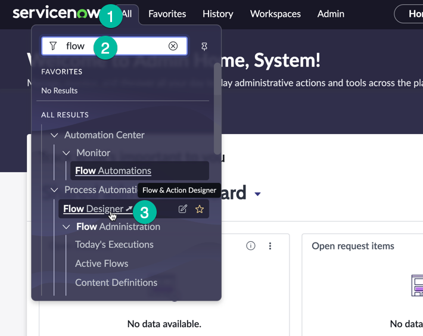

2. Uma vez na interface do **Flow Designer**, para acessar o Spoke Generator, selecione **Create New** (1) (localizado no lado direito da tela) e depois clique em **Spoke**.
   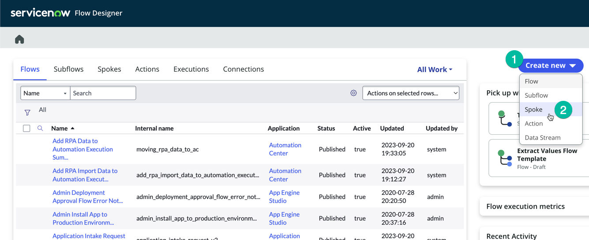

3. O Spoke Generator solicitará as seguintes informações: uma imagem em miniatura (1) (você pode fazer upload de uma imagem em miniatura para servir como logo do seu Spoke; sinta-se à vontade para encontrar uma imagem gratuita no Google Imagens e fazer o upload aqui), um Nome do Spoke (2) e uma Descrição (4).

   | Campo         | Valor                                                        |
   |---------------|--------------------------------------------------------------|
   | Nome do Spoke | Visitor Access                                              |
   | Nome do Escopo do App | Este campo é gerado automaticamente a partir do Nome do Spoke |
   | Descrição     | Este spoke será usado para verificar se o visitante está registrado no aplicativo de Acesso de Visitantes |
   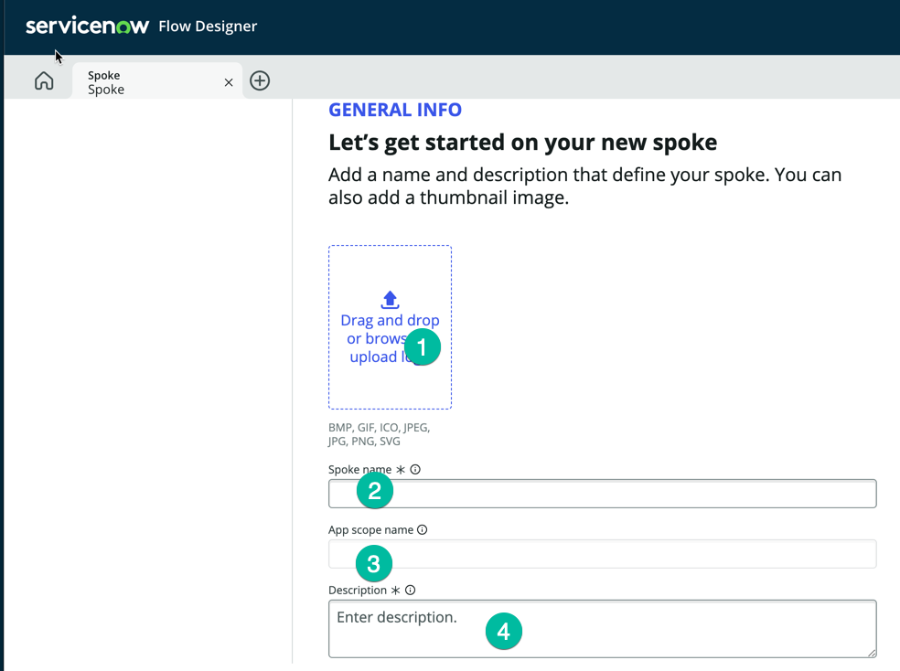

4. Depois de definir o valor, clique em **Create and Continue** (1) como mostrado abaixo:
   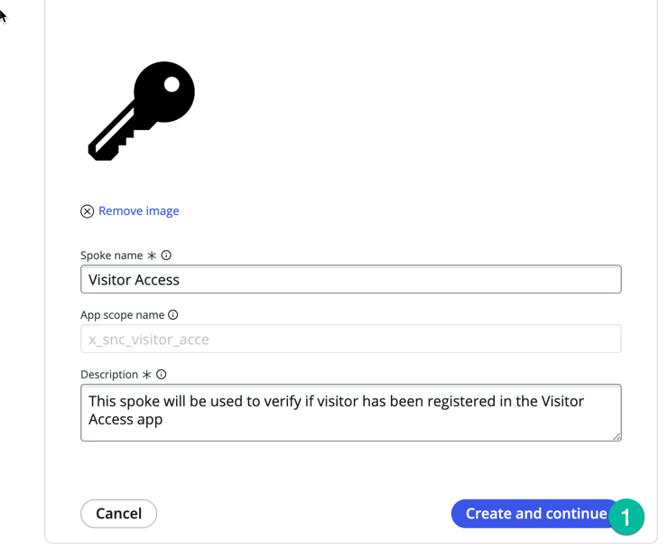

5. Na tela seguinte, você será solicitado a selecionar o método que deseja usar para criar seu novo spoke. Pretendemos utilizar o método OpenAPI Specification, já que temos o arquivo YAML que descreve a API e segue a Especificação OPENAPI.
   * Selecione **OpenAPI Specification** (1) e clique em **Continue** (2)
   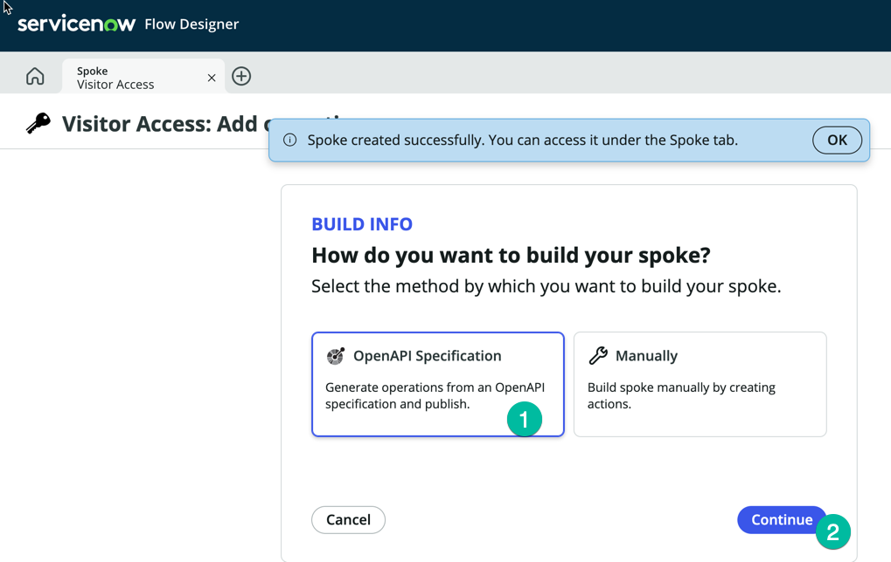

6. Na próxima tela, **Visitor Access: Add operations**, você pode fornecer o arquivo YAML. Clique em **Import New** (1), e depois forneça a URL do arquivo YAML, copie a URL do link aqui [Swagger YAML File](./swagger.yaml).
   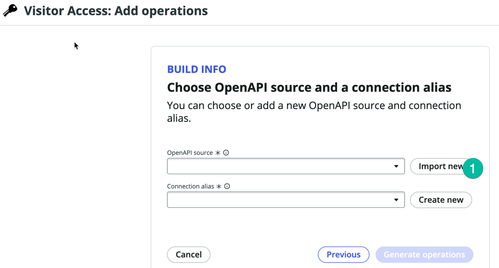

7. Cole a URL copiada na etapa anterior no campo **OpenAPI URL** (1), e depois clique em **Import** (2)
   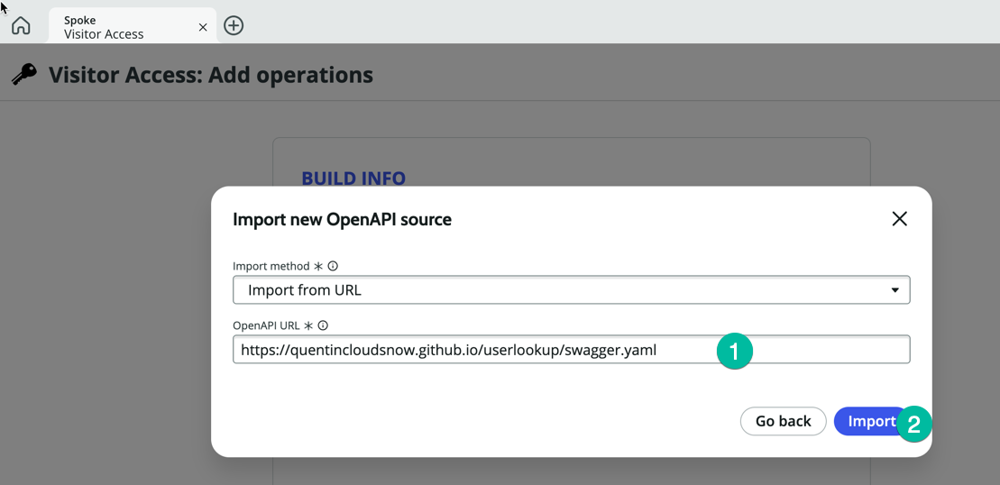

8. Após a importação, você deve ver algo semelhante a isto:
   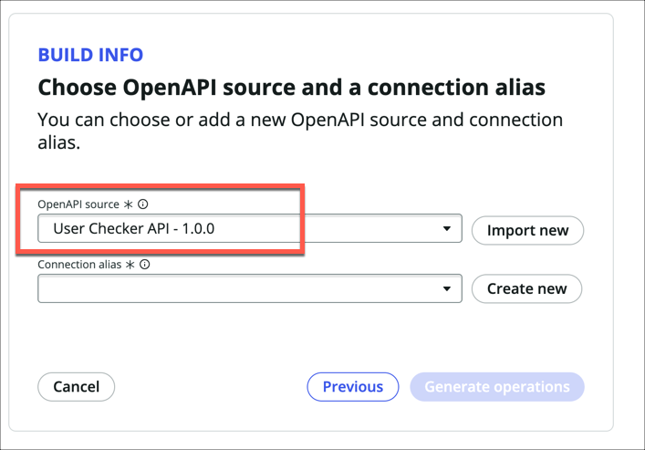

9. Em seguida, clique em **Create New** ao lado do campo **Connection Alias** (1)
   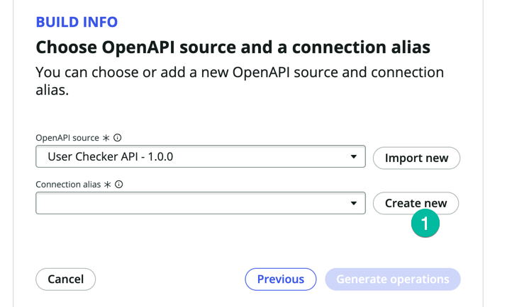
   :::note
   No ServiceNow, um Connection Alias é uma configuração usada para estabelecer e gerenciar conexões com sistemas externos. Funciona como uma camada de abstração para conectar a sistemas externos e simplifica o processo de integração dentro dos fluxos de trabalho e outros componentes do ServiceNow. Normalmente, ao conectar o ServiceNow a um sistema externo, você deve configurar a URL do endpoint (o sistema de terceiros) e especificar como autenticar com ele. Isso é feito através das configurações de Conexão e Credenciais no ServiceNow. Na prática, é essencial discutir com o administrador do sistema remoto e coordenar com a equipe de segurança antes de iniciar essa configuração.
   :::

10. No campo **Connection alias name** (1) digite **VisitorAppConnection** e mantenha o **Authentication Configuration Template** com o valor padrão **Api Key Template** (2), depois clique em **Create** (3)
    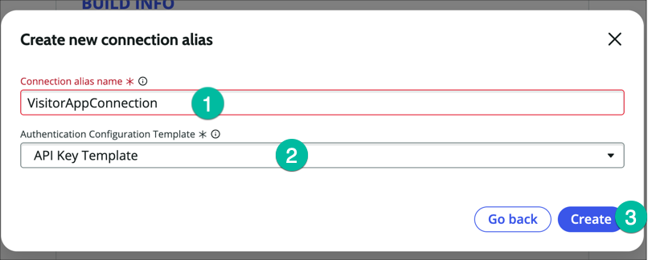

11. Clique em **Generate operation** (1)
    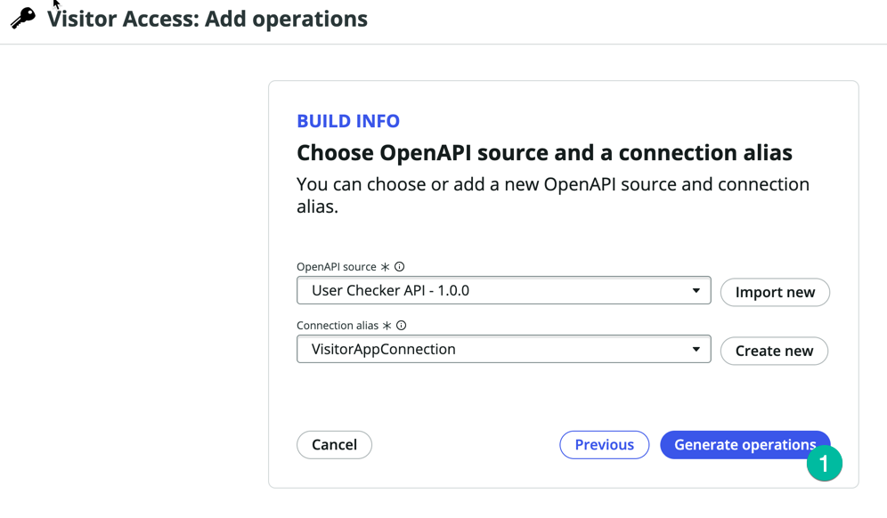

12. O sistema solicitará que você selecione qual Spoke Action deseja criar, como mostrado abaixo:
    
    :::note
    Para este laboratório, estamos utilizando uma API muito básica projetada especificamente para fins de laboratório e educativos. Esta API consiste em apenas um método, por isso apenas uma ação está visível. Em cenários do mundo real, a maioria das aplicações comerciais que você tenta integrar terá dezenas ou até centenas de métodos em sua API. Você terá a opção de escolher os métodos que deseja utilizar do ServiceNow e criar Spoke Actions para eles.
    :::

13. Selecione a Ação **Check if a user exists** (1) e depois clique em **Publish** (2)
    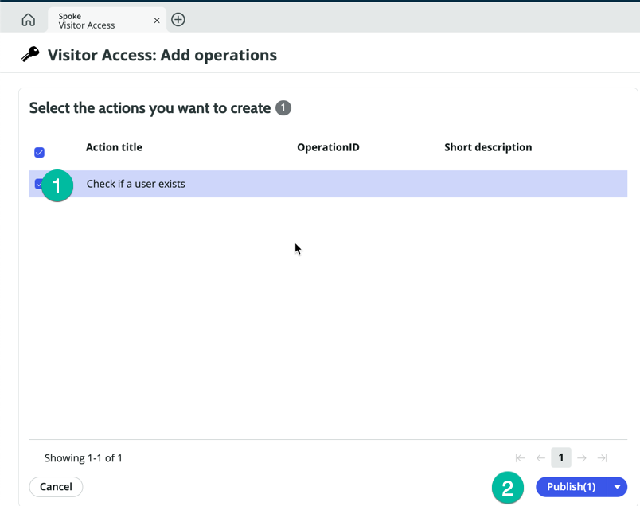

14. Clique na Spoke Action recém-criada **Check if a user exists** (1), isso abrirá o editor de Ação no Flow Designer para que possamos inspecioná-la
    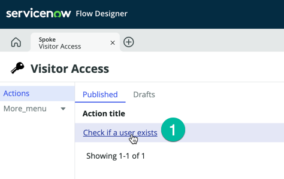

15. Observe a seção de Entrada da Ação, as Entradas para essa Spoke Action foram criadas automaticamente
    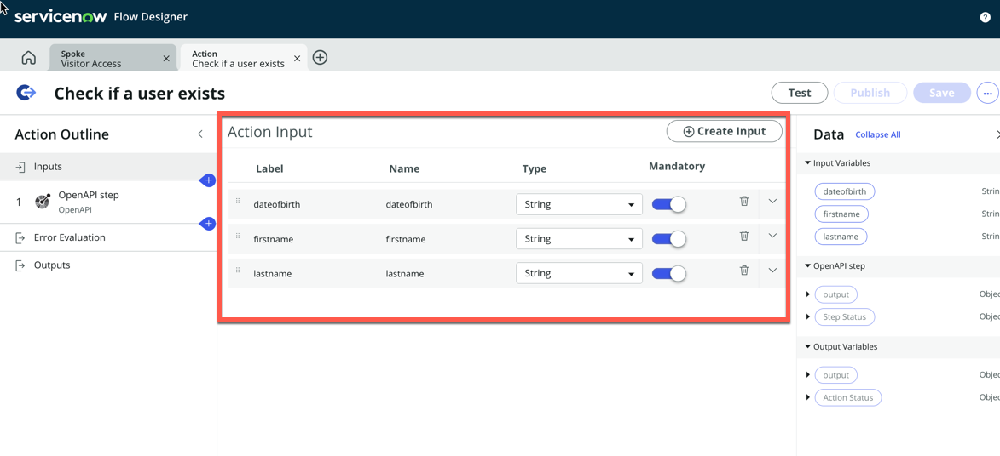

16. Clique no OpenAPI Step (1)
    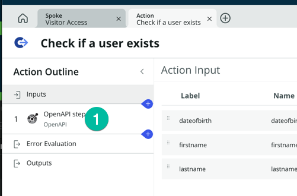

17. Observe os inputs da etapa, eles estão usando as Entradas da Ação, então os valores das Entradas da Ação serão passados como parâmetros quando a chamada API for feita ao sistema externo.
    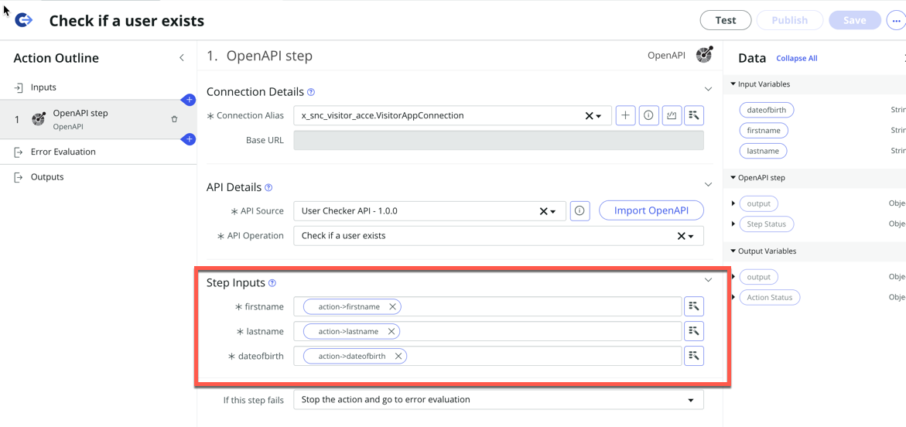

18. Precisamos atualizar o Connection Alias na seção de Detalhes da Conexão. Nós pré-criamos nesta instância de laboratório um registro de Conexão que aponta para o endpoint da API correto. Vamos usar este.

19. Clique no campo **Connection Alias** (1) e selecione **VisitorAccess_ConnectionAlias** (2)
    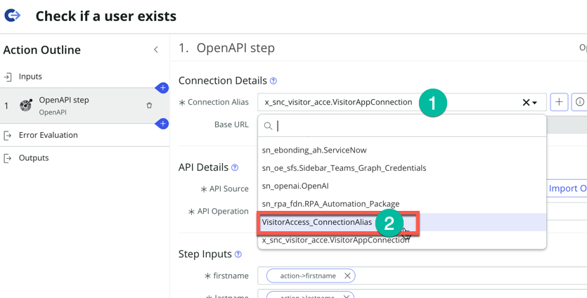

20. Observe que o campo **Base URL** foi atualizado e exibe a URL do endpoint da API. Esses registros de connection alias são normalmente gerenciados pela equipe de Segurança ou por usuários com privilégios mais elevados.
    * No lado direito, observe os outputs disponíveis do OpenAPI Step, expanda a seção **user** (1) como mostrado abaixo:
    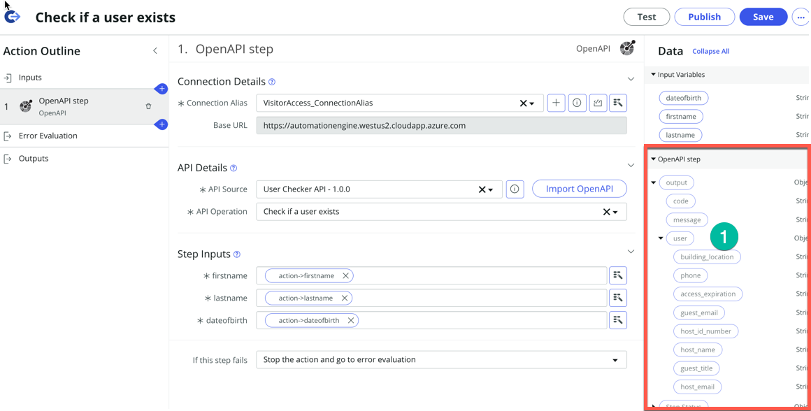
    Esses são todos os valores que podemos recuperar do aplicativo externo e usar em um Workflow do ServiceNow.
