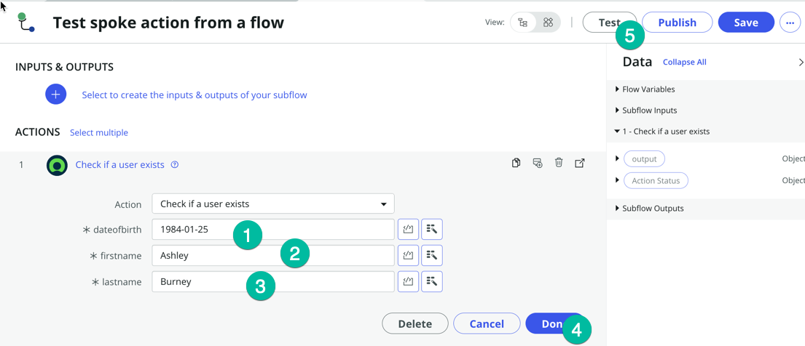
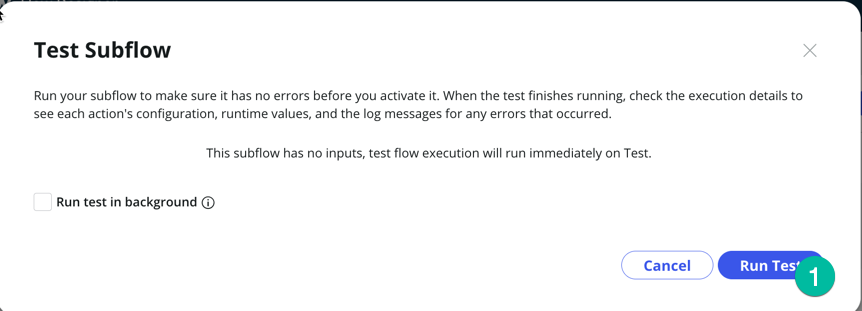
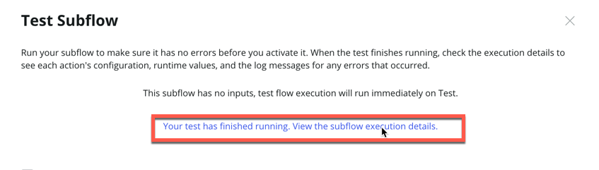

## Visão Geral

Nesta atividade, você testará o novo spoke.

## Instruções

1. É hora de testar a Spoke Action! Clique no botão **Test** 
   

2. Você será solicitado a inserir algumas informações do usuário, **dateofbirth** (1), **firstname** (2), **lastname** (3). Por favor, use os seguintes valores:
    * Depois clique em **Run Test** (4)

    | Campo        | Valor     |
    |--------------|-----------|
    | dateofbirth  | 1984-01-25|
    | firstname    | Ashley    |
    | lastname     | Burney    |

   

   :::note
   Normalmente, esses valores serão passados para a ação via um Workflow. Estamos apenas testando a ação manualmente agora.
   :::

3. Após a execução da ação, clique em **Your test has finished running. View the Action execution details** (1) para inspecionar a resposta que recebemos do sistema externo.
   

4. Na página **Execution Details**, role para baixo até ver a seção **ouput Data** e clique no detalhe da saída (1)
   .png>)
   Você deve ver uma tela semelhante a esta. Observe a resposta retornada pela API. Ela contém o código de retorno, a mensagem e informações adicionais do usuário. Nossa nova Spoke Action funciona!

5. Antes de prosseguir para a próxima etapa, em sua nova Ação, certifique-se de clicar em "Save" (1) e depois em "Publish" (2) para garantir que a Ação seja salva e inclua a atualização que adicionamos ao fluxo (alterando o Connection Alias).
   

### Agora vamos usar essa Spoke Action em um fluxo!

6. Clique no botão Home para retornar à página principal do Flow Designer
   

### Nos passos seguintes, queremos apenas mostrar como um construtor pode consumir/utilizar a nova Spoke Action que criamos.

27. Clique em **Create New** (1) e depois em **Subflow** (2)
   

28. Insira um **Subflow name** (coloque o nome que desejar) e clique em **submit** (deixe todos os outros campos com os valores padrão)
   :::note
   Normalmente, um construtor criaria um novo fluxo ou subfluxo em seu próprio Application Scope, mas para um teste rápido em uma instância de laboratório, não importa, podemos salvá-lo no escopo Global.
   :::
   

29. Uma nova aba será aberta para o seu novo subfluxo, em **ACTIONS** clique em **Add an Action, Flow Logic or Subflow** (1)
   

30. Selecione Ação e depois digite **Visit**, isso deve exibir seu novo spoke **Visitor Access** (2), clique nele e depois na ação **Check if a user exists** (3)
   

31. Agora podemos passar os valores para a ação. Aqui vamos definir valores manualmente apenas para fins de teste, normalmente buscaríamos um registro no ServiceNow e passariamos os valores desse registro para a ação. Vamos cobrir isso em detalhe na seção opcional do laboratório.

   | Campo        | Valor     |
   |--------------|-----------|
   | dateofbirth  | 1984-01-25|
   | firstname    | Ashley    |
   | lastname     | Burney    |

32. Usando os valores da tabela acima, defina **dateofbirth** (1), **firstname** (2), **lastname** (3), depois clique em **Done** (4) e clique no botão **Test**. 
   
   Depois clique em **Run Test** (1) 
   

33. Clique em **Your Test has finished running, View the subflow execution details** 
   

## Recapitulando

Neste laboratório, aprendemos como criar um novo Spoke usando o Spoke Generator, permitindo integrar o ServiceNow com um aplicativo externo que possui uma API utilizável. Na seção opcional deste laboratório, abordaremos conceitos mais avançados do Flow Designer/Ihub e demonstraremos como utilizar o valor recuperado da Spoke Action para atualizar um registro no ServiceNow.

:::note
Com o Spoke Generator, você não precisa mais configurar manualmente o REST Step e o JSON Parser Step; a Spoke Action gerada pelo Spoke Generator lida com isso automaticamente para você.
:::
