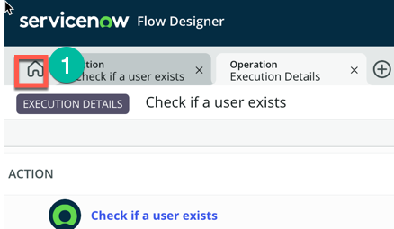
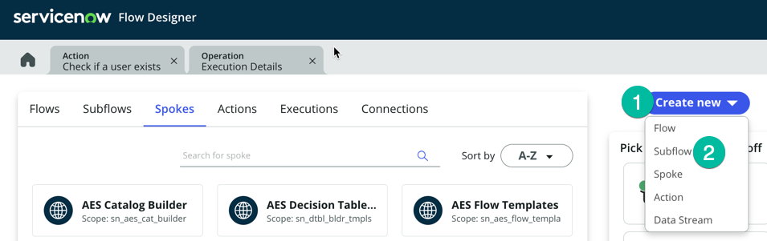
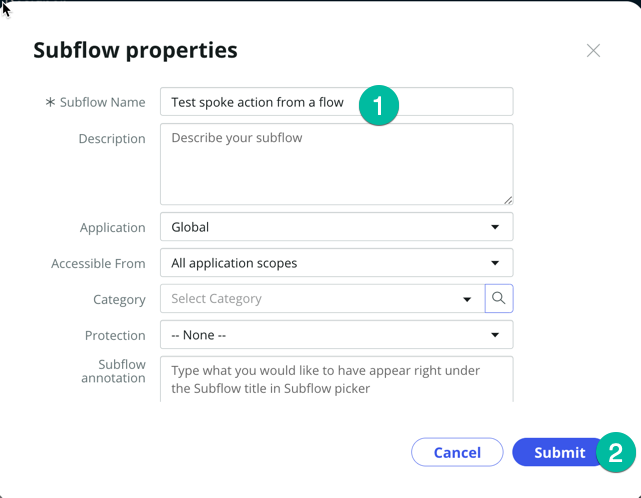
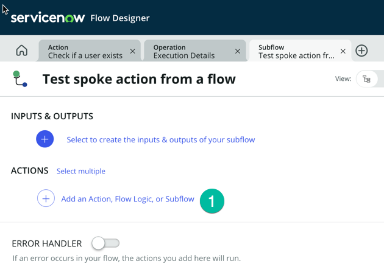
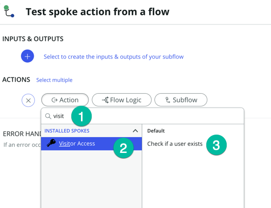
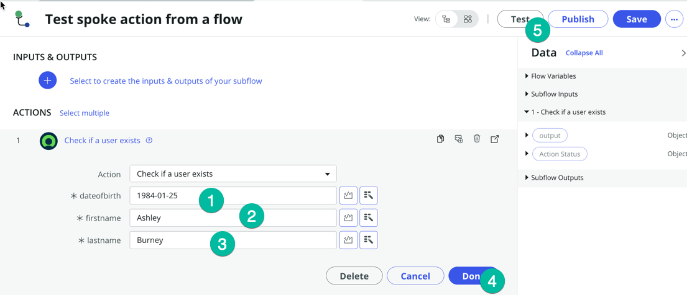
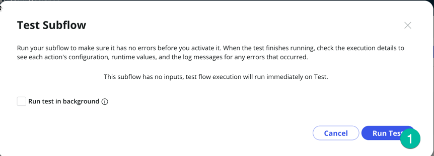

## Visão Geral

Nesta atividade, você usará o novo Spoke em um Fluxo.

## Instruções

1. Clique no botão Home para retornar à página principal do Flow Designer
   

### Nos passos seguintes, queremos apenas mostrar como um construtor pode consumir/utilizar a nova Spoke Action que criamos.

2. Clique em **Create New** (1) e depois em **Subflow** (2)
   

3. Insira um **Subflow name** (coloque o nome que desejar) e clique em **submit** (deixe todos os outros campos com os valores padrão)
   :::note
   Normalmente, um construtor criaria um novo fluxo ou subfluxo em seu próprio Application Scope, mas para um teste rápido em uma instância de laboratório, não importa, podemos salvá-lo no escopo Global.
   :::
   

4. Uma nova aba será aberta para o seu novo subfluxo. Em **ACTIONS** clique em **Add an Action, Flow Logic or Subflow** (1)
   

5. Selecione Ação e depois digite **Visit**, isso deve exibir seu novo spoke **Visitor Access** (2). Clique nele e depois na ação **Check if a user exists** (3)
   

6. Agora podemos passar os valores para a ação. Aqui vamos definir valores manualmente apenas para fins de teste; normalmente buscaríamos um registro no ServiceNow e passaríamos os valores desse registro para a ação. Vamos cobrir isso em detalhe na seção opcional do laboratório.

    | Campo        | Valor     |
    |--------------|-----------|
    | dateofbirth  | 1984-01-25|
    | firstname    | Ashley    |
    | lastname     | Burney    |

    Usando os valores da tabela acima, defina **dateofbirth** (1), **firstname** (2), **lastname** (3) e depois clique em **Done** (4) e no botão **Test**. 
    

7. Em seguida, clique em **Run Test** (1) 
    

8. Clique em **Your Test has finished running, View the subflow execution details** 
    

## Recapitulando

Neste laboratório, aprendemos como criar um novo Spoke usando o Spoke Generator, permitindo integrar o ServiceNow com um aplicativo externo que possui uma API utilizável. Na seção opcional deste laboratório, abordaremos conceitos mais avançados do Flow Designer/Ihub e demonstraremos como utilizar o valor recuperado da Spoke Action para atualizar um registro no ServiceNow.

:::note
Com o Spoke Generator, você não precisa mais configurar manualmente o REST Step e o JSON Parser Step; a Spoke Action gerada pelo Spoke Generator lida com isso automaticamente para você.
:::
