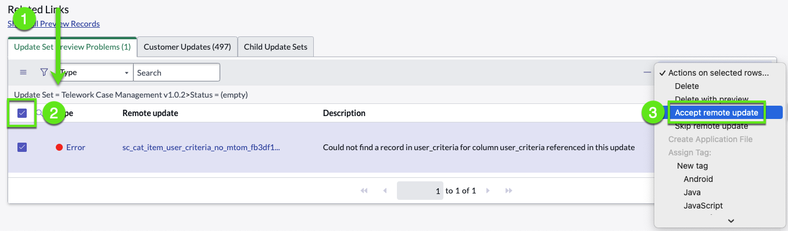
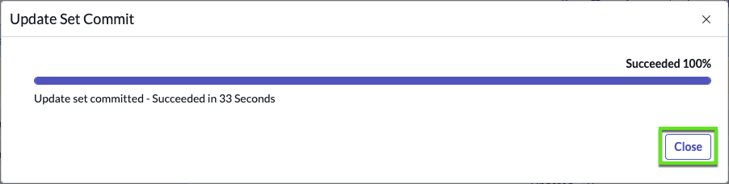
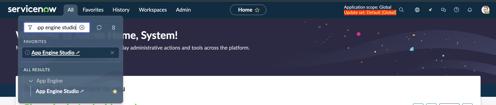
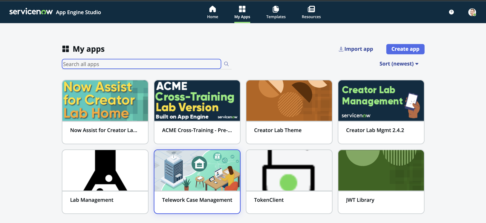
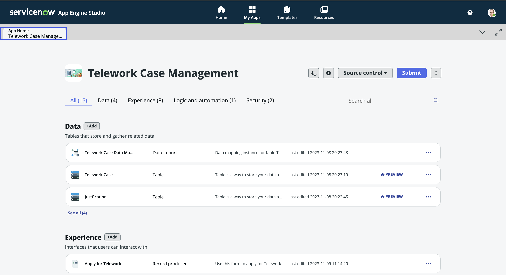

Neste exercício, aprenderemos como importar um aplicativo com escopo existente usando um Update Set ou um arquivo XML. Este aplicativo foi criado no laboratório 101, Gerenciamento de Casos de Teletrabalho.

## Passos para Importar o Aplicativo  

>1. Vá para All > 'Retrieved Update Sets'  

>2. Role até 'Related Links' e clique em 'Import Update Set from XML'  

>3. Faça o Upload do Update Set  

>4. Encontre o registro que você acabou de importar: Estado = 'Loaded'  

>5. Visualizar Update Set  

>6. Aceitar/Pular Atualizações Remotas  

>7. Confirmar Update Set  
    
## Aqui estão esses passos em detalhes: 

# Passo 1 - Vá para 'Retrieved Update Sets'  

>1. Vá para All  

>2. Em seguida, sob 'System Update Sets', vá para: **Retrieved Update Sets**  
  

# Passo 2 - Importar Update Set

>1. Role até o final da lista

>2. Clique no link relacionado: **Import Update Set from XML**
  

# Passo 3 - Fazer o Upload do Update Set  

>1. Clique em 'Choose File'

>2. Encontre e escolha o arquivo que você baixou anteriormente "Telework Case Management...xml"
  

>3. Clique em 'Upload'
  

# Passo 4 - Encontrar o registro Estado = 'Loaded'

>1. Clique com o botão direito em 'Committed' (qualquer registro)

>2. Escolha "Filter Out"  
  

>3. Clique no update set recuperado "Telework Case Management..."  
  

# Passo 5 - Visualizar Update Set  

>1. Clique em 'Preview Update Set'  
  

>2. Acompanhe a barra de progresso...até 100%

>3. Clique em 'Close' (podem haver erros, então está ok se disser 'Failed')  
  

# Passo 6: Se houver erros. Se não houver erros, vá para o Passo 7  

**Para mais informações sobre update sets e uso das diferentes opções, aqui estão alguns links úteis:**

[ServiceNow Update Sets](https://docs.servicenow.com/bundle/vancouver-application-development/page/build/system-update-sets/concept/system-update-sets.html)  
[Guia Completo de Update Sets](https://www.servicenowelite.com/blog/2016/8/7/update-sets)  

>1. Role até as listas relacionadas

>2. Selecione 'All' os registros em 'Update Set Preview Problems'

>3. Expanda a caixa de opções 'Actions on selected rows'

>4. Clique em 'Accept Remote Update'

# Passo 7 - Confirmar Update Set    

>1. Clique em 'Commit Update Set'
  

>2. Clique em **Close**
  

>3. Agora você deve ver que o aplicativo foi importado com sucesso:  
  

# Passo 8 - Abrir o App Engine Studio    

>1. Clique no logotipo do ServiceNow para ir para a página inicial
  

>2. Navegue até o AES em All > App Engine Studio

>3. Busque a aplicação "Telework Case Management" em My Apps

>4. Verifique a estrutura da aplicação.

**Parabéns!**

Você concluiu a importação do aplicativo de Gerenciamento de Casos de Teletrabalho.

Continue no App Engine Studio para encontrar seu aplicativo - Gerenciamento de Casos de Teletrabalho.
