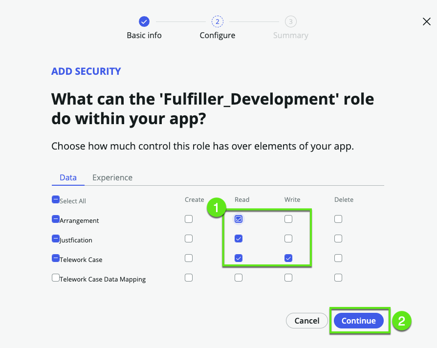
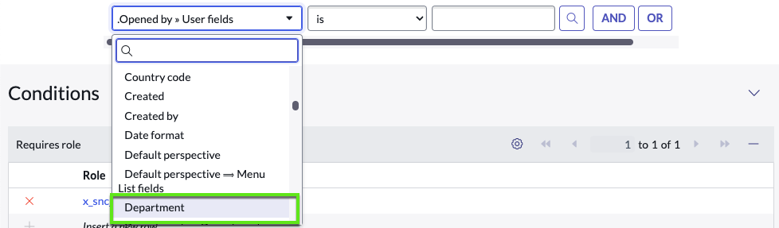

# Visão Geral

Amanda implementou com sucesso seu aplicativo para sua equipe, e ele chamou a atenção de outra equipe que também deseja usá-lo. Uma condição principal é manter a privacidade dos registros entre as duas equipes.

Neste exercício, vamos compartimentalizar os casos de teletrabalho para os usuários do departamento de Desenvolvimento e para os usuários da equipe de Suporte ao Cliente.  

Vamos configurar isso definindo:

>1. Um papel de "fulfiller" para cada equipe: Fulfiller_Development e Fulfiller_Customer_Support 

>2. Em seguida, definiremos controles de acesso específicos para cada um.

>3. No final, uma equipe terá visibilidade apenas sobre solicitações dos usuários do departamento de Desenvolvimento, enquanto a outra equipe terá acesso apenas às solicitações dos usuários do departamento de Suporte ao Cliente. 

Isso garantirá que ambas as equipes possam usar o aplicativo mantendo a separação e privacidade necessárias dos dados.

Vamos começar.

Desenvolvedores cidadãos como Amanda precisam de privilégios especiais para configurar controles de acesso, então Amanda vai solicitar...

## Ajuda dos Administradores do App Engine

1.	Conecte-se como Admin

2. Elevar para Security Admin

    | Passos                                              | 
    |---------------------------------------|------------------------|
    |➊| No canto superior direito, clique no **Avatar**  |
    |➋| Selecione **Elevate role**    |
    |➌| Marque [✔] security_admin   |
    |➍| Clique em Update.   |

    

3. Vá para **App Engine Studio > Security**

    | **Passos**                                              | 
    |---------------------------------------|------------------------|
    |➊| No AES, clique em **More**  |
    |➋| Clique em **Security**    |
    |➌| Clique em **Add**   |

    

:::info
Quando Amanda criou o aplicativo, ele era apenas para uma equipe e ter um único papel de usuário era suficiente.
Agora que precisamos abrir o aplicativo para outra equipe, precisamos de papéis mais específicos para garantir a segurança adequada.
:::

4. Crie o papel **Fulfiller_Development**

    | **Passos**                                              | 
    |---------------------------------------|------------------------|
    |➊| Clique em **build a new role**  |
    |➋| Clique em Continue.   |

    

5. Dê um nome e descrição ao papel.

    | **Passos**                                             | 
    |-------------|-----------------------------------------|
    | Name        | Fulfiller_Development                   |
    | Description | Fulfiller in the Development department |

    

6. Dê ao papel as permissões desejadas

    

7. **Sucesso**

    Clique em Done.

    

7. Repita os passos 4 a 7 para criar o papel **Fulfiller_Customer_Support**

    | **Passos**                                                  | 
    |-------------|----------------------------------------------|
    | Name        | Fulfiller_Customer_Support                   |
    | Description | Fulfiller in the Customer Support department |

8. Você deve ver os dois novos papéis no aplicativo

    

## Refinar os controles de acesso 

1. **Navegar até a Lista de Controle de Acesso (ACL)**
    

2. **Filtrar a lista de registros**

    | **Filtro**                                     | 
    |-------------|---------------------------------|
    |➊| Defina o filtro conforme mostrado abaixo |
    |➋| Clique em **Run**    |
    |➌| Clique em **Updated by** para obter o ACL do administrador no topo   |
    |➍| Abra o primeiro registro  |

    

3. Revise o ACL 

4. Defina a condição: Aberto por alguém no departamento de Desenvolvimento

    1. Clique no campo de condição, role para baixo para selecionar **Show related fields**

        

    2. Selecione "Opened by ⟹ User fields"

        

    3. Clique novamente no campo e agora podemos ver os campos dentro do Opened by

        

    4. Role para baixo e selecione **department**

        
    
    5. Clique novamente no campo e depois selecione **Opened by Department**

        

    6. Finalmente defina o valor da condição como **Development**

        

    7. Salve o registro

        

    8. Observe que o ServiceNow gerou uma descrição

        

    9. Para garantir o acesso aos dados, vamos revisar os outros ACL do nosso trabalho 

        Precisamos excluir qualquer ACL que não tenha nenhuma restrição

        

         
## Atribuir o papel a Abel

### Abrir o usuário Abel

1. Vá para a lista de usuários

    | Passos                                              | 
    |---------------------------------------|------------------------|
    |➊| Clique no menu **All**  | 
    |➋| Pesquise por **Users**    |
    |➌| Clique em **Users**      |

    

2. Abra o usuário **Abel**

    

3. Clique em **Edit** Roles

    

4. Conceda a Abel o papel de usuário de teletrabalho

    

## Vamos testar

1. Vá para o App Engine Studio

2. Visualize a tabela de casos de teletrabalho

    

3. Observe que podemos ver todos os registros

    

4. Volte para a visão de admin e Importe **Abel**

    

5. Volte para a lista de casos de teletrabalho e observe que podemos ver todos os registros

    
