# Create People Finder Spoke

:::info  
**PULE ESTA SESSÃO CASO VOCÊ JÁ TENHA REALIZADO A ATIVIDADE BÔNUS DO LAB CASOS DE TELETRABALHO NÍVEL 1.**
:::

Um *spoke* é um aplicativo escopado contendo conteúdo do Flow Designer dedicado a um aplicativo ou tipo de registro específico. Isso inclui integrações que conectam sistemas ou serviços externos com a plataforma ServiceNow. Ao utilizar *spokes*, as organizações podem estender as capacidades de sua instância ServiceNow e integrá-la com uma ampla gama de ferramentas e serviços externos, melhorando a automação, colaboração e eficiência em suas operações de TI e processos de negócios.

[Clique aqui para saber mais sobre Spokes.](https://docs.servicenow.com/bundle/vancouver-build-workflows/page/administer/flow-designer/concept/spokes.html)

O Spoke Generator permite aos usuários criar *spokes* personalizados para integrar o ServiceNow com sistemas ou serviços externos. Ele fornece uma interface gráfica e um conjunto de ferramentas para simplificar o processo de construção, configuração e implantação de *spokes* adaptados a cenários específicos de integração.

[Clique aqui para saber mais sobre Spoke Generator.](https://docs.servicenow.com/bundle/vancouver-build-workflows/page/administer/flow-designer/concept/spoke-builder.html)

Vamos criar uma integração reutilizável com a Open API de People Finder do departamento financeiro, para que possamos acessar esses dados em nosso fluxo principal.

## Abrir o Flow Designer para usar o Spoke Generator para criar a Integração People Finder

1. Vá para a guia com a Página Inicial do Admin do ServiceNow (seu título pode ser diferente).  
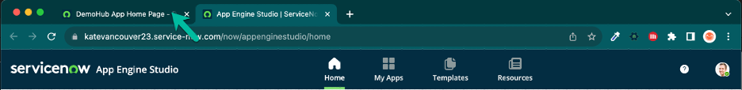

2. Abra o Flow Designer no menu All

   >1. Clique no menu **All**
    
   >2. Procure por "flow designer"
    
   >3. Clique em: Process Automation > Flow Designer  
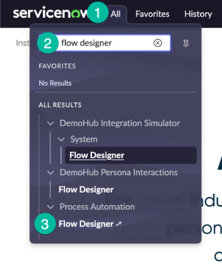

3. Crie um Novo Spoke

   >1. Clique em Create new ▼
   
   >2. Clique em "Spoke"  
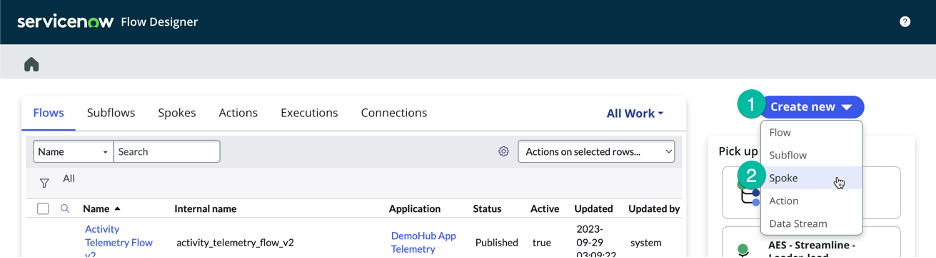

4. Configure as Informações Gerais para o Spoke (💡 clique duas vezes para selecionar, copiar e colar no formulário).

   | |Nome do Campo                | Valor do Campo
   |-|------------------------------| --------------
   |➊|Arraste e solte o ícone na pasta de arquivos telework_lab que baixamos anteriormente | people_finder.png
   |➋|Spoke Name (App scope name will auto-populate) | People Finder
   |➌|Description | API to find people in a remote system
   |➍|Clique no botão Create and continue.  

5. Especifique como queremos construir nosso Spoke

   >1. Selecione OpenAPI Specification

   >2. Clique em Continue
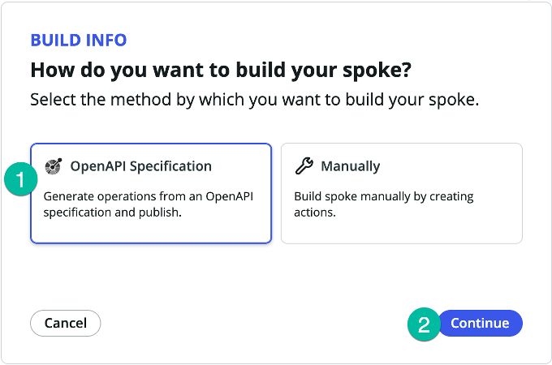

6. Para a origem OpenAPI, clique em Import new  
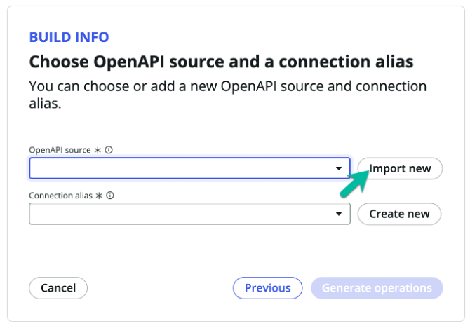

7. Preencha o formulário com os seguintes valores (💡 clique duas vezes para selecionar, copiar e colar no formulário).

   | |Nome do Campo                | Valor do Campo
   |-|------------------------------| --------------
   |➊|Import method | Import from URL
   |➋|OpenAPI URL | https://low-code.guide/api-specs.json
   |➌|Clique no botão Import.  
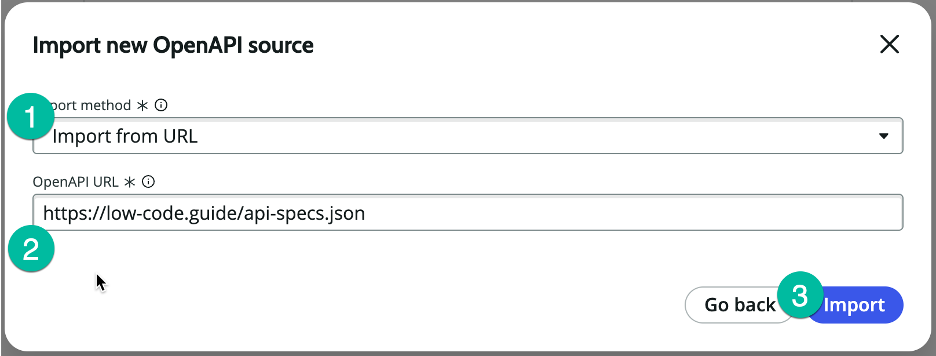

1. Para o alias de conexão, clique em Create new  
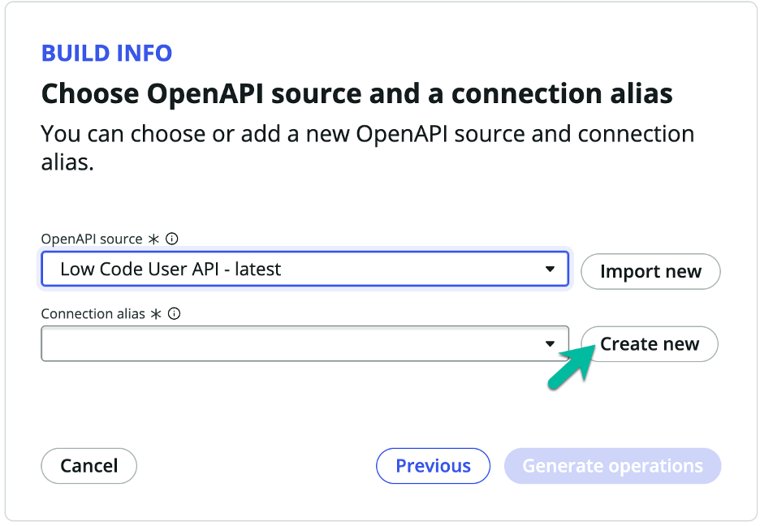

1. Preencha o formulário com os seguintes valores (💡 clique duas vezes para selecionar, copiar e colar no formulário).

   | |Nome do Campo                | Valor do Campo
   |-|------------------------------| --------------
   |➊|Connection & Credential alias name | People Finder
   |➋|Configuration Template for authentication | API Key Template
   |➌|Clique no botão Create alias and continue.  
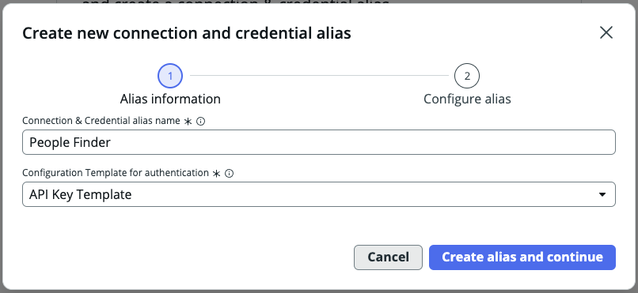

1. Preencha o formulário com os seguintes valores (💡 clique duas vezes para selecionar, copiar e colar no formulário).

   | |Nome do Campo                | Valor do Campo
   |-|------------------------------| --------------
   |➊|Connection Name | People Finder
   |➋|Connection URL | https://low-code.guide/api
   |➌|API Key | appkey
   |➍|Clique no botão Submit.  
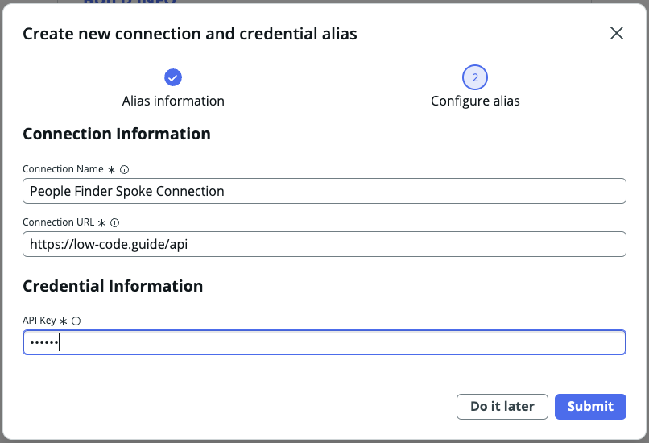

2.  Para continuar, clique no botão Generate operations  

1.  Selecione as ações que deseja criar

   >1. Selecione todas as ações

   >2. Clique no botão Publish(1) | ▼  
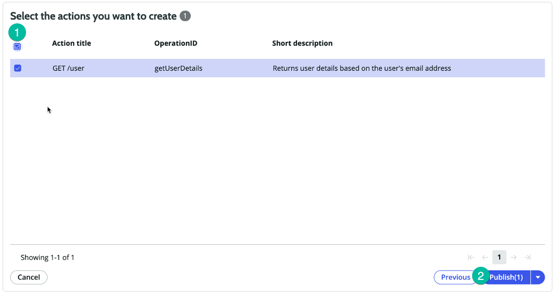

1.  Clique no link "GET /user" para visualizar a ação que acabamos de criar  
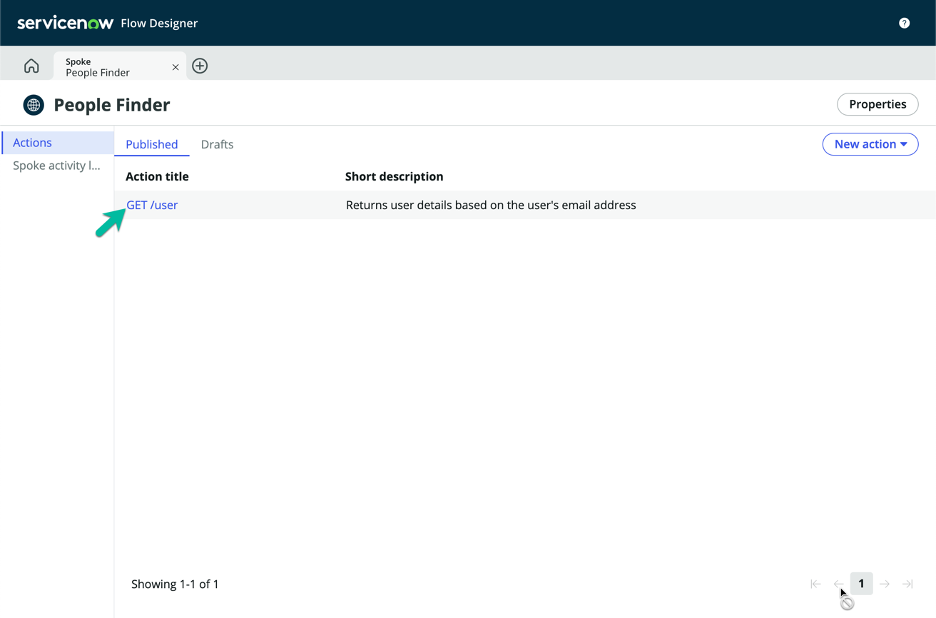

1.  Antes de podermos testar e usar nosso spoke, precisamos definir a URL Base para a Conexão.

   >Clique para expandir a etapa OpenAPI  
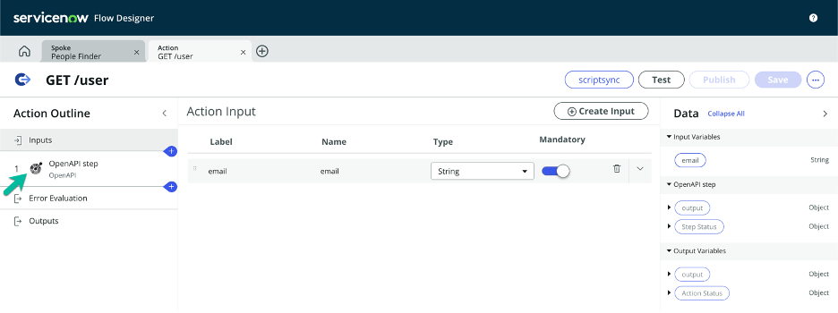

1.  Clique no botão Test  
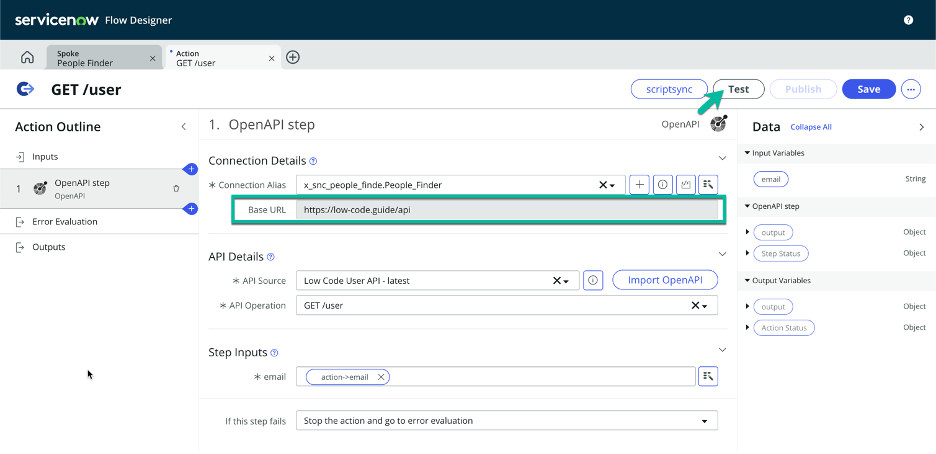

1.  Teste a ação com o e-mail de David Loo (💡 clique duas vezes para selecionar, copiar e colar no formulário).

   | |Nome do Campo                | Valor do Campo
   |-|------------------------------| --------------
   |➊|email | david.loo@example.com
   |➋|Clique no botão Run Test.  
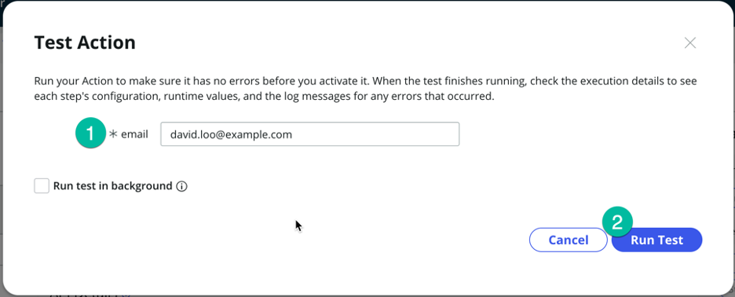

1.  Quando o teste for concluído, clique no link para visualizar os resultados da execução  

1.  Clique no link RUNTIME VALUE  
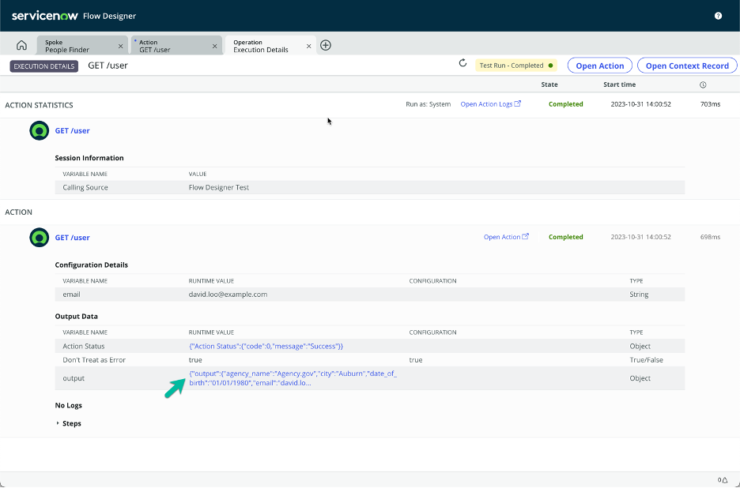

1.  Revise os resultados JSON. Podemos alternar para a visualização formatada.

   >Clique no botão Formatted.
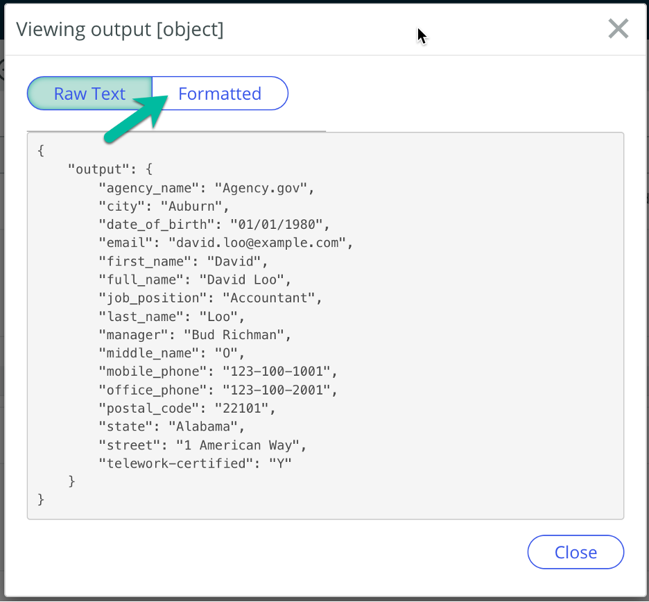

1.  Expanda a saída.
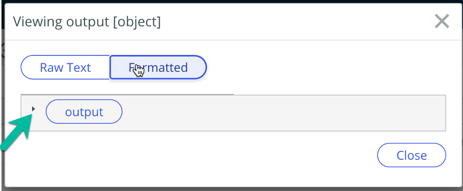

1.  Revise os resultados JSON Formatados.

   > 1. Observe o valor <b>telework-certified</b>.

   > 2. Clique no botão Close
   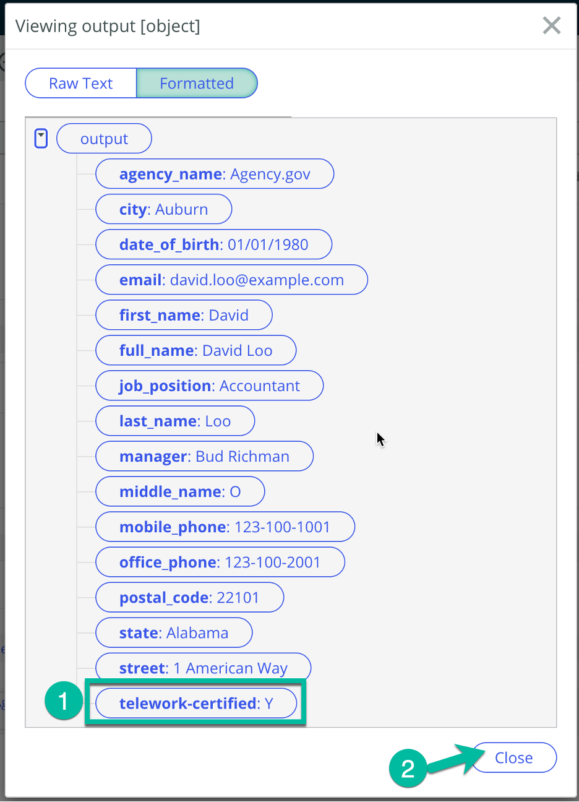

2.  Feche a guia Detalhes da Execução  
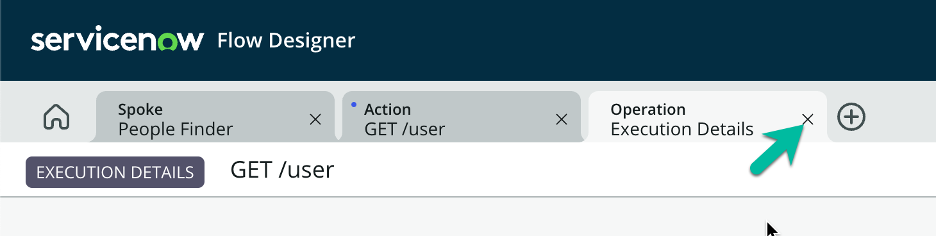

1.  Feche o modal de Teste da Ação clicando no botão Cancel  
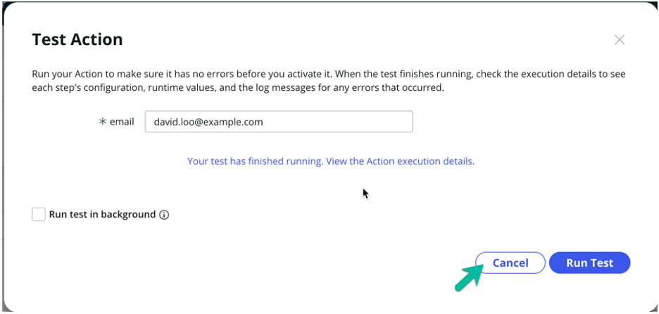

## Bônus: Explore Mais o Spoke Generator

Abra uma nova aba ou janela do navegador e explore o seguinte:
https://developer.opentext.com/imservices/products/contentstorageservice/apis/contentstorage

Por conta própria, crie um novo spoke usando o seguinte OpenAPI spec:
https://raw.githubusercontent.com/deflant/opentext-content-storage-swagger/main/opentext-content-storage-swagger.yaml
