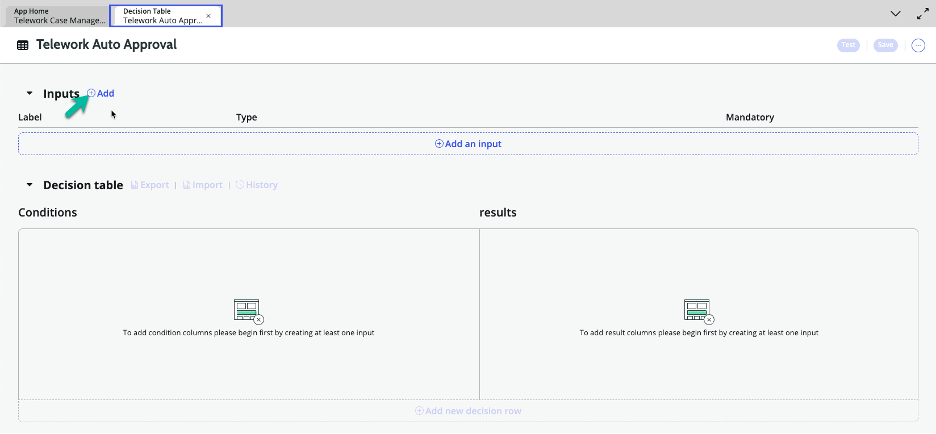
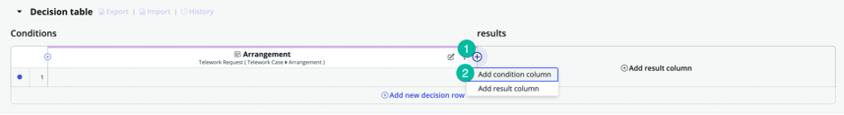

# Criar Tabela de Decisão para Condições de Aprovação Automática

Uma Tabela de Decisão permite que os usuários definam regras de negócios complexas e lógica de decisão usando um formato tabular. As tabelas de decisão são particularmente úteis para automatizar processos de tomada de decisão dentro de fluxos de trabalho, aprovações ou outros processos de negócios.

[Clique aqui para saber mais sobre Tabelas de Decisão.](https://docs.servicenow.com/bundle/vancouver-application-development/page/administer/decision-table/concept/decision-designer-overview.html)

Vamos criar uma tabela de decisão para avaliar o tipo de arranjo e o número de dias e retornar um resultado de aprovação automática que podemos acessar no nosso fluxo principal.

## Voltar ao App Engine Studio para Construir a Tabela de Decisão

1. Vá para a aba com o App Engine Studio.  

2. Clique em "Logic and Automation (1)".  

3. Clique no botão +Add.  

4. Selecione o tile Decision.  

5. Clique no botão Begin.  

6. Configure sua tabela de decisão.

   | |Nome do Campo              | Valor do Campo
   |-|---------------------------| --------------
   |➊|Name | Telework Auto Approval
   |➋|Accessible from | This application scope only
   |➌|Clique no botão Continue.  

7. Clique no botão Edit Decision Table.  

8. Clique no botão ⨁ Add ao lado de Inputs.  

9. Preencha o seguinte:

   | |Nome do Campo              | Valor do Campo
   |-|---------------------------| --------------
   |➊|Label | Telework Case
   |➋|Type | Reference
   |➌|Table | Telework Case  

10. Na linha de Input que você acabou de criar, clique em Add condition column.  

11. Preencha o formulário NEW CONDITION COLUMN.

   | |Nome do Campo              | Valor do Campo
   |-|---------------------------| --------------
   |➊|Condition Column Label | Arrangement
   |➋|Description | Type of Arrangement
   |❸|Data to Evaluate | Field
   |❹|Field | Telework Case.arrangement
   |❺|Default operator | is
   |❻|Clique no botão Done.  

12. Adicione outra coluna de condição.

   >1. Clique no botão de mais ⨁ ao lado da condição que acabamos de criar.

   >2. Selecione "Add condition column".  

13. Preencha o formulário NEW CONDITION COLUMN.

   | |Nome do Campo              | Valor do Campo
   |-|---------------------------| --------------
   |➊|Condition Column Label | Days per Week
   |➋|Description | Days per Week
   |❸|Input | Telework Request
   |❹|Data to Evaluate | Field
   |❺|Field | Telework Case.days_per_week
   |❻|Default operator | less than or is
   |❼|Clique no botão Done.  

14. Na coluna de resultados, clique em ⨁ Add result column.  

15. Preencha o formulário NEW RESULT COLUMN.

   | |Nome do Campo              | Valor do Campo
   |-|---------------------------| --------------
   |➊|Result Column Label | Auto Approved
   |➋|Description | Is telework auto approved
   |❸|Result Type | True/False
   |❹|Clique no botão Done.  

16. Vamos definir nossa primeira linha de decisão clicando na linha 1.  

17. Preencha a Condição de Arranjo.

   | |Nome do Campo              | Valor do Campo
   |-|---------------------------| --------------
   |➊|Operator | is
   |➋|Value | Situational Telework  

18. Preencha a Condição de Número de Dias.

   | |Nome do Campo              | Valor do Campo
   |-|---------------------------| --------------
   |➊|Operator | less than or is
   |➋|Value | 3
   |❸|Click on the value in the Auto Approved column (currently false). 

19. Altere o resultado para Aprovação Automática para verdadeiro.

   >1. Altere o resultado para true.

   >2. Clique no botão OK para continuar.  

20. Vamos adicionar nossa próxima linha de decisão clicando em ⨁ Add new decision row  

21. Preencha a Condição de Arranjo.

   | |Nome do Campo              | Valor do Campo
   |-|---------------------------| --------------
   |➊|Operador | is
   |➋|Valor | Situational Telework  

22. Preencha a Condição de Número de Dias.

   | |Nome do Campo              | Valor do Campo
   |-|---------------------------| --------------
   |➊|Operator | greater than
   |➋|Value | 3

23. Vamos adicionar outra linha de decisão clicando em ⨁ Add new decision row  

24. Preencha a Condição de Arranjo.

   | |Nome do Campo              | Valor do Campo
   |-|---------------------------| --------------
   |➊|Operator | is not
   |➋|Value | Situational Telework  

25. Vamos salvar nosso trabalho clicando no botão Save.  

## Bônus

Teste diferentes cenários antes de modificar o Fluxo Principal.
