# Modificar o Fluxo de Aprovação de Caso de Teletrabalho

Agora que criamos o People Finder Spoke e nossa Tabela de Decisão de Aprovação Automática, vamos modificar o Fluxo de Aprovação de Caso de Teletrabalho para permitir a aprovação automática para aqueles que foram pré-certificados ou solicitaram 3 dias ou menos para Teletrabalho Situacional.

## Abrir o Fluxo de Aprovação de Caso de Teletrabalho e adicionar nossas mudanças

1. Volte para a aba Home do App no App Engine Studio.  
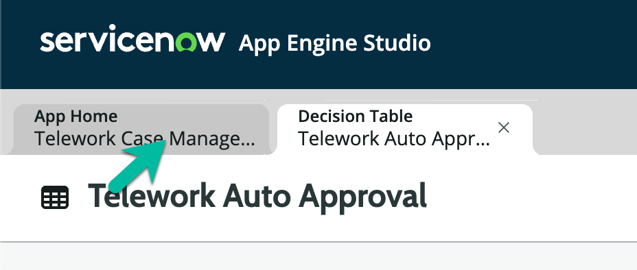

2. Abra o fluxo de Aprovação de Caso de Teletrabalho clicando na linha em Logic and Automation.  
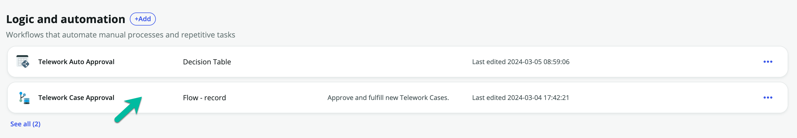

3. Altere a visualização do Flow Designer para Tree View.  
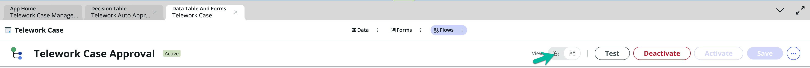

4. Primeiro, queremos adicionar uma Variável de Fluxo para armazenar o status de aprovação automática.

   >1. Clique no botão ... ao lado do botão Save no canto superior esquerdo da sua tela.

   >2. Selecione "Flow Variables" no menu suspenso.  
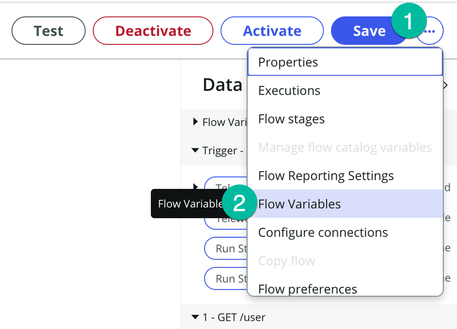

5. Clique no sinal de mais ⨁ para adicionar uma variável.  
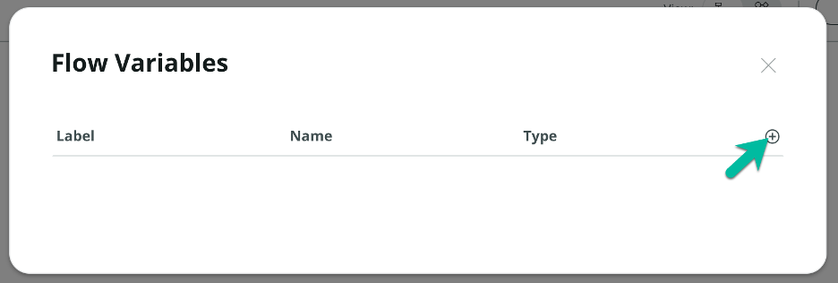

6. Configure a variável de fluxo.

   | |Nome do Campo              | Valor do Campo
   |-|---------------------------| --------------
   |➊|Label |Approved
   |➋|Name |approved
   |❸|Type | True/False
   |❹|Salve a variável.  
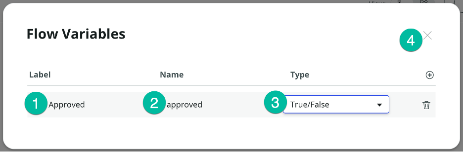

7. Antes do nosso primeiro passo, queremos chamar o People Finder Spoke. Passe o mouse acima do passo "Ask for Approval" e clique no sinal de mais ⨁.  
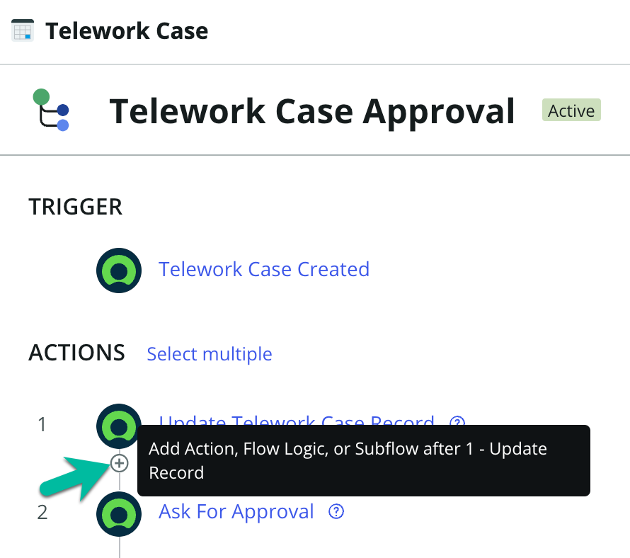

8. Adicione o People Finder Spoke

   >1. Selecione "Action" como o tipo de passo.

   >2. Procure por "people finder".

   >3. Selecione a ação "GET /user".  
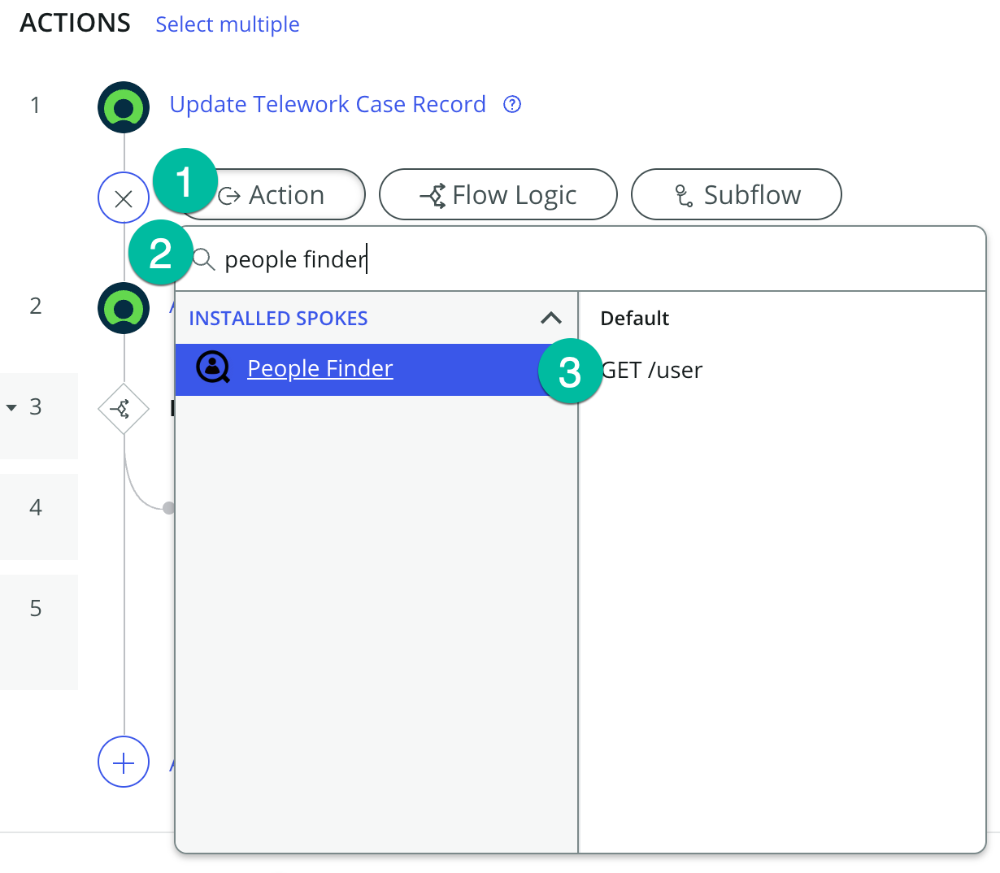

9. Clique no seletor de dados para e-mail.  
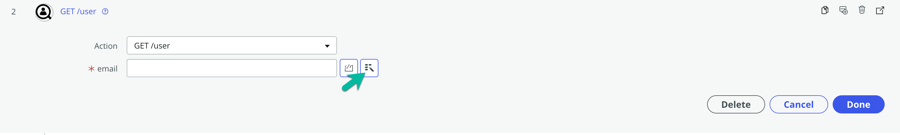

10. Navegue até o endereço de e-mail da pessoa que abriu a solicitação.

   >1. Clique em "Trigger - Record Created"

   >2. Clique na seta azul ao lado do registro "Telework Case" para detalhar.

   >3. Clique na seta azul ao lado de "Opened by".

   >4. Clique em "Email" para definir o valor.  
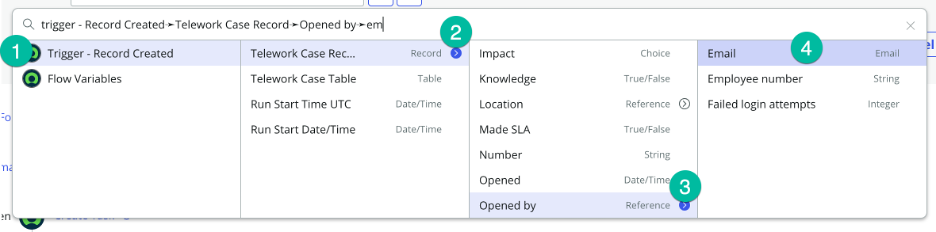

11. Clique no botão Done.  
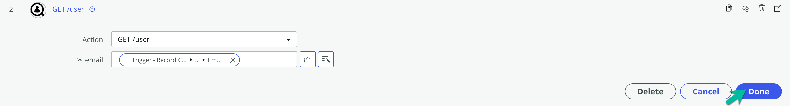

12. Em seguida, queremos usar a tabela de decisão que construímos. Passe o mouse entre os passos 2 e 3 e clique no sinal de mais ⨁.  
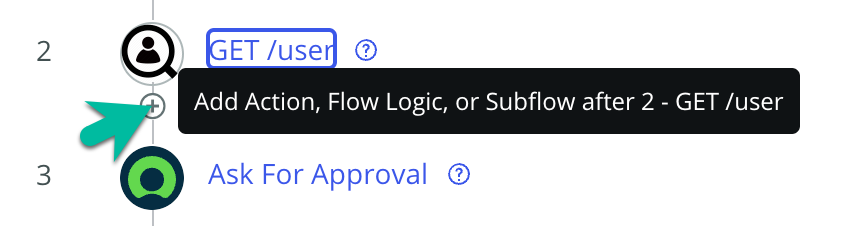

13. Adicione a Tabela de Decisão de Aprovação Automática de Teletrabalho.

   >1. Selecione "Flow Logic" como o tipo de passo.

   >2. Selecione "Make a decision" na lista.  
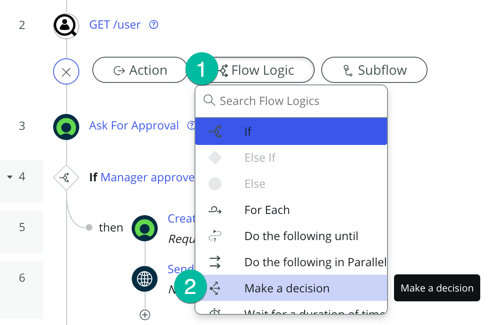

14. Configure o passo de decisão.

   | |Nome do Campo              | Valor do Campo
   |-|---------------------------| --------------
   |➊|Decision Label |Check auto approve conditions
   |➋|Decision Table |Telework Auto Approval
   |❸|Execution | First decision that matches
   |❹|Use Branches | Un-check
   |❺|Telework Request | Drag and drop Telework Case Record data pill   
   |❻|Clique no botão Done.  
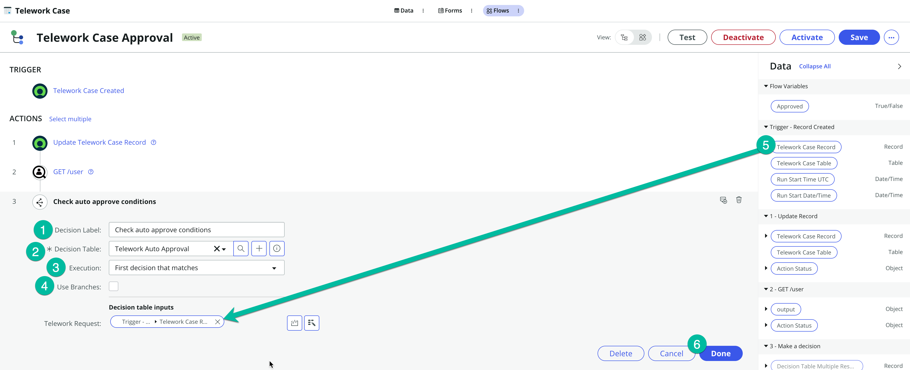

15. Agora, precisamos verificar se qualquer condição de aprovação automática foi atendida. Passe o mouse entre os passos 3 e 4 e clique no sinal de mais ⨁.  
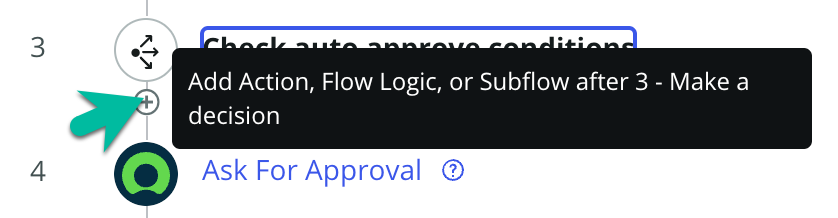

16. Adicione a condição if.

   >1. Selecione "Flow Logic" como o tipo de passo.

   >2. Selecione "If" na lista.  
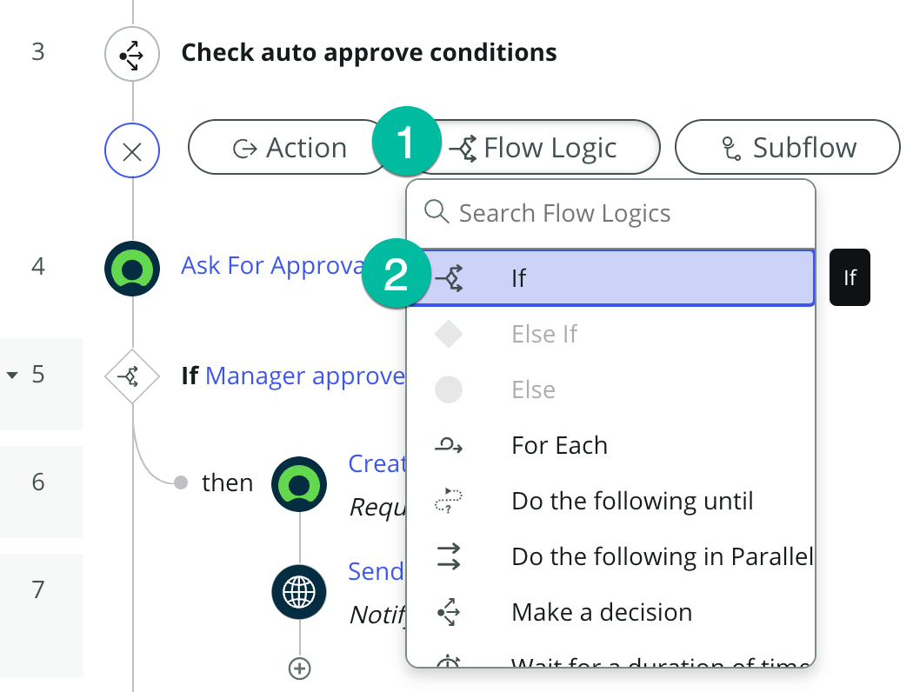

17. Configure a condição if.

   | |Nome do Campo              | Valor do Campo
   |-|---------------------------| --------------
   |➊|Condition Label |If auto approve conditions are met
   |➋|Condition 1 | Dot-walk (veja passo 18 abaixo)
   |❸|Operator | is
   |❹|Value | Y
   |❺|Click on the or button.
   |❻|Condition 2 | Dot-walk (veja passo 19 abaixo)
   |❼|Operator | is
   |❽|Value |True
   |❾|Clique no botão Done.  
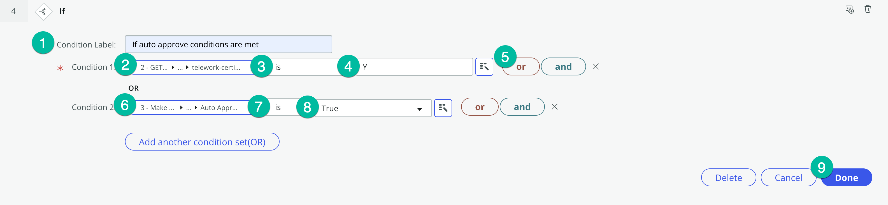

18. Navegar na Condição 1 (passo 2 acima)

   >1. Clique em "2 - GET /User"

   >2. Clique na seta azul ao lado do objeto "output" para detalhar.

   >3. Clique em "telework-certified" para definir o valor.  
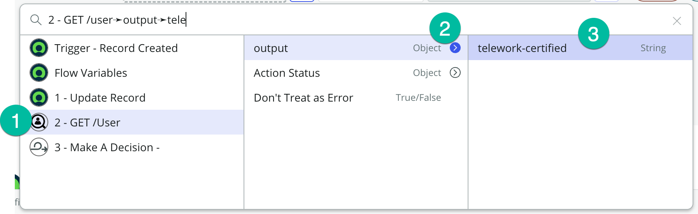

19. Navegar na Condição 2 (passo 2 acima)

   >1. Clique em "3 - Make A Decision"

   >2. Clique na seta azul ao lado do registro "Decision Table Multiple Result Record" para detalhar.

   >3. Clique na seta azul ao lado do glide_var "Result elements" para detalhar.

   >4. Clique em "Auto Approved" para definir o valor.  
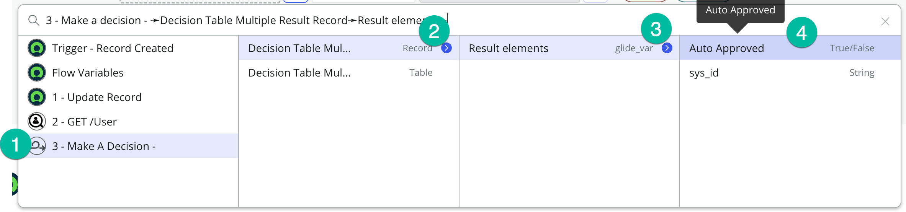

20. Vamos definir o valor de Approved para verdadeiro.

   >1. Selecione "Flow Logic" como o tipo de ação.

   >2. Selecione "Set Flow Variables" na lista.  
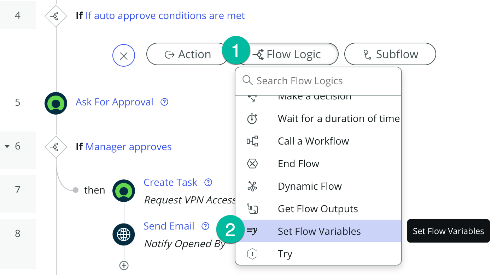

21. Para adicionar uma variável de fluxo para definir, clique no sinal de mais ⨁.  
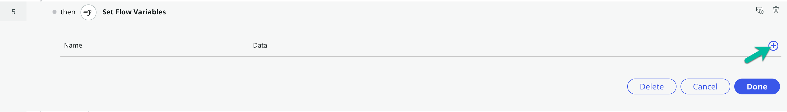

22. Defina a variável de fluxo Approved para verdadeiro.

   >1. Selecione "Approved | True/False" no menu suspenso.

   >2. Marque a caixa de dados para true.

   >3. Clique no botão Done.  
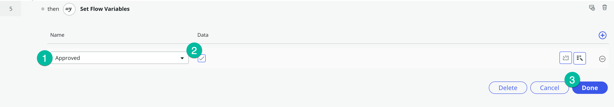

23. Agora, vamos adicionar a lógica de fluxo para quando nossa condição não for atendida. Passe o mouse acima do 'Ask for Approval' e clique no sinal de mais ⨁.  
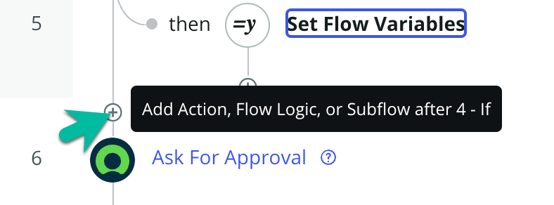

24. Adicione a condição else.

   >1. Selecione "Flow Logic" como o tipo de passo.

   >2. Selecione "Else" na lista.  
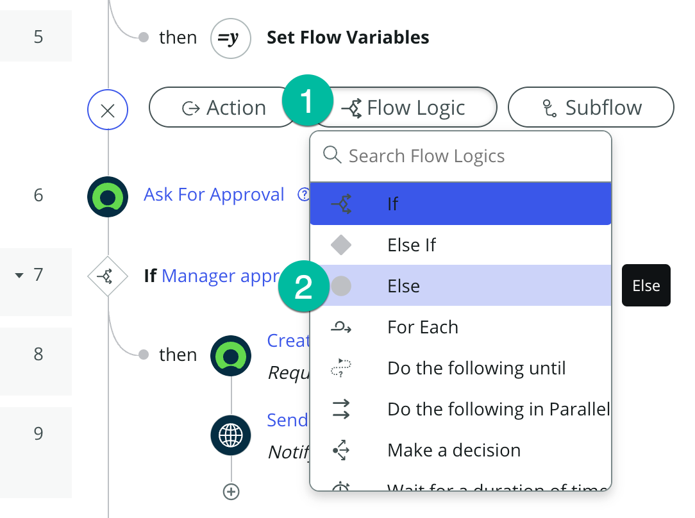

25. Mova a ação de solicitação de aprovação.

   >1. Passe o mouse ao lado do passo 'Ask for Approval' até ver uma forma de cruz e o texto "Drag to reorder steps".

   >2. Arraste para o sinal de mais ⨁ abaixo do 'Else'.
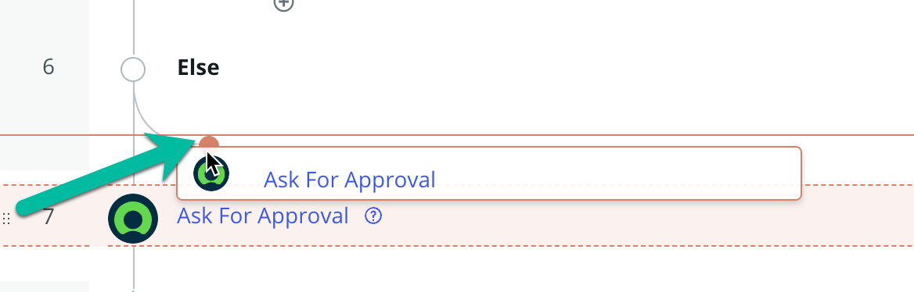

1.  Mova a condição if para a aprovação do gerente.

   >1. Passe o mouse ao lado do 'If' até ver uma forma de cruz e o texto "Drag to reorder steps".

   >2. Arraste o 'If' para o sinal de mais ⨁ abaixo do passo 'Ask for Approval'.
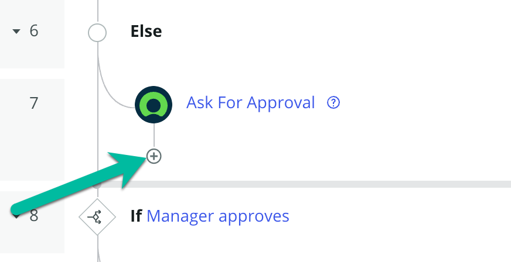

1.  Agora, defina a variável de fluxo quando o gerente aprovar. Passe o mouse acima do passo 'Create Task' e clique no sinal de mais ⨁.  
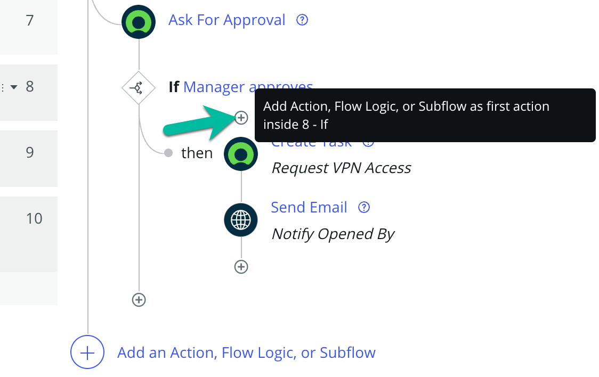

1.  Defina a variável de fluxo de Aprovação para verdadeiro.

   >1. Selecione "Flow Logic" como o tipo de ação.

   >2. Selecione "Set Flow Variables" na lista.  
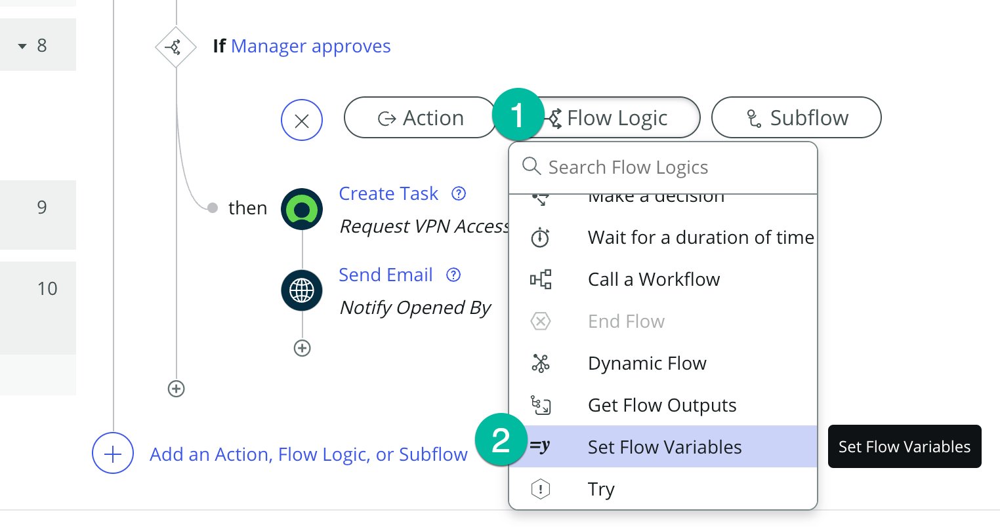

1.  Para adicionar uma variável de fluxo para definir, clique no sinal de mais ⨁.  
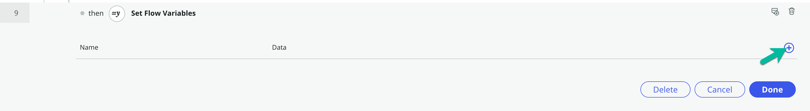

1.  Defina a variável Approved para verdadeiro.

   >1. Arraste e solte a variável de fluxo Approved dos dados à direita da tela para o campo Nome.

   >2. Marque a caixa de dados para true.

   >3. Clique no botão Done.  
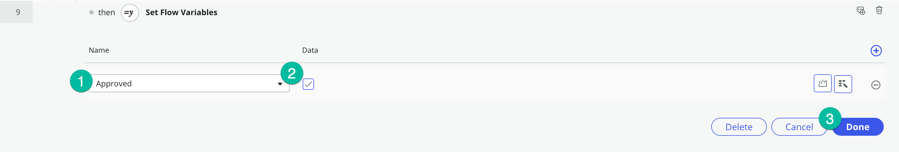

1.  Vamos retornar à nossa lógica principal e adicionar um novo passo.  
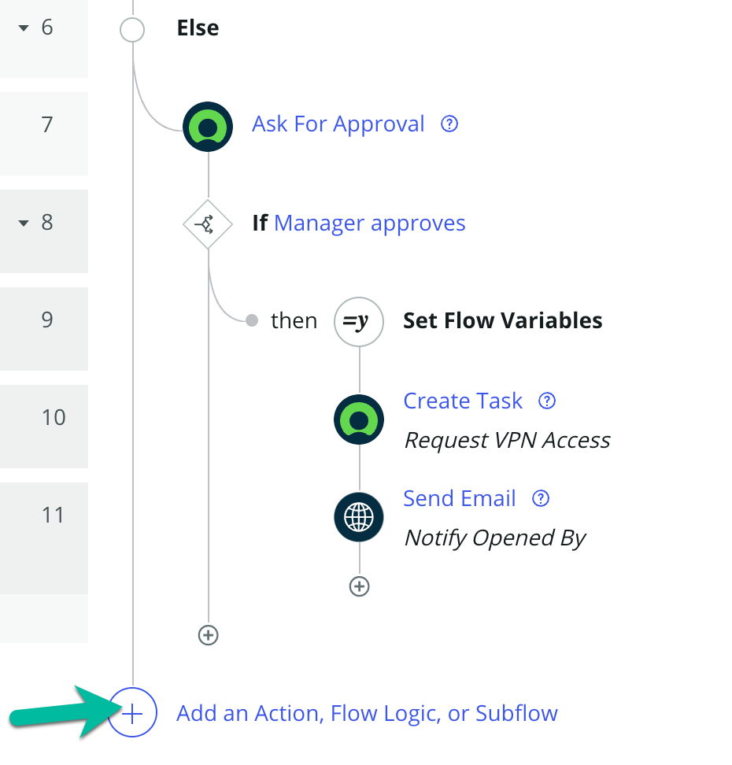

1.  Adicione a condição if.

   >1. Selecione "Flow Logic" como o tipo de passo.

   >2. Selecione "If" na lista.  
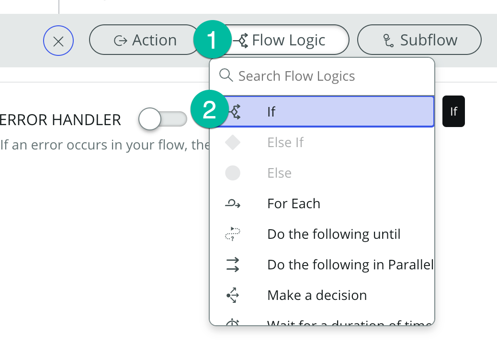

1.  Configure a condição if.

   | |Nome do Campo              | Valor do Campo
   |-|---------------------------| --------------
   |➊|Condition Label | If all approve conditions are met
   |➋|Condition 1 | Drag and drop Approved data pill
   |❸|Operator | is
   |❹|Value | True
   |❺|Clique no botão Done.  
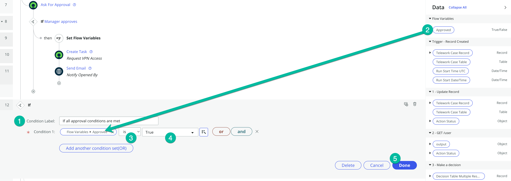

1.  Exclua o espaço reservado de passo abaixo no (x).  
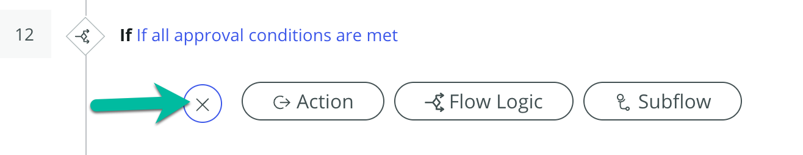

1.  Mova o passo de Criar Tarefa.

   >1. Passe o mouse ao lado do passo 'Create Task' até ver uma forma de cruz e o texto "Drag to reorder steps".

   >2. Arraste o 'Create Task' para o sinal de mais ⨁ abaixo da condição 'Then'.  
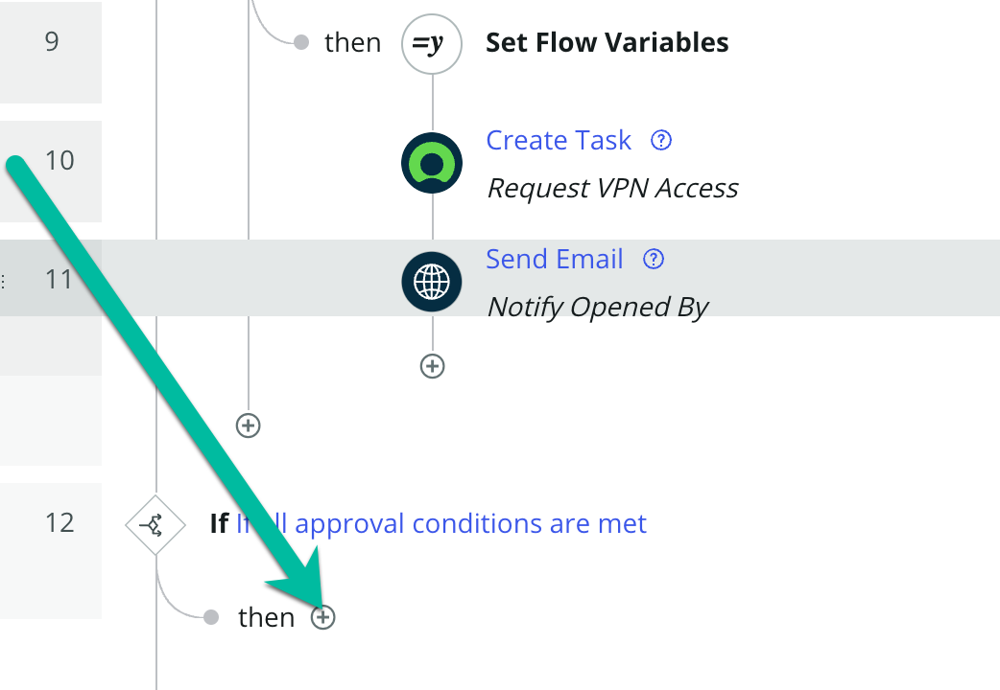

1.  Mova o passo de Enviar E-mail.

   >1. Passe o mouse ao lado do novo passo 'Send Email' até ver uma forma de cruz e o texto "Drag to reorder steps".

   >2. Arraste o passo 'Send Email' para o sinal de mais ⨁ abaixo do novo passo 'Create Taks'.  
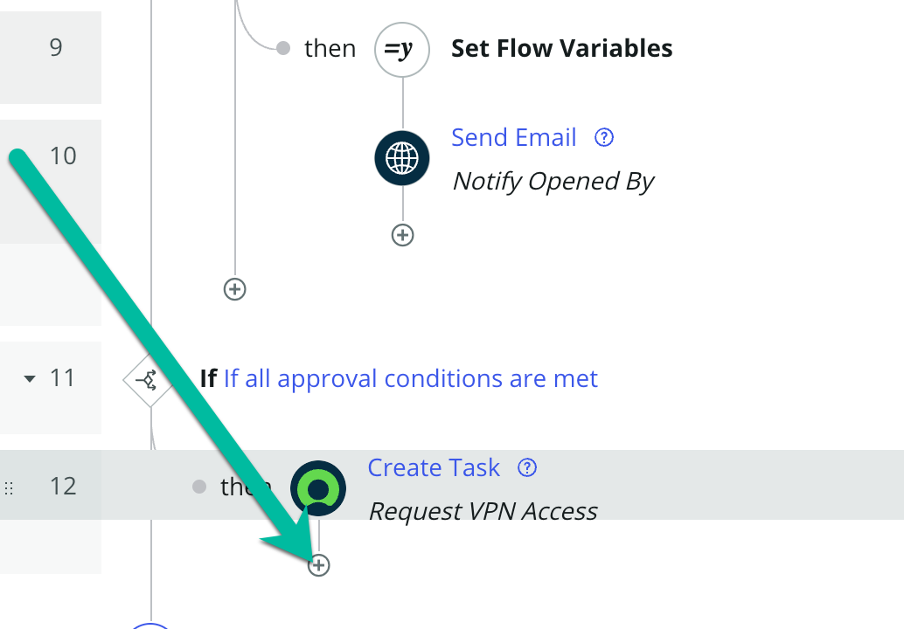

1.  Salve as alterações no fluxo Principal clicando no botão Save.  
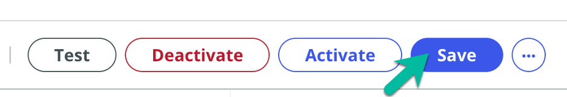

1.  Ative o fluxo Principal clicando no botão Activate.  
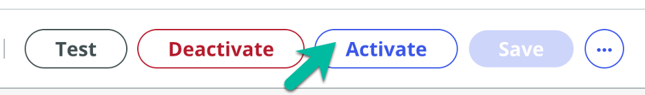

## Bônus

Lembra como testar seu fluxo do laboratório anterior? Teste seu trabalho usando o que você aprendeu!
