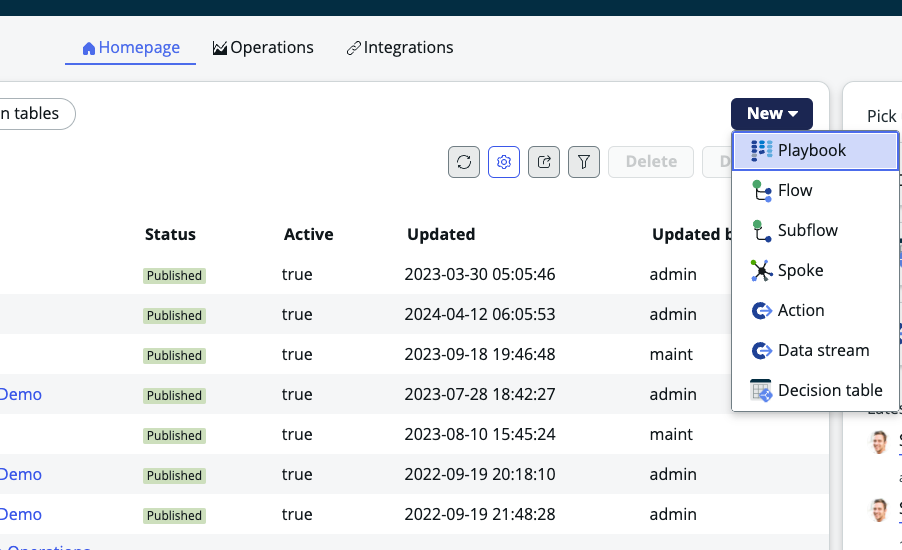
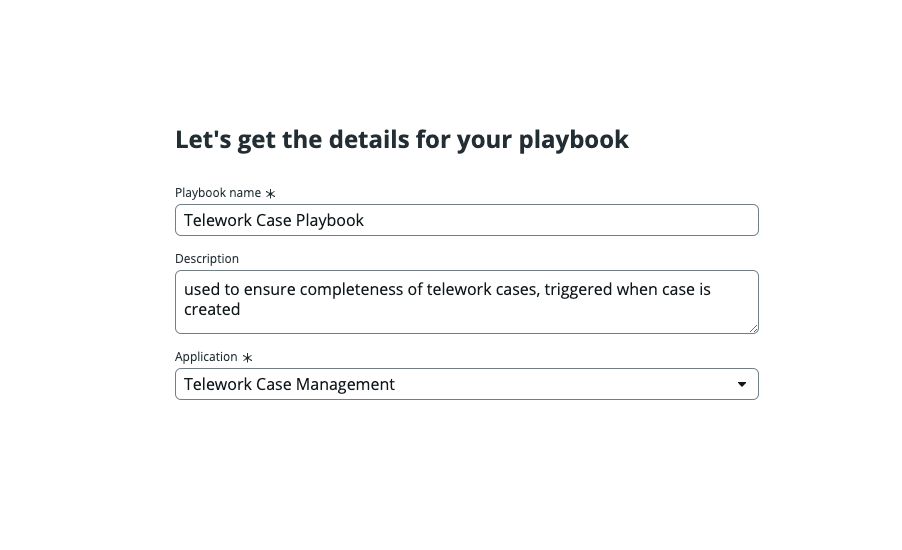
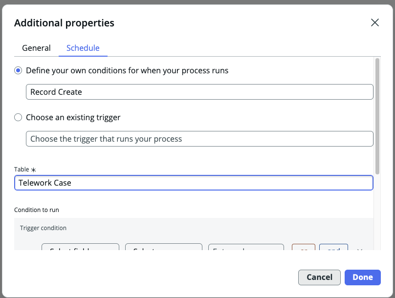
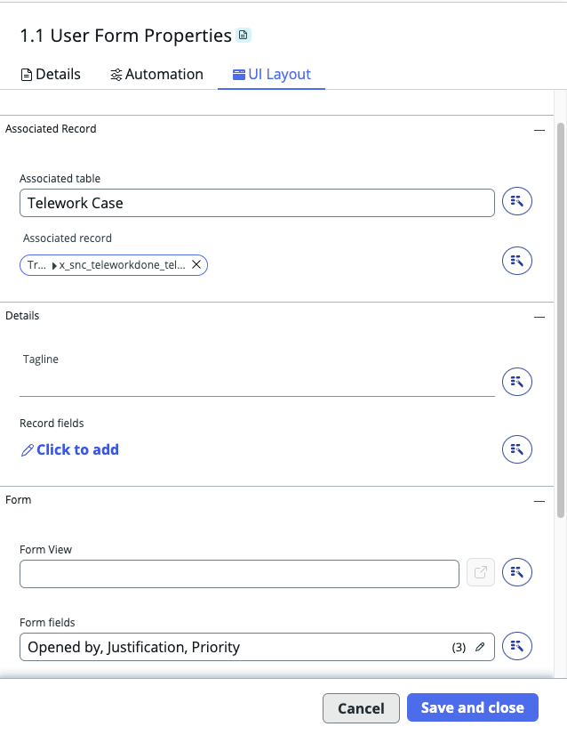
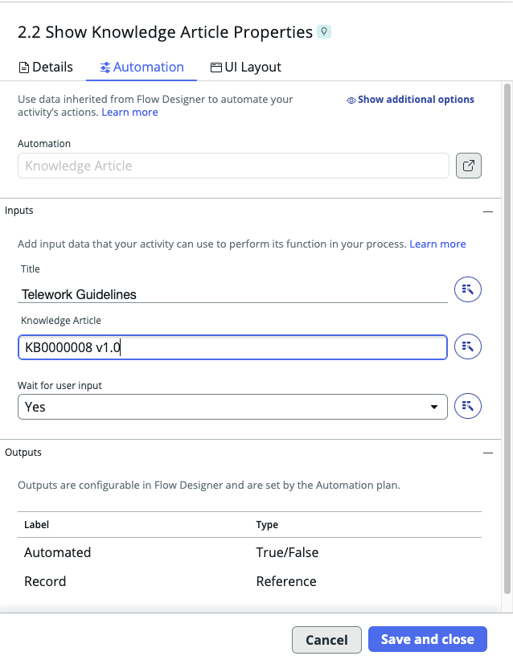
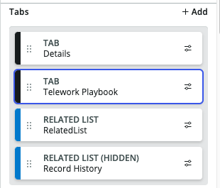
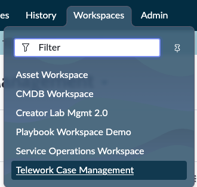
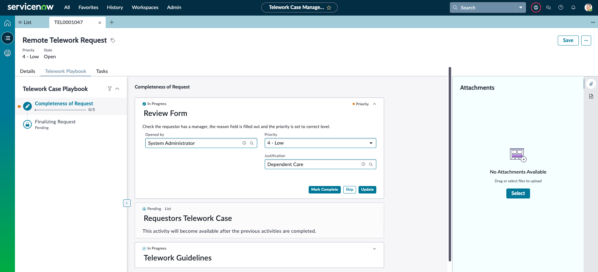

# Adicionando um playbook ao espaço de trabalho

A equipe de Amanda está crescendo e o espaço de trabalho que ela usa para gerenciar e relatar casos de teletrabalho agora é utilizado por mais de seus subordinados diretos. Ela percebeu que alguns desses subordinados nem sempre estão cientes do que validar nas solicitações e Amanda gostaria de uma forma para que qualquer pessoa que visualize os Casos de Teletrabalho seja orientada sobre o que procurar, garantir que o processo seja seguido e que todos os casos sejam tratados de forma igualitária.

A solução para isso é implementar um playbook no espaço de trabalho.

Playbooks permitem que os usuários do espaço de trabalho interajam com um fluxo de trabalho empresarial em tempo real a partir do Workspace. Agentes podem usar o Playbook para atualizar registros, carregar anexos e completar tarefas em várias atividades de fluxo de trabalho.
[Click Here for More Info](https://docs.servicenow.com/en-US/bundle/vancouver-build-workflows/page/administer/workspace/concept/playbook-ui.html)

Exemplo de um playbook em um espaço de trabalho:

## Etapas para Adicionar um Playbook

|   | 
    |-------------|---------------------------------|
    |➊| Projete seu playbook no Process Automation Designer |
    |➋| Teste e Publique seu playbook |
    |➌| Adicione o playbook ao seu espaço de trabalho no workspace builder |
    |➍| Se você quiser alterar a ordem em que a aba aparece, use o UI Builder |

## Vamos começar

# Projete seu playbook no Process Automation Designer

1. 
  |   | 
    |-------------|---------------------------------|
    |➊| Vá para 'All' |
    |➋| Digite 'Process Automation Designer' |
    |➌| Clique em 'Process Automation Designer' (isso abrirá em uma nova aba do seu navegador) |

  

  Agora você está na visualização de lista do Process Automation Designer mostrando todos os processos que foram concluídos.

1. Clique em New > Playbook

  

2. Dê um rótulo e uma descrição ao seu processo e crie um novo playbook
  (**observação: o nome da sua aplicação deve ser o nome da sua aplicação de Gerenciamento de Casos de Teletrabalho, pode ser diferente do que está na captura de tela**)

    | **Etapas**   | 
    |-------------|---------------------------------|
    | Playbook name | Telework Case Playbook |
    | Description | used to ensure completeness of telework cases, triggered when case is created  |
    | Application | Telework Case Management |

  

1. Selecione um gatilho clicando em Trigger

    | Etapas | 
    |-------------|---------------------------------|
    |➊| "Define your own conditions for when your process runs" |
    |➋| Choose "Record Create" |
    |➌| Choose Table "Telework Case" |
    |➍| Clique em 'Done' |

  

    
    Mude para 'Board View'

  

Agora você deve estar nesta página:

## Em seguida, adicionaremos 2 estágios

1. Adicionando o Primeiro Estágio

    | Etapas | 
    |-------------|---------------------------------|
    | Click | + Add Stage  |
    | Label | Completeness of Request |
    | Description | ensure all the information is provided |
    | When to start | When process starts |
    | Click | 'Save and close' |

2. Adicionando o Segundo Estágio

    | Etapas | 
    |-------------|---------------------------------|
    | Click | + Add Stage (next to the stage you created)  |
    | Label | Finalizing Request |
    | Description | ensure all approvals and tasks have been created and completed |
    | When to start | After specific stages |
    | Click | 'Save and close' |

Sua tela agora deve estar assim:

## Na Coluna 1, Completeness of Request, vamos adicionar 3 atividades  

 | Completeness of Request | 
    |-------------|---------------------------------|
    | Atividade &nbsp;➊| Verifique se o opened_by tem um gerente, se o campo de motivo está preenchido e defina a prioridade |
    | Atividade &nbsp;➋| Veja se o opened_by já tem casos de teletrabalho submetidos |
    | Atividade &nbsp;➌| Dê ao usuário do espaço de trabalho o artigo de conhecimento das diretrizes de teletrabalho se ele quiser anexá-lo |

### **Completeness of Request – Atividade** ➊

1.  
    |  | 
    |-------------|---------------------------------|
    | Clique | + Add Activity |

## \*\*Faça uma Pausa\*\* Explore a Tela de Atividade

- 'Search Activities'
- 'Create a new activity' – para saber mais sobre isso, [clique aqui](https://docs.servicenow.com/bundle/vancouver-build-workflows/page/administer/process-automation-designer/task/create-activity-definition.html)

_(as caixas foram contornadas com cores para diferenciá-las. Na sua instância, não haverá cor ao redor de cada seção)_

- Caixa vermelha: Estas são suas atividades agrupadas; no flow designer, seriam seus 'spokes'
- Caixa roxa: Em cada atividade agrupada, estão as atividades que você pode atribuir ao seu processo. Estas podem incluir atividades interativas e não interativas.
- Caixa verde: Para cada atividade, esta caixa descreve as informações necessárias para que a atividade funcione.

Mais informações, [Clique Aqui](https://docs.servicenow.com/bundle/vancouver-build-workflows/page/administer/process-automation-designer/task/create-process-definition.html)

## \*\*De volta ao Laboratório e Adicionando Atividade 1\*\*

Observação: Estaremos usando o pacote 'Common Activities'. Sinta-se à vontade para ver o que há em 'Global' e 'Process Automation Content' para ideias sobre o que mais você pode adicionar a um playbook.

2.  
    | Escolha | 
    |-------------|---------------------------------|
    | ➊| Common Activities |
    | ➋| User Form |

  Você deve estar aqui agora:

  

 
No lado direito, estão as propriedades da atividade. Aqui é onde fornecemos as informações necessárias para que a atividade funcione.
 
 

3. Preencha o formulário (Editar propriedades da atividade):

  | Escolha | 
    |-------------|---------------------------------|
    | Label | Review Form |
    | Description | Check the requestor has a manager, the reason field is filled out and the priority is set to correct level. |
    | Clique | `UI Layout` TAB (Não clique em 'Save and Close') |

  

 
 

4. Esta atividade possui algumas entradas necessárias

    | Escolha | 
    |-------------|---------------------------------|
    | Associated table | Telework Case |
    | Associated record | use o data pill picker para escolher o registro trigger |
    | Form Fields | **Escolha os campos:** opened\_by,justification,priority |
    | Click | Save and close |

  

Antes de prosseguir, vamos testar para que você possa ver como tudo ficará para o usuário do workspace.

Clique em 'Test' no canto superior direito próximo a ativar: Test

1. 
    | TESTE | 
    |-------------|---------------------------------|
    | ➊ | Escolha o registro de Telework Case – as imagens abaixo usarão TEL0001002 |
    | ➋ | Clique em Run Test |

  

2. Escolha a 'Playbook preview' – clique em: View (isso abrirá em uma nova aba do navegador)  
  

  Dê um momento para esta tela carregar – quando terminar, deve se parecer com isto:

    

3. Tente adicionar algo para 'Justification' depois 'Update' e então 'Mark Complete'  

4. No canto inferior direito há uma engrenagem – você pode abrir isso e tentar algumas das configurações adicionais. Estas podem ser configuradas na aba de experiência para seu playbook (não faremos isso neste laboratório).

5. Se tudo estiver certo, você pode fechar esta aba do navegador e então clicar em Done e você deverá voltar ao designer de playbook aqui:

    

### **Completeness of Request – Atividade ➋**

Após o usuário do workspace revisar o formulário, gostaríamos que ele visse uma lista de quaisquer casos de teletrabalho que já foram abertos pelo solicitante. Essa será nossa próxima atividade – adicionar uma lista de casos de teletrabalho abertos pelo solicitante.

1.  
    | Abaixo de 'Review Form'  | 
    |-------------|---------------------------------|
    | Clique | + Add Activity  |

2.  
    | Escolha | 
    |-------------|---------------------------------|
    | ➊ | Process Automation Content |
    | ➋ | Show list of records |

  

3. Na 'Edit activity properties' no lado direito

  |   | 
    |-------------|---------------------------------|
    | Label | Requestors Telework Case |
    | Description | If the requestor has submitted any other telework case requests, they will be listed below |
    | Clique | UI Layout |

    

4. Preencha a aba 'UI Layout'

  |   |   
    |-------------|---------------------------------|
    | List Title | Requestors Case |
    | Table | Telework Case |
    | Columns | Number,state,created,opened_by |
    | Clique  | 'Add Condition' ao lado de 'List Query' |

  Condição: opened_by  é  opened_by            
   
  'Add Condition' deve parecer assim (então clique em Save / Modify ):
  
  
  
  **Antes** de clicar em 'Save and close', seu formulário deve parecer com isto:
  
    

5.  
  |  | 
    |-------------|---------------------------------|
    | Clique | Save and Close |

    

### **Completeness of Request – Atividade ➌**

A última atividade nesta coluna será mostrar ao usuário do workspace o artigo de conhecimento sobre diretrizes de teletrabalho – muitos pediram para ter isso à mão caso precisem durante o processo ou para anexar para revisão do solicitante.

1.  
    | Abaixo de 'Requestors Telework Cases'  | 
    |-------------|---------------------------------|
    | Clique | + Add Activity  |

2.  
    | Escolha | 
    |-------------|---------------------------------|
    | ➊ | Common Activities |
    | ➋ | Show Knowledge Article |

  

3. Na 'Edit activity properties' no lado direito

  |   | 
    |-------------|---------------------------------|
    | ➊  Label | Show Telework Guidelines KA |
    | ➋  Description | This will give the requestor the telework guidelines knowledge article so they can use it if needed in the process |
    | ➌  Start rule | When stage starts (we want this to be available right away) |
    | ➍  Click | Automation Tab (next to details tab) |

    

4. Preencha a aba 'Automation'

  |   | 
    |-------------|---------------------------------|
    | ➊ Título | Telework VPN Guidelines |
    | ➋ Artigo de Conhecimento | KB0000008 |
    | ➌ Clique | Save and Close |

  

Ótimo – seu processo deve se parecer com isto agora:

##
**Se você encontrar um erro relacionado a uma 'conexão de fim' para o passo 2**  
- Vá para 'Diagram View'  
- Conecte a Atividade 1.2 ao Estágio 2  
- Deve se parecer com isto:  

  
- depois volte para a visualização em painel  

## Sinta-se à vontade para fazer uma pausa e testar seu processo como fizemos anteriormente

 
 

## Finalizando a Etapa 'Finalizing Request'

Para a segunda coluna, etapa 'Finalizing Request', vamos adicionar apenas uma atividade.

1. **Adicionar Atividade**

   - Na coluna 'Finalizing Request':

     |  | 
     |-------------|---------------------------------|
     | Clique | + Add Activity  |

2. **Escolher Tipo de Atividade**

   - Escolha:

     | Escolha | 
     |-------------|---------------------------------|
     | ➊ | Common Activities |
     | ➋ | Instructions |

3. **Configurar Propriedades da Atividade**

   - Na 'Edit activity properties' à direita:

     |   | 
     |-------------|---------------------------------|
     | ➊ Label | Check for approval and IT Task |
     | ➋ Description | Ensure approval was done and the IT Task was assigned to the right group |
     | ➌ Start rule | When stage starts |
     | ➍ Clique | Save and Close |

   - Seu formulário deve parecer com isso:
       

   - Agora, você está pronto com a versão um do seu Playbook! É hora de clicar em Activate
       

   - O que mais você adicionaria ao processo?

   - Você notou uma atividade para aprovação do gerente? Algumas ótimas atividades já estão lá, prontas para uso!

## Adicionando o Playbook ao Seu Espaço de Trabalho

Agora que publicamos o playbook, precisamos adicionar o playbook ao nosso espaço de trabalho no App Engine Studio.

1. **Abrir o App Engine Studio**

   - Abra 'App Engine Studio'.
   - Abra seu aplicativo 'Telework Case Management'.  
     

2. **Editar o Espaço de Trabalho Telework**

   - Edite o espaço de trabalho 'Telework'.
       
   - (Se 'Get Started' aparecer, clique em 'Get Started'.)

   - Você deve agora estar no construtor de espaço de trabalho, e sua tela deve parecer com isso (alguns dos relatórios podem diferir):
     

3. **Configurar Páginas de Registro**

   - No topo da página:
     
     |  |
     |-------------|---------------------------------|
     | Clique | 'Record pages' |
     | Escolha | 'Telework Case Record Page' |

       

4. **Adicionar o Playbook**

   - No lado esquerdo, escolha 'Record details' na barra de navegação esquerda.
     

   - No lado direito, está o painel de configuração de detalhes do registro:

     |  | 
     |-------------|---------------------------------|
     | Clique em | `+ Add playbook` |
       

   - Preencha os campos:

     |  | 
     |-------------|---------------------------------|
     | ➊ Tab name | Telework Playbook |
     | ➋ Playbook experience | Global Playbook Experience |
     | ➌ Clique | Add |
       

## O Que É uma Experiência de Playbook?

Após criar seu processo no designer de automação de processos, você pode usar a experiência "Global Playbook Experience", que é ótima se você usou todas as atividades padrão e gosta da aparência no espaço de trabalho.

Alternativamente, você pode criar suas próprias experiências e componentes para oferecer ainda mais flexibilidade para o usuário. Você também pode usar o UI Builder para criar novos componentes e personalizar ainda mais a experiência para as necessidades dos seus trabalhadores.

Para mais informações sobre como usar experiências de playbook, aqui estão alguns recursos:

- [Playbook Experiences – docs page](https://docs.servicenow.com/en-US/bundle/vancouver-platform-user-interface/page/administer/workspace/concept/set-up-playbook.html)
- [Platform Academy Session #21 Video](https://www.youtube.com/watch?v=mQKrlf3iyNg)

## Personalizar a Posição da Aba

Agora que você adicionou o playbook ao espaço de trabalho, observe como ele está aparecendo como uma aba na página de registro no final. Vamos movê-lo para o início.

- Clique no link no canto superior direito 'open in UI Builder' (e se aparecer um pop-up, continue para o UI Builder):
  

- No UI Builder – pode levar um minuto para carregar. Em breve, você verá as páginas e seções à esquerda.

1. **Mover a Aba**

   - À esquerda vá para: (esses itens já devem estar expandidos)

     >Corpo  
     >>- Painéis redimensionáveis
     >>>- Esquerda
       >>>>- Clique em "Main Tab"
         

   - No painel direito do UI Builder, arraste a aba Telework Playbook para que fique após a aba Details.
       

   - Deve parecer com isso. Então clique em Save:
     

   ### Você Concluiu!

   Quando o botão 'Save' no canto superior direito estiver desativado, você pode fechar essa aba e agora vamos testar no seu espaço de trabalho.

## Testando o Playbook

1. **Criar um Novo Caso de Teletrabalho**

   - Volte para a visualização da plataforma e, em espaços de trabalho, encontre 'Telework Case Management':
    

   - O playbook é executado quando um novo caso de Teletrabalho é criado, então precisamos fazer isso para ver o playbook em ação.

   - Quando o espaço de trabalho abrir:

     |  | 
     |-------------|---------------------------------|
     | ➊ | Escolha 'List' Menu no canto esquerdo |
     | ➋ | Escolha 'New' |
       

   - Preencha os campos:

     |  | 
     |-------------|---------------------------------|
     | Arrangement | Remote telework |
     | Justification | Dependent Care |
     | Clique | Save |

   - Se não aparecer imediatamente, atualize o navegador – isso pode acontecer na primeira vez que você executar.

   - Aqui está seu playbook:

     - Passe por ele e verifique a experiência.
     - O que você faria diferente?
     - O que mais seria útil?

   - Parabéns!
    
