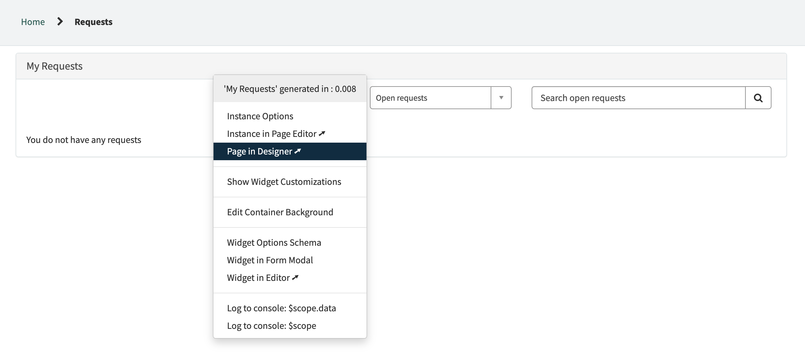
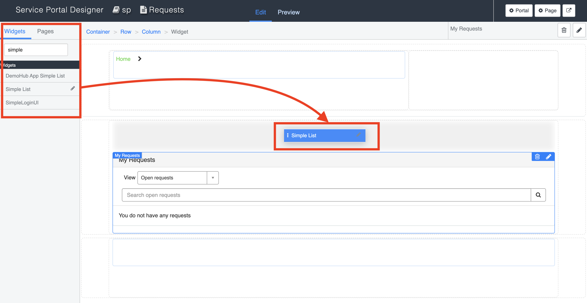
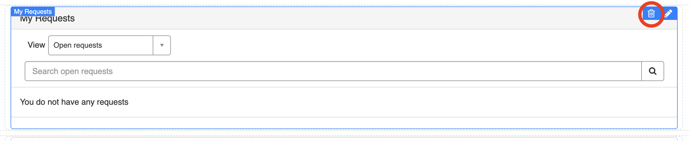
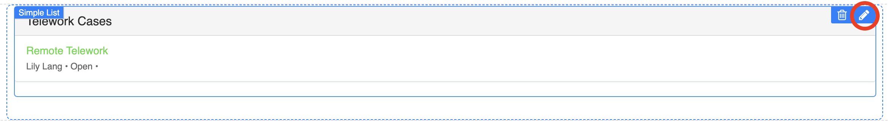
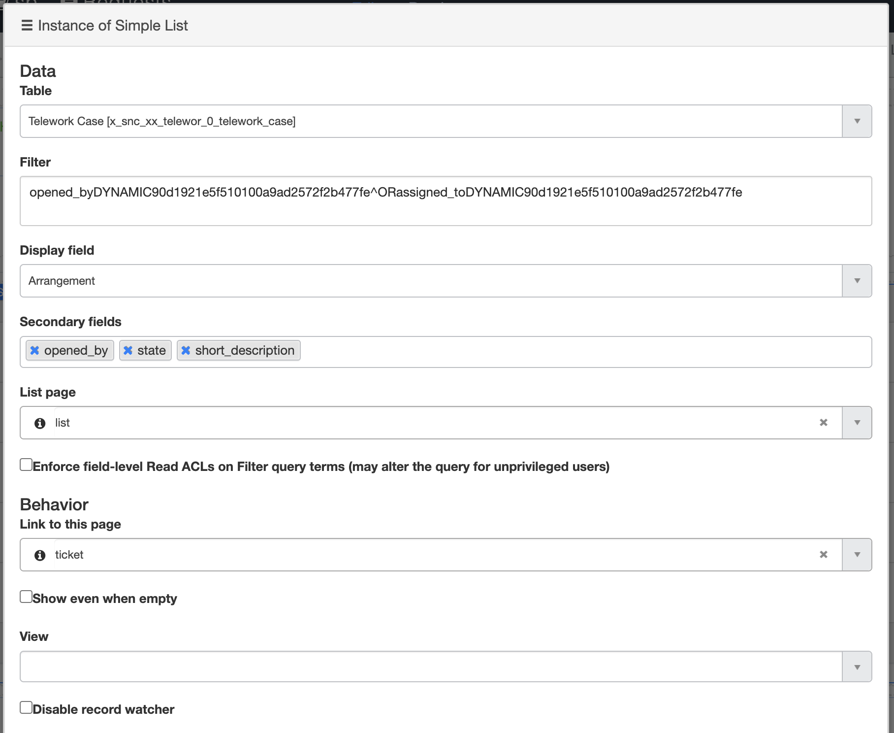
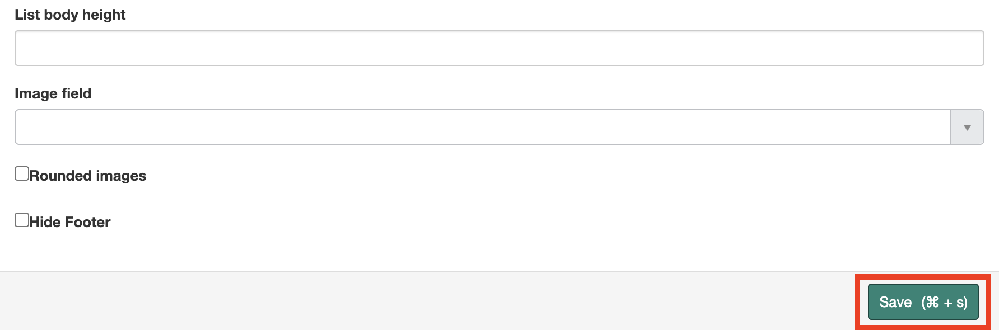
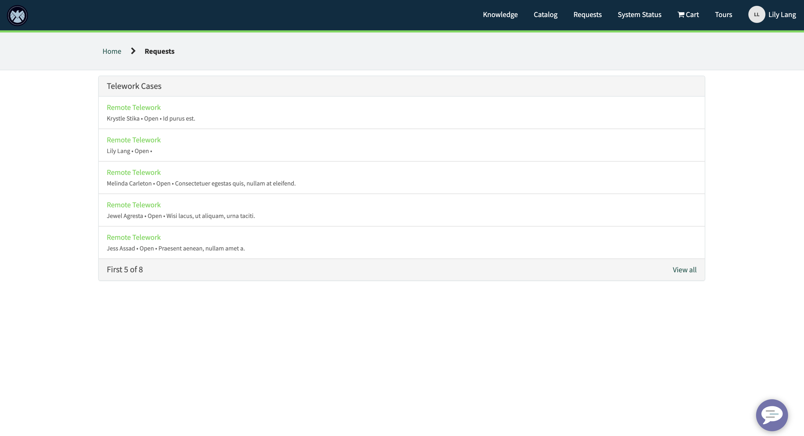

# Portal: Add a Widget

Neste exercício, aprenderemos como configurar uma página existente e um widget para dar aos usuários acesso à lista de solicitações de Teletrabalho que eles enviaram ou estão atribuídas a eles.

## Passos

1. A partir da página inicial do portal de serviços, selecione **Requests** na barra de navegação no canto superior direito da tela  
   

2. **Ctrl + Clique Direito** no widget “My Requests” e selecione **Page in Designer**  
   

3. Encontre o widget **Simple List** na lista à esquerda da página e **arraste/solte** acima do widget “My Requests”  
   

4. Remova o widget My Requests da página clicando no **ícone de lixeira** no canto superior direito do widget  
   

5. Configure as **opções do widget** para o Simple List selecionando o ícone de lápis no canto superior direito do widget  
   

6. Defina os seguintes valores:

   |  | 
   |-------------|---------------------------------|
   | **Table:** | Telework Case |
   | **Display Field:** | Arrangement |  
   | **Secondary fields:** | Opened by, State, Short Description |
   | **List page:**| list |
   | **Link to this page:**| ticket |
   | **Filter:** | *Isso mostrará todos os Casos de Teletrabalho abertos por ou atribuídos ao usuário logado* |
    ```
    opened_byDYNAMIC90d1921e5f510100a9ad2572f2b477fe^ORassigned_toDYNAMIC90d1921e5f510100a9ad2572f2b477fe
    ```      
    

7. **Salve** suas opções de widget (você pode precisar rolar para baixo)  
   

8. Atualize a aba onde a **página de solicitações** do seu portal está aberta para ver seu novo widget  
   

9. Clique em qualquer registro para navegar para a página do ticket  
   
