# Portal: Create a Widget

Neste exercício, aprenderemos como clonar um widget existente para modificá-lo. Utilizaremos o botão para permitir que os usuários naveguem para uma visão editável dos Casos de Teletrabalho que enviaram ou estão atribuídos a eles.

## Passos

1. Para acessar o Widget Editor, navegue para **Service Portal** > **Service Portal Configuration**, e então clique em **Widget Editor**  
   

2. Selecione **link-button** sob Edit an existing widget  
   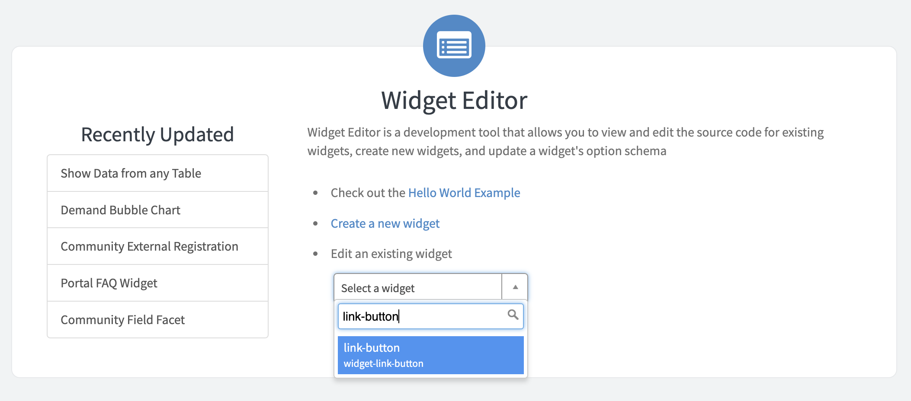

3. Selecione **Clone “link-button”** nas opções adicionais do menu no canto superior direito  
   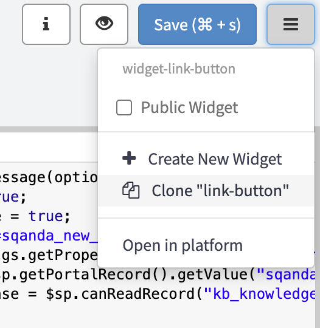

4. Nomeie seu widget como **Edit Request Button**. O Widget ID será preenchido automaticamente  
   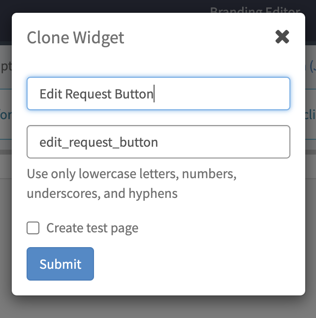

5. **Submeta**

6. Selecione seu novo widget no canto superior esquerdo do widget editor  
   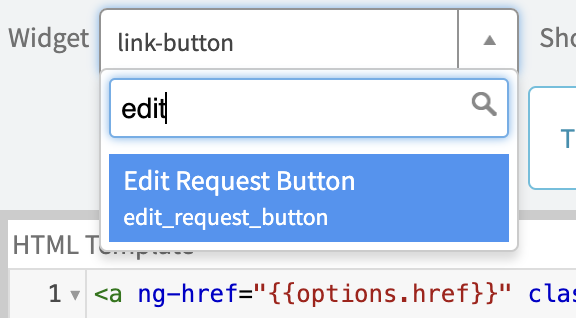

7. Substitua o HTML Template e o Server Script com o seguinte código:

    **HTML:**  *o botão irá vincular à página "form" e passar o nome da tabela e o sys_id do registro atual como parâmetros na URL*  
    ```
    <a href="?id=form&table=YOUR_TABLE&sys_id={{data.sys_id}}&view=sp" class="btn btn-{{options.color}} m-b">{{data.buttonMsg}}</a>
    ```

    **Server Script:**  
    ```
    (function($sp) {
    
    // Obtém o sys_id da URL da página do registro atual e o adiciona ao objeto de dados do widget para que possa ser acessado a partir do HTML
    var sys_id = $sp.getParameter('sys_id');
    data.sys_id = sys_id;

    // Define o texto que aparece no botão para a mensagem configurada através das opções do widget ou o padrão "Click Here" se nada for configurado
    data.buttonMsg = gs.getMessage(options.button_text || "Click Here");
    
    })($sp);
    ```

   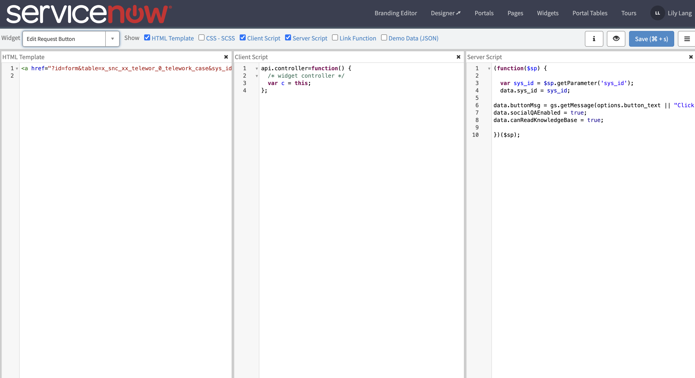

8. **Salve** usando o botão azul no canto superior direito do widget editor

9. Substitua **YOUR_TABLE** no HTML template pelo nome da sua tabela

    - Na visualização da plataforma, navegue até **System Definition** > **Tables**  
      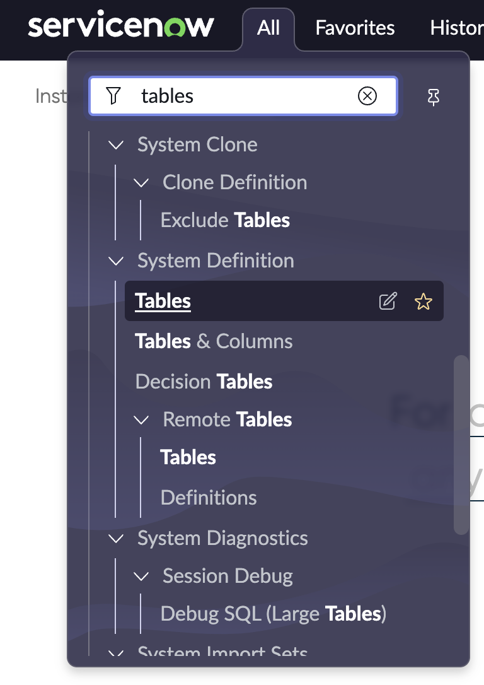  
    - Na barra de busca abaixo de "Label" procure por: *telework*  
      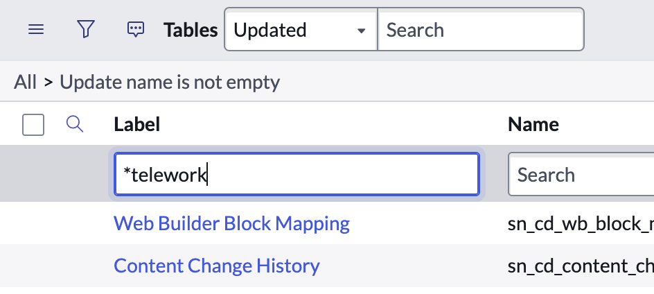  
    - Pressione **Enter/Return** no seu teclado  
    - Abra sua tabela **Telework Case** clicando no rótulo  
    - Copie o valor no campo **Name**  
      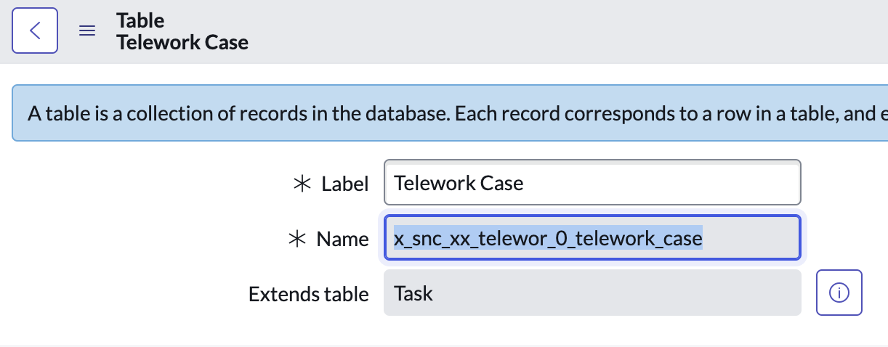  
    - Volte para a aba onde o widget editor está aberto e substitua **YOUR_TABLE** pelo valor copiado  
      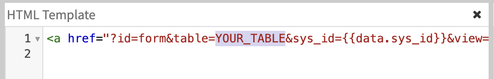  
    - **Salve**

10. Volte para a visualização da plataforma e mude seu escopo para **Service Portal – Standard Ticket** usando o seletor de escopo na barra de navegação  
    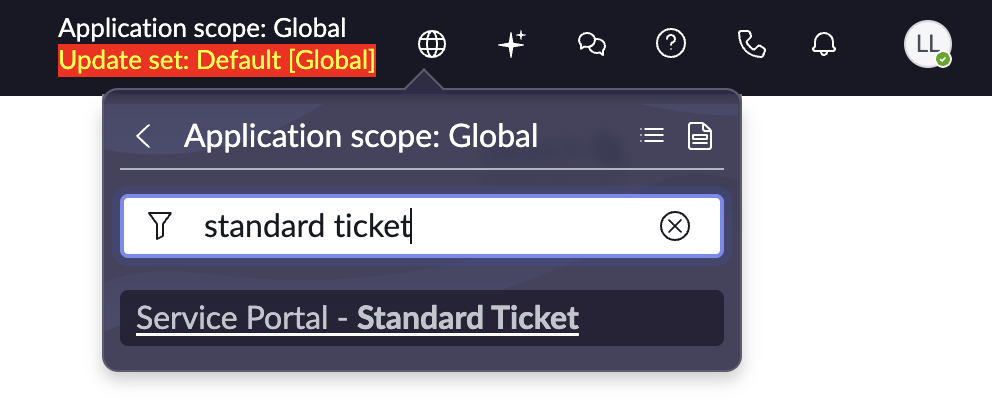

11. Navegue de volta para a página de solicitações do Service Portal e clique em qualquer caso de teletrabalho para levá-lo à **página do ticket**  
    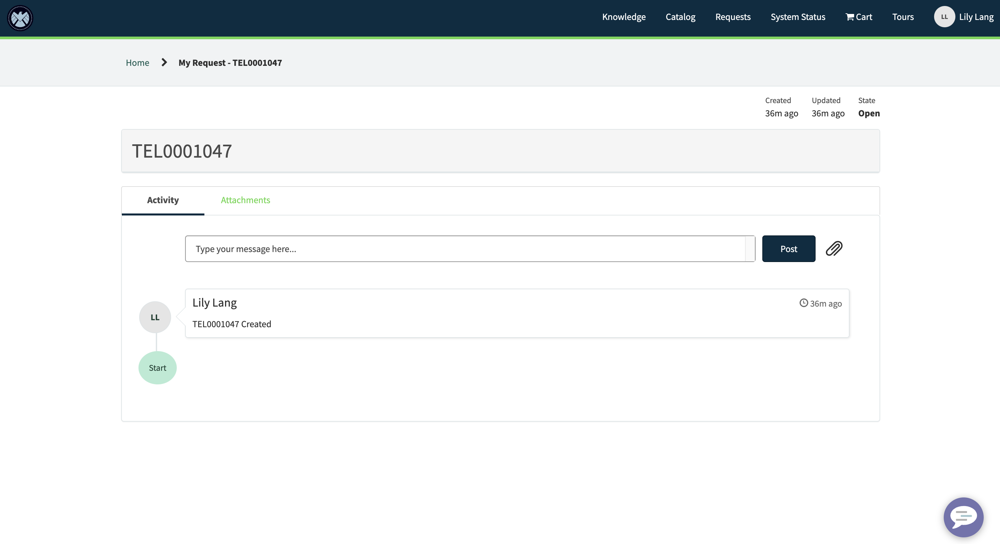

12. **Ctrl + Clique Direito** no widget e selecione **Page in Designer**  
    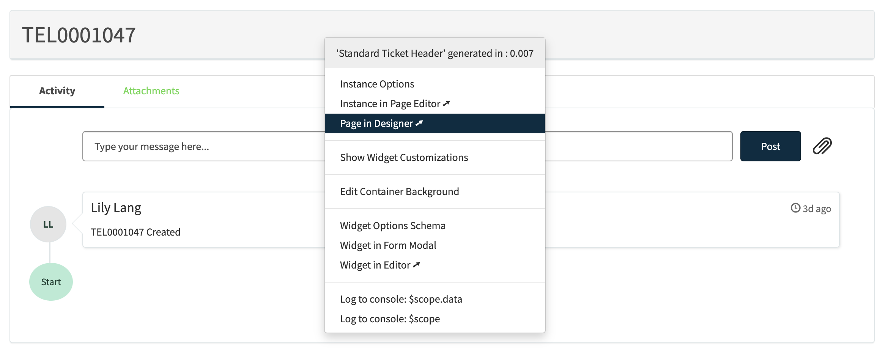

13. Arraste e solte seu widget Edit Request Button na seção superior direita da página  
    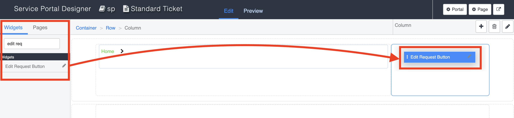

14. Configure as opções para o seu widget e defina o Conteúdo do botão como **Edit**  
    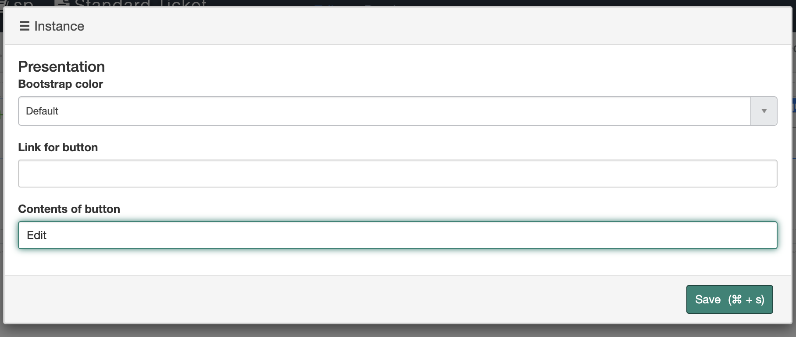

15. **Salve**

16. Navegue de volta para a aba onde sua página de ticket está aberta e **recarregue** a página para ver seu novo botão  
    

17. Use o botão Edit para ver seu ticket em uma página de formulário editável  
    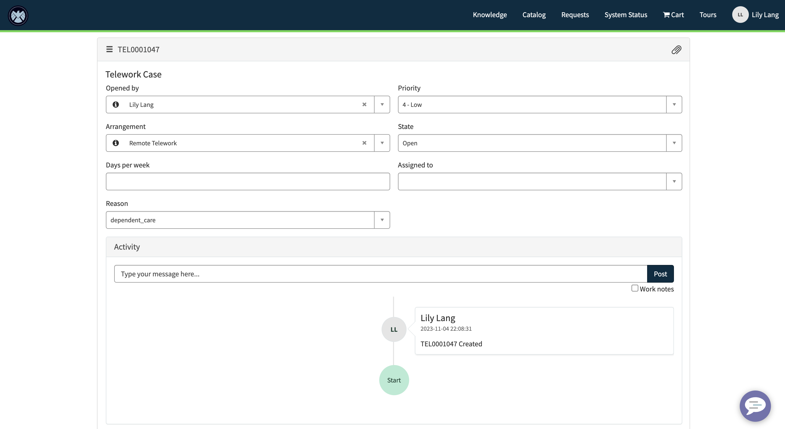


