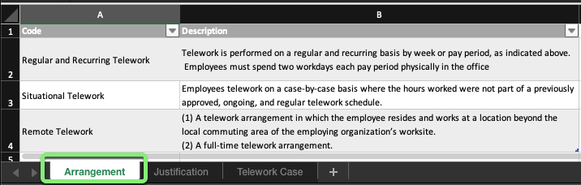

## Visão Geral

Na história do caso de uso para este laboratório, Amanda e sua equipe de realizadores têm rastreado os pedidos de Teletrabalho em uma planilha chamada `Telework_Data.xlsx`.

Revise a planilha para entender os dados que você converterá para uma experiência digital em um aplicativo ServiceNow.

## Instruções

1. Abra o arquivo `Telework_Data.xlsx` em seu laptop local.

2. Observe que ele possui três planilhas separadas.

3. * Clique na primeira planilha "**Arrangement**". 
   * Os usuários selecionam estas para especificar o tipo de Teletrabalho de que precisam. 
   

4. * Clique na segunda planilha "**Justification**". 
   * Os usuários selecionam estas para especificar o motivo pelo qual precisam de Teletrabalho.
   

5. * Clique na terceira planilha "**Telework Case**". 
   * Estes são os diferentes Casos de Teletrabalho que os usuários enviaram.
   * Contém referências às duas primeiras tabelas.
   

6. Feche a planilha.

## Resumo do Exercício

É sempre uma boa ideia entender os dados que você converterá em um aplicativo antes de iniciar o trabalho de desenvolvimento.
