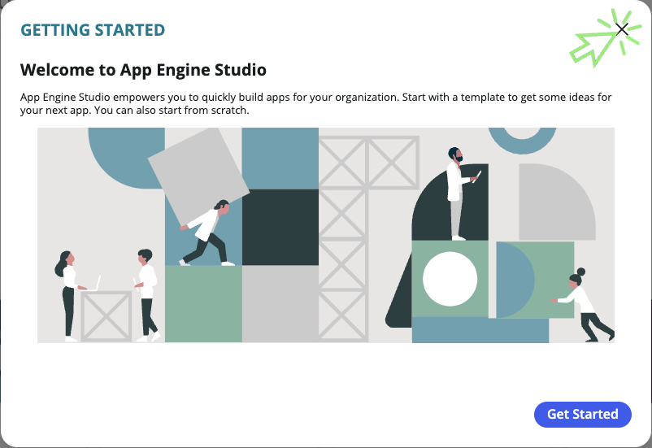
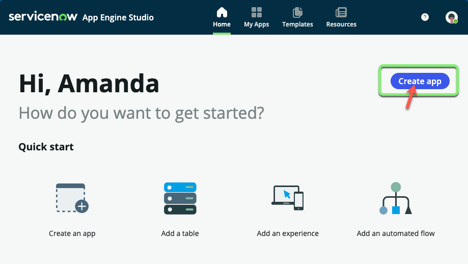
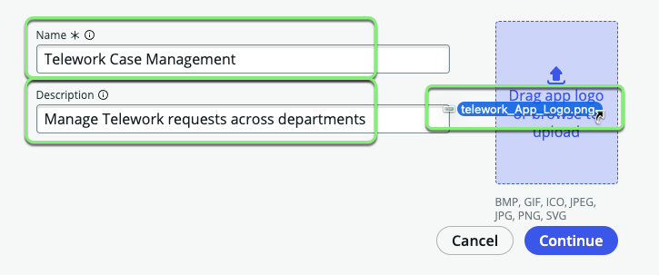
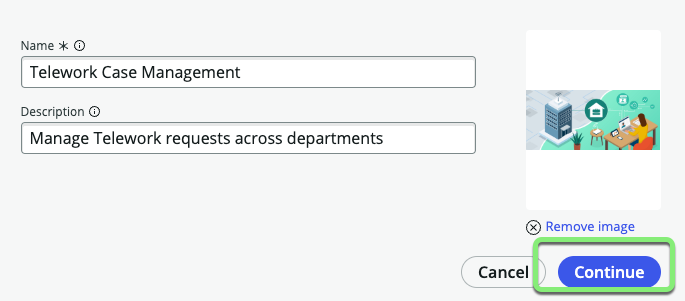
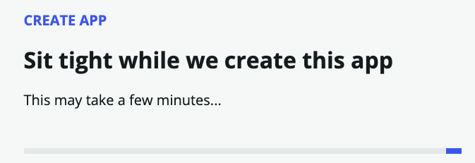

## Visão Geral

Neste exercício, você criará um aplicativo com escopo chamado "Telework Case Management" no ServiceNow.

Um aplicativo com escopo, ou "app" para abreviar, atua como um contêiner para todos os ativos que constituem um aplicativo, incluindo tabelas, formulários, fluxos e recursos de segurança.

Somente o Proprietário do aplicativo e Colaboradores convidados podem fazer alterações no aplicativo.

## Instruções

1. Acesse sua Instância de laboratório e navegue até o **AES (App Engine Studio)** em `All > App Engine > App Engine Studio`

:::info
Este workshop utiliza como base uma instância ServiceNow em idioma Inglês. Recomendamos que utilize em Inglês para uma melhor experiência neste treinamento. Caso prefira utilizar em Português selecione o idioma de preferência na tela de login da sua instância.
:::

2. **Caixa de Diálogo "Começar":** Se a caixa de diálogo "Getting Started" aparecer, feche-a clicando no botão Get Started.
   

3. **Página Inicial do App Engine Studio:** Após fechar a caixa de diálogo, você estará na página inicial do App Engine Studio. Aqui, você pode:
   - Criar novos aplicativos ou estender aplicativos desenvolvidos anteriormente.
   - Explorar vários modelos pré-criados para abordar desafios de negócios comuns.

   Sinta-se à vontade para voltar aqui mais tarde para revisar as capacidades oferecidas por esses modelos.

4. **Criar o Aplicativo:**
   - Clique no botão Create App.
   

5. **Preencher o Formulário:**
   - Preencha o formulário com os seguintes detalhes:

     |Campo|Valor 
     |--|--
     |**Name** | `Telework Case Management` 
     |**Description**| `Manage Telework requests across departments`

   - Faça o upload do arquivo **App_Logo.png** que você baixou.
   
   - Clique em Continue.
   

6. **Funções:**
   - Na tela "Let's add roles", clique em Continue.
   

   

7. **Ir para o Painel do App:**
   - Clique em Go to app dashboard.
   

## Resumo do Exercício

Parabéns! Você criou com sucesso um aplicativo ServiceNow chamado "Telework Case Management."

Nos próximos exercícios, construiremos sobre esta base, adicionando dados, experiências, lógica e segurança para tornar este aplicativo verdadeiramente funcional.
