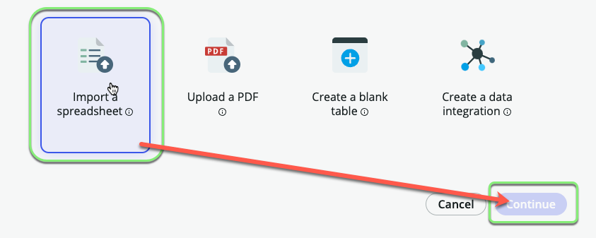
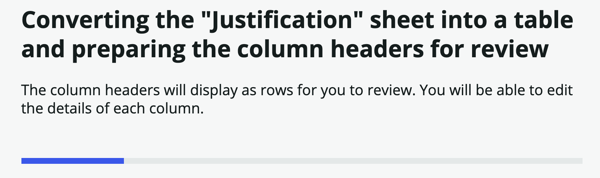
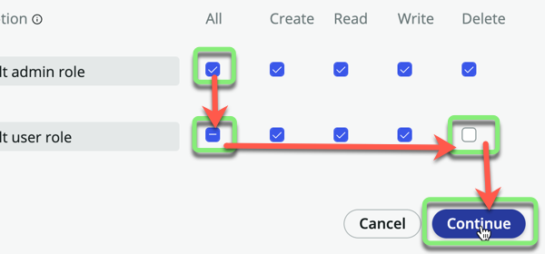
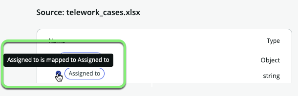
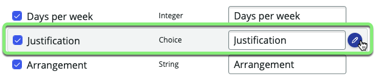

## Visão Geral

Neste exercício, vamos importar dados do arquivo `Telework_Data.xlsx` diretamente para novas tabelas.

## Instruções

1. **Fechar o tour guiado.**
   * Marque "Don't show me this again"
   * Clique no 'X' no canto.
  

2. Ao lado de **Data**, clique em +Add.
   

3. - Selecione "Import a spreadsheet".
   - Clique em Continue.
   

4. - Arraste e solte o arquivo `Telework_Data.xlsx` na caixa 
   :::note
   _Se você tiver problemas com o arrastar e soltar, clique em '..browse to upload a spreadsheet' e selecione o arquivo._
   :::
   - Clique em Continue.
   
   
**Parece que a planilha tem várias planilhas.**

5. Comece com a planilha `Arrangement`. 
   - Marque 'Import spreadsheet data'.
   - Clique em Convert to table.
   

6. Deixe selecionado 'A new table'.
   - Clique em **Create new table**.
   - Clique em Continue.
   

   

7. **Definir o campo de exibição para a tabela.**
   - Clique na seta no final da linha **Code** para expandir as opções.
   
   - Marque a caixa **Display** em **Code**.
   
   - Clique em Continue.

:::info
* O campo **Display** é o que aparece ao referenciar este registro a partir de outra tabela. Cada tabela pode ter apenas um campo marcado como **Display**.
* Por exemplo, se você referenciar esta tabela em um menu suspenso, será exibido o Code e não a Description.
* Campos também são conhecidos como colunas de tabela.
:::

8. **Etiqueta da Tabela**:
   - Defina a "Table label" como `Arrangement`.
   - Clique em Continue.
   
   - Observe que "Table name" foi preenchido automaticamente com 'arrangement'.
   - Clique em Continue novamente.
   

:::tip
* Sempre dê à sua tabela um nome no singular e não no plural. O ServiceNow automaticamente a tornará plural ao visualizar vários registros.

* Por exemplo, se você nomear a tabela como 'Arrangements', mais tarde você a verá no ServiceNow como 'Arrangementss' com dois s's.
:::

9. **Definir as Permissões da Tabela.**
   - Para o papel **admin**, marque "All".
   - Para o papel **user**, marque "Read".
   - Clique em Continue.
   

   

   

**Agora importe a planilha `Justification`.**

10. Clique na seta ao lado de 'Justification'.
   

11. - Marque 'Import spreadsheet data'.
    - Clique em Convert to table.
    

12. Deixe selecionado 'A new table'.
    - Clique em **Create new table**.
    - Clique em Continue.
    

   

13. Clique na seta para expandir as opções.
    

14. - Marque Display.
    - Clique em Continue.
    

15. **Etiqueta da Tabela**:
    - Defina a "Table label" como `Justification`.
    - Clique em Continue.
    
    - Observe que "Table name" foi preenchido automaticamente com 'justification'.
    - Clique em Continue novamente.

16. **Definir as Permissões da Tabela.**
    - Para o papel **admin**, marque "All".
    - Para o papel **user**, marque "Read".
    - Clique em Continue.
    

   

   

**Agora importe a planilha `Telework Case`.**

17. Clique na seta ao lado de 'Telework Case'.
   

18. - Marque 'Import spreadsheet data'.
    - Clique em Convert to table.
    

:::warning
Preste atenção especial ao próximo passo!
:::

19. Deixe selecionado 'A new table'.
    - Clique em **Create from an extensible table**.
    - Clique em Continue.
    

20. **Selecionar a Tabela**:
    1. Clique na caixa de pesquisa.
    2. Clique na tabela **Task**.
    3. Clique em Continue.
    

21. **Configuração da Tabela**:
    - Defina a "Table label" como `Telework Case`.
    - Marque 'Auto number'.
    - Clique em Continue.
    

22. **Definir Permissões**:
    - Para o papel <strong>admin</strong>, marque <strong>All</strong>.
    - Para o papel <strong>user</strong>, marque <strong>All</strong> e desmarque <strong>Delete</strong>.
    - Clique em Continue.
    

**Nos próximos passos, você irá corresponder os campos da sua importação com os campos na sua tabela recém-extendida. Você terá a oportunidade de criar novos campos a partir da sua importação na nova tabela.**

:::info Fonte: telework_cases.xlsx
* No lado esquerdo da página estão os campos de origem da planilha.
* O sistema foi capaz de **Auto mapear** alguns dos campos com nomes correspondentes na Tabela de Destino.
* Campos **Auto mapeados** têm uma marca de seleção ao lado deles. 

:::

:::info Destino: Telework Case
* No lado direito da página estão os campos de destino na tabela **Telework Case**.
* Quando o sistema conseguiu **Auto mapear** um campo, ele adicionou uma pílula de Dados da Tabela de Origem. 

:::

:::caution
* No lado esquerdo da tela, você pode ver que algumas das colunas da planilha não existem na tabela de destino.
* Você criará esses novos campos nos próximos passos. 

:::

23. **Adicionar os campos ausentes.**
    * Clique no link **Add Fields** à direita.
    
    Você terá a opção de '_Adicionar campos da sua importação à tabela de destino_'.
    

Dias por semana está ok como um inteiro. **Não faça nada com ele.**

24. **Modificar Tipo de Campo**: Mude 'Justification' de `String` para `Reference`.
     1. Passe o mouse sobre a linha e edite o campo **Justification** clicando no ícone de lápis.
     
     2. Clique em "String" sob **Field type** e altere para **Reference**.
     
     
     3. No campo 'Reference table', digite `just`.
     4. Clique na tabela `Justification` nos resultados da pesquisa.
     
     5. Clique em Update field

:::note
* Um campo `Reference` aponta para outra tabela. Você quer que o campo `Justification` aponte para a tabela `Justification` criada anteriormente. 
:::

25. **Modificar Tipo de Campo**: Mude 'Arrangement' de `String` para `Reference`.
     1. Passe o mouse sobre a linha e edite o campo **Arrangement** clicando no ícone de lápis.
     
     2. Clique em "String" sob **Field type** e altere para **Reference**.
     
     
     4. Digite `Arrangement` no campo **Reference table** e clique em **Arrangement** no menu suspenso. 
     
     5. Clique em Update field.

26. **Concluir a adição de novos campos.**
    * Clique em Add fields para adicionar os novos campos à Tabela de Destino. 
    

Cada campo no lado esquerdo da página deve agora ter uma marca de seleção ao lado, como abaixo. Se não, por favor, revise os passos anteriores ou peça assistência a um instrutor.

27. Clique em Continue no canto inferior direito. 

28. Clique em Edit tables.
    

## Recapitulação do Exercício

Muito bem! Você importou a planilha usada por Amanda e sua equipe para rastrear Casos de Teletrabalho em três novas tabelas.

A tabela `Telework Case` faz referência às tabelas `Justification` e `Arrangement`. Isso ajudará a garantir a consistência na entrada de dados.

Como `Justification` e `Arrangement` são tabelas independentes, você pode facilmente adicionar ou remover entradas em produção. Isso significa que as escolhas podem ser ajustadas sem a necessidade de implantar uma nova versão do aplicativo.
