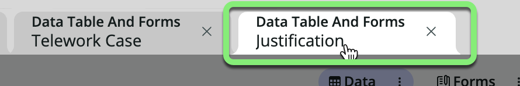
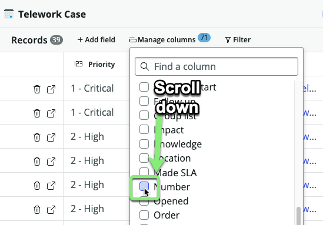
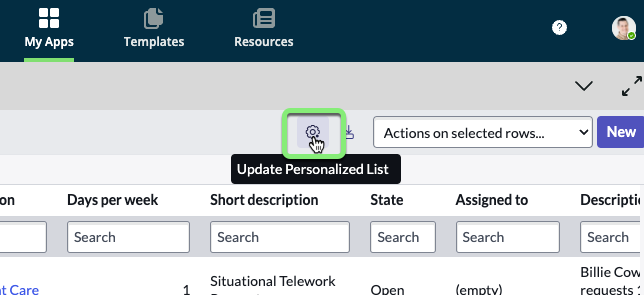

## Visão Geral

O Table Builder é uma ferramenta poderosa para projetar e personalizar tabelas, formulários e elementos de formulário dentro do ServiceNow. Neste exercício, você aprenderá a editar a tabela `Telework Case` usando a visualização **Spreadsheet** na aba **Data** do Table Builder.

Além disso, você explorará a visualização **Fields** para modificar as propriedades e a estrutura da tabela.

## Instruções

1. * Clique na aba `Arrangement`.
   * Feche o pop-up **Welcome to Table Builder** clicando no 'X' no canto.
   * Você pode ver que a planilha `Arrangement` foi importada com sucesso para a nova tabela `Arrangement`.
   * Feche a aba `Arrangement`.
   

2. * Clique na aba `Justification`.
   
   * Feche o pop-up **Welcome to Table Builder** clicando no 'X' no canto.
   * Você pode ver que a planilha `Justification` foi importada com sucesso para a nova tabela `Justification`.
   * Feche a aba `Justification`.

3. Você deve estar agora na aba `Telework Case`. _(Se não estiver, clique nela.)_
   * Feche o pop-up **Welcome to Table Builder** clicando no 'X' no canto.

4. Marque a opção 'Do not show again' e, em seguida, clique no 'x' para fechar o próximo pop-up.
   

:::info
A visualização padrão no Table Builder é a visualização "Spreadsheet".

Nesta visualização, você pode visualizar e editar dados.
:::

5. **Rearranjar as colunas exibidas.**
   1. Clique em **Manage columns**.
   
   2. Role para baixo e marque a caixa ao lado de 'Number'.
   
   :::tip
   O botão com oito pontos é chamado de **Handle icon**.
   
   :::
   3. Clique e segure o **Handle Icon** ao lado de 'Number', e arraste para o topo da lista.
   
   4. Clique em Apply.

:::info
Você pode reordenar colunas através de arrastar e soltar com o **Handle icon**.

Se você reorganizar as colunas na visualização de planilha, o sistema manterá esta visualização personalizada da disposição das colunas para você.
:::

### Nos próximos passos, você definirá as colunas padrão para todos os outros lugares no aplicativo.

6. Clique em 'Preview' no canto superior direito.

:::caution
Você está vendo uma visualização **personalizada** das colunas que você configurou com a visualização de planilha.

:::

7. **Redefinir sua visualização de lista personalizada para a visualização padrão.**
   * Clique no ícone de engrenagem.
   
   ### Note que você está na janela pop-up 'Personalize List Columns'.
   * Clique em Reset to column defaults
   

:::info
O objetivo de definir e, em seguida, redefinir uma visualização de lista personalizada foi ensinar a diferença entre sua visualização de lista *pessoal* e a visualização padrão que todos os outros veriam.
:::

### Definir a visualização padrão para todos os usuários no sistema.

8. 
   * Clique nos três pontos à direita da palavra 'Priority' na primeira coluna.
   * Clique em 'Configure'.
   * Clique em 'List Layout'.
   

9. 
   * Pesquise por 'Number' no lado esquerdo.
   * Clique nele.
   * Clique na seta direita para movê-lo para o lado direito.
   

10. Clique na seta para cima para mover 'Number' para o topo da lista.

1.  Organize o lado direito para ter estes campos na seguinte ordem. *(Você pode precisar mover alguns dos campos de volta para o lado esquerdo.)*
    * Number 
    * Short description
    * Priority
    * Opened by
    * Assigned to
    ### RESULTADO
    

2.  Clique em Save.
   
   ### RESULTADO
   

3.  Feche a aba '**Preview - Telework Case**'.

1.  **Mude para a visualização 'Fields' do Table Builder.**
    - Clique nos três pontos ao lado de **Data** e selecione 'Fields'.
    

2.  **Oculte os campos `Task` e visualize apenas os campos personalizados relacionados a 'Telework Case'.**
    :::info
    As linhas cinza escuras são campos que existem na tabela `Task` que estamos herdando na nossa tabela `Telework Case`.
    :::
    - Clique em **Filter options.**
    - Escolha 'Hide extended fields.'
    
    Agora você pode ver facilmente apenas os campos personalizados relacionados à tabela `Telework Case`.
    

## Recapitulação do Exercício

Neste exercício, você aprendeu a usar o **Table Builder** para visualizar e editar dados na visualização **Spreadsheet** e configurar seus Campos na visualização **Fields**. O próximo exercício envolverá o uso do recurso **Form** para visualizar e personalizar o formulário usado para exibir registros individuais (linhas) dentro da tabela.

Para mais informações e recursos avançados, você pode consultar a [Documentação do Produto ServiceNow: Table Builder](https://docs.servicenow.com/csh?topicname=tb-landing-page.html&version=latest).
