## Visão Geral

A aba **Forms** no Table Builder é o seu espaço para criar, configurar e personalizar visualmente as visualizações de formulário para seus **fulfillers** sem a necessidade de navegar entre diferentes ferramentas.

Neste exercício, focaremos na criação de um novo formulário padrão exclusivo para a tabela `Telework Case`.

Esta visualização de formulário é a visualização 'back-end' que será visível na Plataforma para os **fulfillers** que trabalham nos Casos de Teletrabalho.

Os **fulfillers** pediram que os seguintes campos fossem adicionados ao formulário:
* Opened by
* Arrangement
* Days per week
* Justification

## Instruções

1. Clique no botão **Forms** no centro da página.
   
   Esta é a visualização padrão do formulário herdado da tabela `Task`, que vamos personalizar para a tabela `Telework Case`.
   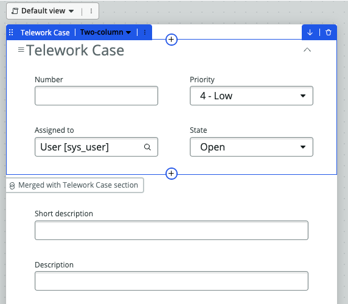

2. **Adicione o campo 'Opened by' ao formulário.**
   1. Passe o cursor sobre o campo 'Assigned to' até que o botão "+Add" apareça e clique no botão.
   
   2. Digite `opened by` na caixa de pesquisa e clique em 'Opened by'.
   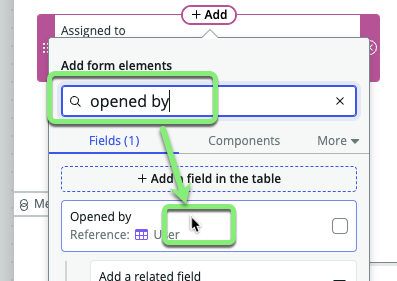
   **Resultado:** O campo **Opened by** foi adicionado ao formulário.
   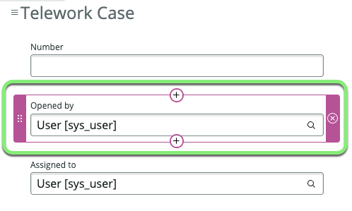

Um campo adicionado. Três para ir...
* ~~Opened by~~
* Arrangement
* Days per week
* Justification

3. **Adicione o campo 'Arrangement' ao formulário.**
   1. Passe o cursor abaixo do campo 'Assigned to' até que o botão "+Add" apareça e clique no botão.
   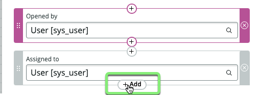
   2. Digite `arrangement` na caixa de pesquisa e clique em 'Arrangement'.
   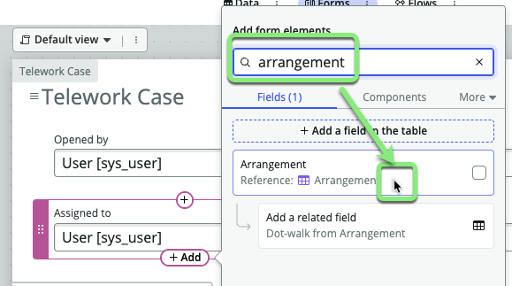
   **Resultado:** O campo **Arrangement** foi adicionado ao formulário.
   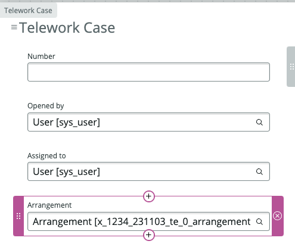

Dois campos adicionados. Dois para ir...
* ~~Opened by~~
* ~~Arrangement~~
* Days per week
* Justification

4. **Adicione o campo 'Days per week' ao formulário.**
   1. Passe o cursor abaixo do campo 'State' até que o botão "+Add" apareça e clique no botão.
   2. Digite `days per week` na caixa de pesquisa.
   3. Clique em 'Days per week'.
   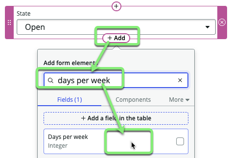
   **Resultado:** O campo **Days per week** foi adicionado ao formulário.
   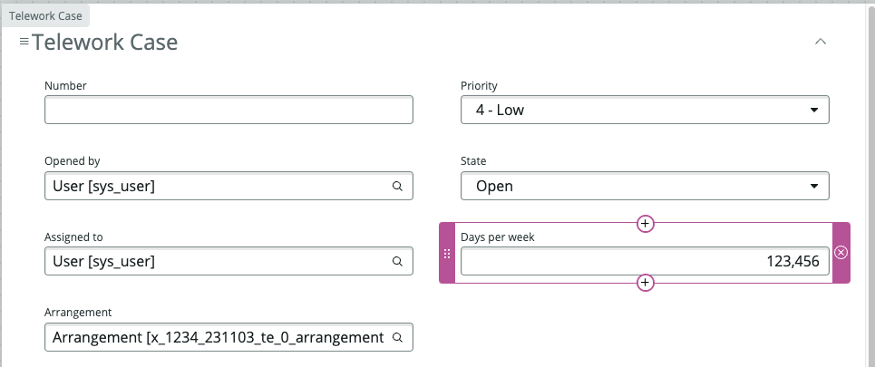

Três campos adicionados. Um para ir...
* ~~Opened by~~
* ~~Arrangement~~
* ~~Days per week~~
* Justification

5. **Adicione o campo 'Justification' ao formulário.**
   1. Passe o cursor abaixo do campo 'Days per week' até que o botão "+Add" apareça e clique no botão.
   2. Digite `justification` na caixa de pesquisa.
   3. Clique em 'Justification'.
   
   **Resultado:** O campo **Justification** foi adicionado ao formulário.
   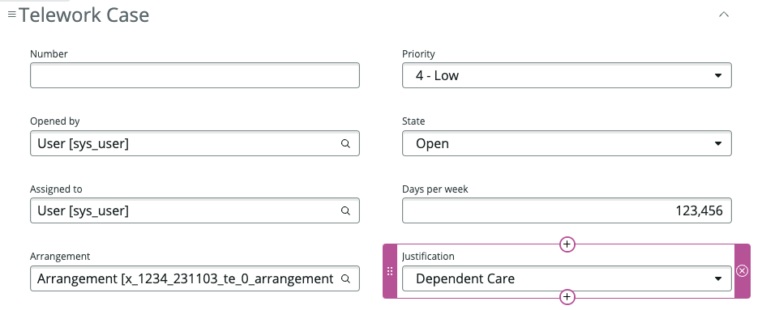

Todos os quatro campos foram adicionados ao formulário. Os **fulfillers** devem estar satisfeitos com o novo formulário.
* ~~Opened by~~
* ~~Arrangement~~
* ~~Days per week~~
* ~~Justification~~

6. Clique nos três pontos à direita de **Default view**, depois clique em Configure related list (UI16 e anterior).
   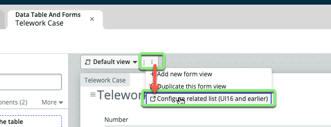

7. Mova 'Approvers' do lado esquerdo para o lado direito. Em seguida, clique em Save.
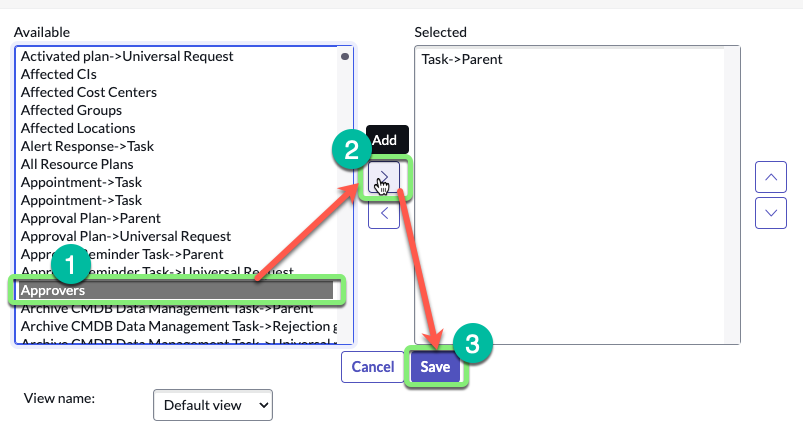

8. Feche a aba 'Related Lists'.
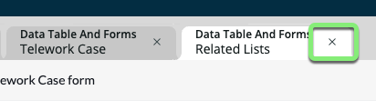

9. **Salve seu trabalho.**
   * Clique em Save no canto superior direito.

10. **Volte para a visualização 'Data -> Spreadsheet'.**
    1. Clique nos três pontos ao lado do pill **Data**.
    2. Clique em **Spreadsheet**.
   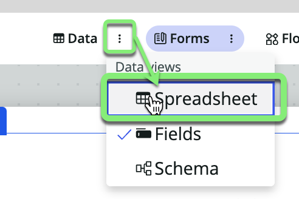

11. Clique no ícone de escape ao lado de um registro para abri-lo.
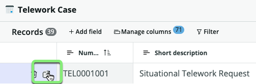

12. **Confirme que o novo formulário atende aos requisitos dos usuários fulfillers.**
    * Verifique o novo formulário para a tabela `Telework Case`.
    * Agora deve ter os quatro campos solicitados pelos nossos **fulfillers** no formulário.
       * Opened by
       * Arrangement
       * Days per week
       * Justification
    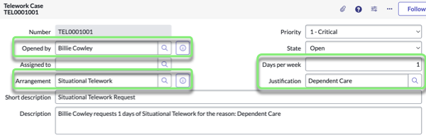

    _Se você não vê os campos no formulário, por favor, revise os passos anteriores ou peça ajuda ao seu instrutor._

### Você também pode ajustar os campos que aparecem no histórico de atividades.

13. Clique no botão de funil à direita da caixa 'Activities'.
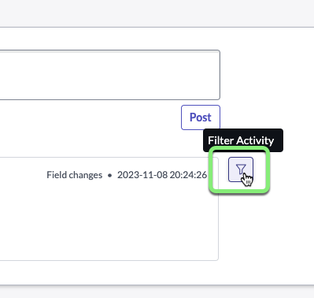

14. Clique em 'Configure available fields'.
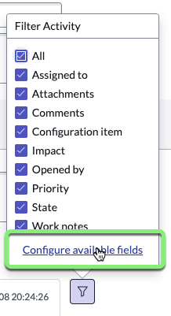

15. Clique em 'Active', depois pressione CTRL+A (CMD+A no Mac) para selecionar todos, e mova todos os campos para o lado direito clicando no chevron direito.
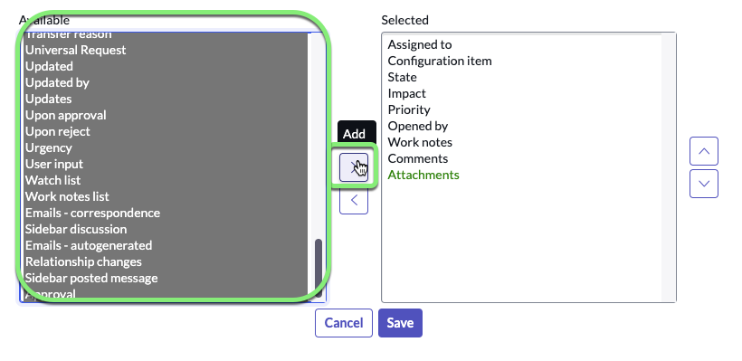

16. Clique em Save.
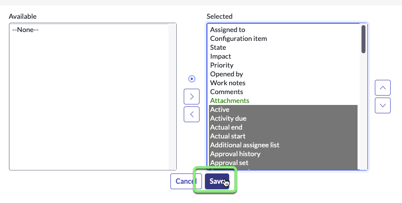

### Agora Amanda e sua equipe poderão ver um histórico de atividades em andamento de quaisquer campos que mudem nos registros de Telework Case. Normalmente, você não adicionaria todos esses campos, mas isso facilita o laboratório.

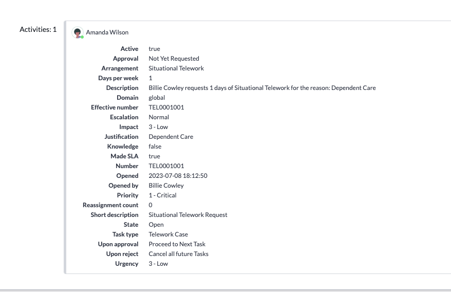

17. Feche a aba Record.
   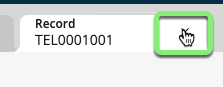

18. Feche a aba **Data Table and Forms**.
   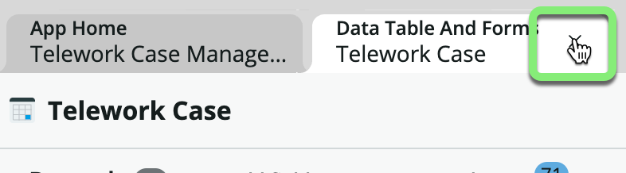

### Você deve estar agora na página **App Home**.
   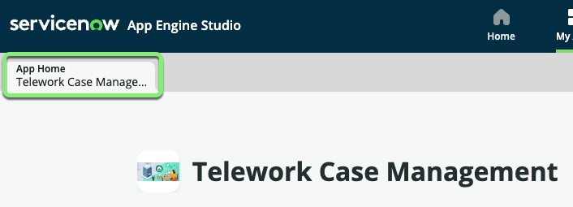

## Recapitulação do Exercício

Neste exercício, aprendemos como modificar a visualização do formulário para nossa tabela Telework Case.
