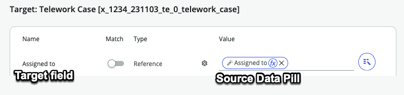
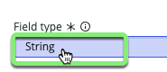

## Visão Geral

O ServiceNow possui muitos modelos de dados reutilizáveis para ajudar a acelerar o desenvolvimento. Um dos mais frequentemente usados é a tabela "Task".

Neste exercício, criaremos uma "Tabela de Casos de Teletrabalho" estendendo a tabela "Task". Esta nova tabela herdará campos da tabela "Task" e será usada para rastrear Solicitações de Casos de Teletrabalho.

## Instruções

1. Ao lado de **Dados**, clique em +Adicionar.
   

2. **Como Adicionar Dados**:
   1. Selecione <b>Importar uma planilha</b>.
   2. Clique em Continuar.
   

:::dica
Se tiver dificuldades para arrastar o arquivo na próxima etapa, clique na página e selecione manualmente o arquivo.
:::

3. **Escolher uma Planilha para Importar**:
   1. Arraste e solte o arquivo <strong>telework_cases.xlsx</strong> na caixa.
   2. Marque **Importar dados da planilha**.
   3. Clique em Continuar.
   
   

4. **Importar para uma Nova Tabela**:
   1. Selecione **Criar a partir de uma tabela extensível**.
   2. Clique em Continuar.
   

5. **Selecionar a Tabela**:
   1. Clique na caixa de pesquisa.
   2. Clique na tabela **Task**.
   3. Clique em Continuar.
   

6. **Configuração da Tabela**:
   1. Rótulo da tabela: `Telework Case`
   2. Nome da tabela (auto-preenchido)
   3. Numeração automática (marcada)
   4. Clique em Continuar.
   

7. **Definir Permissões**:
   1. Para o papel <strong>admin</strong>, marque <strong>Todas</strong>.
   2. Para o papel <strong>user</strong>, marque <strong>Todas</strong> e desmarque <strong>Excluir</strong>.
   3. Clique em Continuar.
   

8. **Ótimo! Agora sua tabela está pronta para dados.**
   * Clique em Continuar.
   

## Agora você está pronto para mapear os campos da planilha para a nova tabela 'Telework Case'.

:::info Fonte: telework_cases.xlsx
* No lado esquerdo da página estão os campos de origem da planilha.
* O sistema conseguiu **Mapear automaticamente** alguns dos campos com nomes correspondentes na Tabela de Destino.
* Campos **Mapeados automaticamente** têm uma marca de seleção ao lado deles.

:::

:::info Destino: Telework Case
* No lado direito da página estão os campos de destino na tabela **Telework Case**.
* Quando o sistema conseguiu **Mapear automaticamente** um campo, ele adicionou um "Data pill" da Tabela de Origem.

:::

:::cuidado
* No lado esquerdo da tela, você pode ver que algumas das colunas da planilha não existem na tabela de destino.
* Você criará esses novos campos nas próximas etapas.

:::

9. **Adicionar os campos ausentes.**
   * Clique no link **Adicionar Campos** à direita.
   
   Você será dado a opção de '_Adicionar campos da sua importação para a tabela de destino_'.
   

   Dias por semana está correto como um número inteiro. **Não faça nada com ele.**
   

10. **Modificar Tipo de Campo**: Altere 'Justificação' de `String` para `Choice`.
    1. Passe o cursor sobre a linha e edite o campo **Justificação** clicando no ícone de lápis.
    
    2. Clique em "String" sob **Tipo de Campo** e altere para **Choice**.
    
    
    4. Clique em Atualizar campo

    :::nota
    As opções serão adicionadas automaticamente importadas da planilha.
    
    
Imagem das opções da planilha

    :::

11. **Modificar Tipo de Campo**: Altere Arrangement de `String` para `Reference`.
    1. Passe o cursor sobre a linha e edite o campo **Arrangement** clicando no ícone de lápis.
    
    2. Clique em "String" sob **Tipo de Campo** e altere para **Reference**.
    
    
    4. Digite `Arrangement` no campo **Tabela de Referência** e clique em **Arrangement** no menu suspenso.
    
    5. Clique em Atualizar campo.

    :::nota
    * Um campo `Reference` aponta para outra tabela. Você quer que o campo `Arrangement` aponte para a tabela `Arrangement` criada anteriormente.
    * Isso permitirá que os usuários selecionem as opções importadas da planilha `telework_arrangement_choices.xlsx`.
    
    
Imagem das opções da planilha

    :::

12. **Concluir a adição de novos campos.**
    * Clique em Adicionar campos para adicionar os novos campos à Tabela de Destino.
    

Cada campo no lado esquerdo da página agora deve ter uma marca de seleção ao lado, como abaixo. Se não tiver, reveja as etapas anteriores ou peça ajuda a um instrutor.

13. **Finalizar**:
    * Clique em Continuar no canto inferior direito.
    

14. **Tabela Pronta**:
    * Clique em Concluído.
    

## Recapitulação do Exercício

Neste exercício, você criou uma "Tabela de Casos de Teletrabalho" estendendo a tabela "Task". Esta tabela herda campos da tabela "Task" e será usada para rastrear Solicitações de Casos de Teletrabalho. Você completou essas tarefas com sucesso usando administração simples de apontar e clicar, sem necessidade de conhecimento especializado em aplicativos ou banco de dados.

**A seguir, exploraremos as visualizações de listas e formulários
