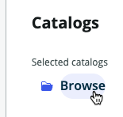
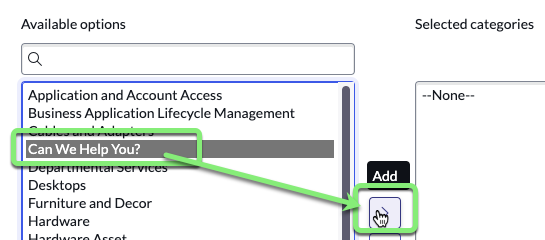
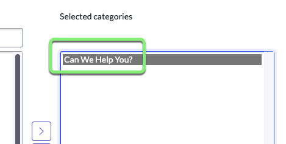

## Visão Geral

O primeiro conjunto de requisitos para o formulário **Record Producer** diz respeito a onde as solicitações de Teletrabalho serão criadas. Elas devem ser criadas na nossa tabela 'Telework Case'.

Também precisamos apresentar o **Record Producer** em um portal fácil de usar para os usuários **solicitantes**.

Siga as instruções abaixo para aprender a criar um **Record Producer** que atenda aos requisitos acima.

## Instruções

1. Clique na aba **Experience**.

2. Clique em +Add.

3. Clique em **Record Producer**.

:::info
Um Record Producer é um tipo específico de Item de Catálogo que permite que os usuários finais criem registros a partir de um Catálogo de Serviço.
:::

4. Clique em Begin.

5. **Vamos configurar seu Record Producer.**
    - Defina os seguintes valores e clique em Continue. 

    || 
    |--|--|
    |**Name**             |`Apply for Telework`
    |**Short description**|`Use this form to apply for Telework`

    

6. Clique no botão Edit record producer.

7. **O destino do Record Producer será a tabela `Telework Case`.**
   1. Clique em **Destination** 
   
   2. Digite **Tel**.
   3. Selecione a tabela **Telework Case**.
   
   4. Clique em Continue to Location.

:::info Catálogos e Categorias
Assim como na vida real, um **Catalog** do ServiceNow contém **Categories** de itens e serviços que podem ser solicitados por um **requester**.

Um **Topic** é uma maneira mais recente no ServiceNow para organizar **Catalog Items** e **Record Producers** para o portal do **Employee Center**.
:::

8. **Adicione o Record Producer a um Catálogo.**
    1. Na caixa **Catalogs**, clique em Browse.
    
    2. Mova **Service Catalog** para a caixa da direita, 'Selected catalogs'.
    
    
    3. Clique em Save selections.

9. **Adicione o Record Producer a uma Categoria.**
    1. Na caixa **Categories**, clique em Browse.
    
    2. Mova **Can We Help You?** para a caixa da direita, 'Selected categories'.
    
    
    3. Clique em Save selections.

10. **Adicione o Record Producer a um Tópico.**
    1. Na caixa **Topics**, clique em Browse.
    
    2. Marque a caixa para **IT**.
    
    3. Clique em Save selection.

11. Clique em Continue to Questions.

## Recapitulação do Exercício

Você configurou onde o **Record Producer** será visível para os usuários **solicitantes** para enviar solicitações de Teletrabalho.
