## Visão Geral

Anteriormente, você criou o formulário **back-end** que os usuários **fulfiller** verão para registros na tabela `Telework Case`. Neste exercício, você criará o formulário **front-end** com perguntas para o usuário responder ao enviar o formulário.

Os usuários **fulfiller** solicitaram que o **Record Producer** faça as seguintes perguntas ao **requester** com base no formulário em PDF que estamos digitalizando:

* **Para quem é a solicitação?**
  * _Deve ser preenchido automaticamente com o nome do usuário atual, mas pode ser editado para um usuário diferente._
* **Quando você precisa disso?**
    * _As opções devem ser:_
      * Hoje
      * Amanhã
      * Esta semana
      * Próxima semana
* **Qual tipo de Teletrabalho você está solicitando?**
  * _As opções devem ser:_
    * Teletrabalho Regular e Recorrente
    * Teletrabalho Remoto
    * Teletrabalho Situacional
* **Número de Dias por Semana?**
  *  _A entrada deve ser apenas um número inteiro. Nenhuma letra permitida._
  *  _Este campo deve aparecer apenas se a resposta à pergunta anterior for 'Teletrabalho Situacional'._
* **Qual é a razão para o Teletrabalho?**
  * _As opções devem ser:_
    * Cuidados com Dependentes
    * Médico
    * Acomodação Razoável

## Instruções

:::info
Um **Question set** é um termo do ServiceNow para um conjunto de perguntas que podem ser reutilizadas em vários Record Producers e Itens de Catálogo. Algumas perguntas no conjunto podem ter lógica especial para validar a entrada ou preencher respostas automaticamente.  
As duas primeiras perguntas que você adicionará ao seu **Record Producer** já existem no sistema como parte de um **Question set** chamado 'Standard Employee Questions'.  
* **Para quem é a solicitação?**
* **Quando você precisa disso?**
:::

1. **Adicione o Question set 'Standard Employee Questions'.**
    1. Clique na seta ao lado de Insert new question.
    2. Clique em 'Question set'.
    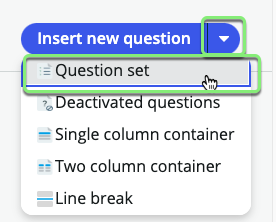
    3. Digite `Standard`.
    4. Clique em '**Standard** Employee Questions'.
    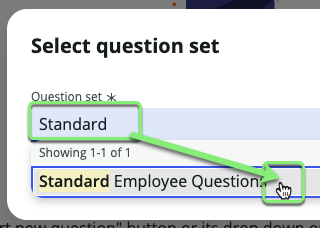
    5. Clique na seta à esquerda de 'Standard Employee Questions' para expandir o Question set e ver quais perguntas ele contém.
    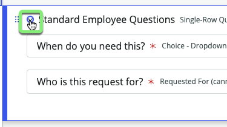

:::note
_Usuários avançados do ServiceNow podem conhecer Question sets fora do App Engine Studio com um nome diferente: 'Variable sets'._
:::

**Perguntas restantes para adicionar:**
* ~~Para quem é a solicitação?~~
* ~~Quando você precisa disso?~~
* Qual tipo de Teletrabalho você está solicitando?
* Número de Dias por Semana?
* Qual é a razão para o Teletrabalho?

2. **Adicione a pergunta 'Qual tipo de Teletrabalho você está solicitando?'**
    1. Clique em Insert new question.  
    2. Configure os seguintes valores:

    |**Field Name** | **Field Value**
    |--|--|
    |**Question type:** | Choice
    |**Question subtype:** | Record reference
    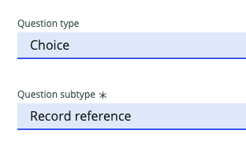

    3. Role para baixo até a seção **Details**.
    
    4. Configure os seguintes valores: (💡 duplo clique, copie e cole no formulário). 

    |**Field Name** | **Field Value**
    |-----------------------------| --------------
    |**Map to a specific field**  | Checked
    |**Table field**              | choose **Arrangement**
    |**Question label**           | What type of Telework arrangement are you applying for? 
    |**Mandatory**                | Checked 
    |**Question Preview** | Observe no painel direito, depois **Question Preview** mostra como a pergunta ficará para o usuário. 

    :::info
    Observe o **Question Preview** que mostra como a pergunta ficará para o usuário.
    
    :::

    5. Clique em Continue to Additional details.
    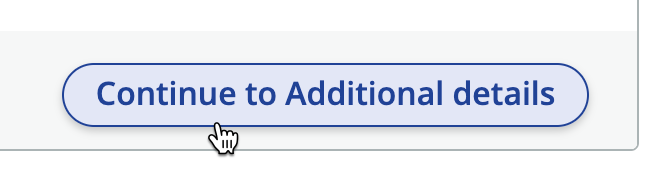

    6. Digite `Arrangement` na caixa **Source table** e clique em 'Arrangement' na lista suspensa.
    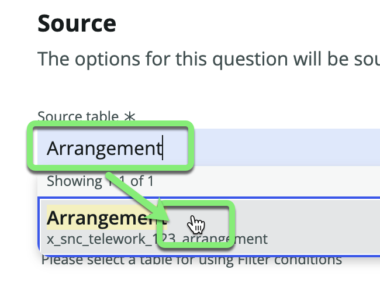

    7. Clique na aba **Annotation**.
    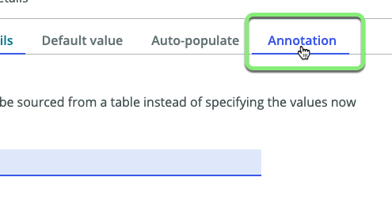

    No processo atual com o PDF, a equipe está gastando muito tempo corrigindo e redirecionando manualmente as solicitações de Teletrabalho devido a confusão entre os diferentes tipos de arranjo de Teletrabalho.  
    Adicione uma anotação para ajudar os usuários a entender o que estão selecionando.  

    8. Marque a caixa **Show instructions**.

    9. Abra o arquivo: `telework_form_annotation.docx`.

    10. Copie todo o texto do arquivo ( ⌘ Cmd  ou CTRL+A, CTRL+C )

    11. Cole no campo Instructions (⌘ Cmd  ou CTRL+V ). Você pode optar por manter ou remover a formatação.
    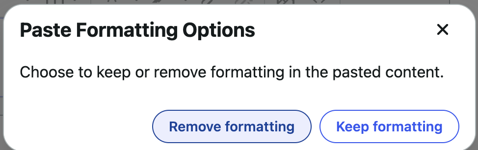

    12. Clique em Insert Question.

**Perguntas restantes para adicionar:**
* ~~Para quem é a solicitação?~~
* ~~Quando você precisa disso?~~
* ~~Qual tipo de Teletrabalho você está solicitando?~~
* Número de Dias por Semana?
* Qual é a razão para o Teletrabalho?

3. **Adicione a pergunta 'Número de Dias por Semana?' usando um método diferente.**
    1.  Clique em + Insert abaixo da última pergunta que você adicionou. 
    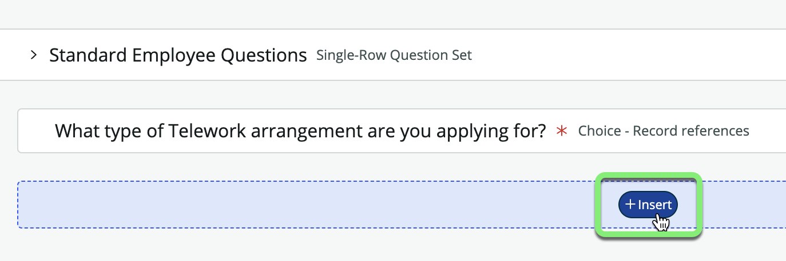
    2. Clique no tile 'New question'. 
    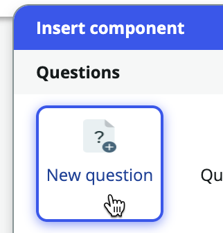
    3. Defina os seguintes valores na seção **Type**:  

    |**Field Name** | **Field Value**
    |-----------------| --------------
    |**Question type**    | Text
    |**Question subtype** | Single line
    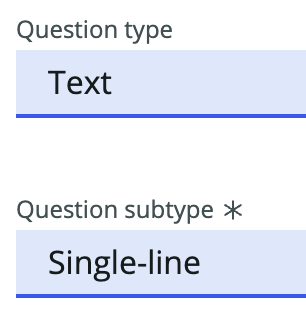

    4. Role para baixo até a seção **Details**.

    5. Na seção **Details**, insira as seguintes informações: (💡 duplo clique, copie e cole no formulário).

    |**Field Name**                   | **Field Value**
    |-----------------------------| --------------
    |**Map to a specific field**      | Checked
    |**Table field**                  | Days per week
    |**Question label**	             | Number of Days per Week?
    |**Name**                         | days_per_week

    6. Clique em **Additional details**.
    7. Clique na lista suspensa **Text validation** e selecione **Number**.
    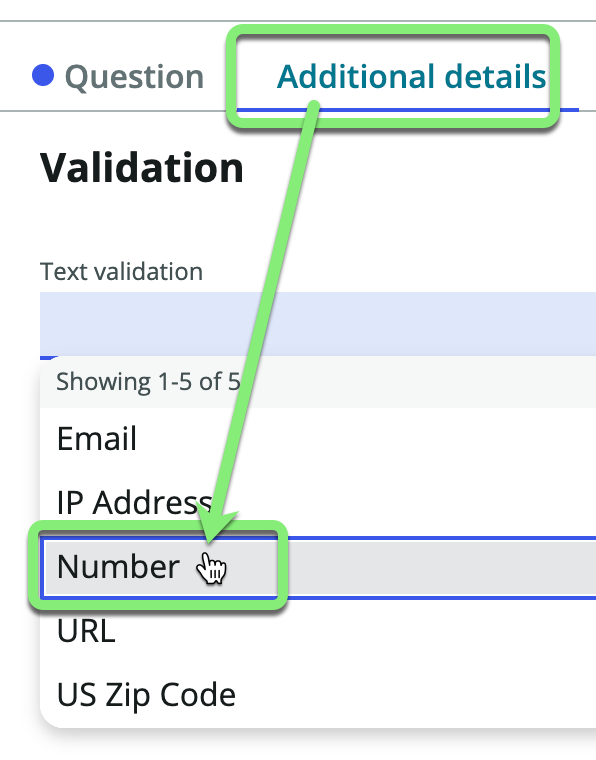
    8. Clique em Insert Question.

**Os fulfillers de Telework Case querem que 'Número de dias por semana' apareça apenas se o usuário responder 'Teletrabalho Situacional'...**
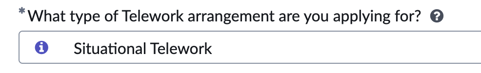

**Isso pode ser feito com um Behavior.**

:::note
Usuários avançados do ServiceNow podem conhecer Behaviors fora do App Engine Studio com um nome diferente: 'UI Policies'.
:::

4. **Defina um comportamento para "Número de Dias por Semana?".**
    1. Passe o mouse sobre a pergunta 'Número de Dias por Semana?'.
    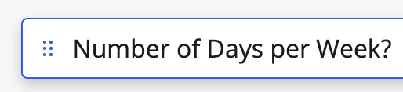
    2. No lado direito da linha, clique neste botão.
    
    
    3. Clique em Define new behavior
    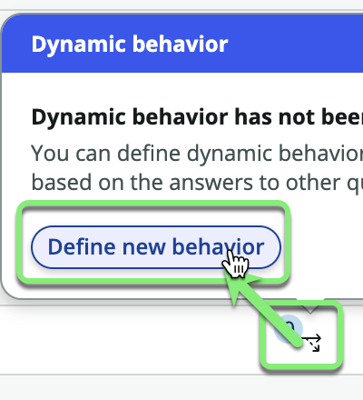

    4. Na aba **Actions**, especificaremos o comportamento necessário:

    |**Field Name**                   | **Field Value**
    |------------------------------ | --------------
    |**Make the question mandatory** | Yes
    |**Make the question visible**   | Yes

    

    5. Clique na aba **Conditions**.

    

    6. Defina o filtro **Dynamic Behavior Condition** como 

    | | |
    |--|--|--
    |arrangement | is | Situational Telework

    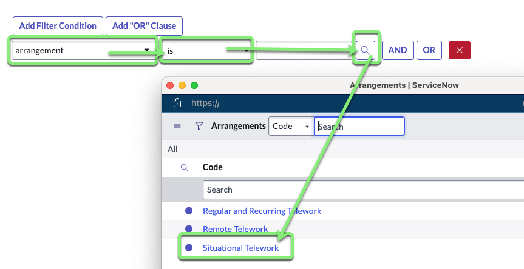

    
    7. Clique em Add behavior.
    

:::info
Isso criará um efeito UI onde o campo "Número de Dias por Semana" só aparecerá quando a resposta para "Qual tipo de Teletrabalho você está solicitando?" for "Teletrabalho Situacional". 
:::

**Perguntas restantes para adicionar:**
* ~~Para quem é a solicitação?~~
* ~~Quando você precisa disso?~~
* ~~Qual tipo de Teletrabalho você está solicitando?~~
* ~~Número de Dias por Semana?~~
* Qual é a razão para o Teletrabalho?

5. **Adicione a pergunta final: Qual é a razão para o Teletrabalho?**
    1. Clique em Insert New Question.
    2. Na seção **Type**, defina os seguintes valores:

    |**Field Name**                   | **Field Value**
    |-----------------------------| --------------
    |**Question type**            | Choice
    |**Question subtype:** | Record reference
    

    2. Role para baixo até a seção **Details**.

    3. Na seção **Details**, insira as seguintes informações: (💡 Copie e cole no formulário). 
    
    |**Field Name**                   | **Field Value**
    |-----------------------------| --------------
    |**Map to a specific field**  | Checked
    |**Table field**              | Justification
    |**Question label**           | What is the reason for Teleworking? 
    |**Name**                     | justification
    |**Mandatory**                | Checked 

    4. Clique em Continue to Additional details.

    5. Digite `just` na caixa **Source table** e clique em 'Justification' na lista suspensa.
    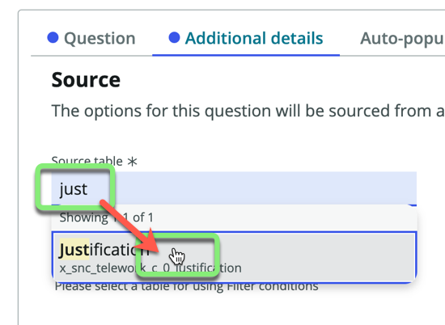
  
    6. Clique em Insert Question.

Sua tela deve agora parecer com isto:

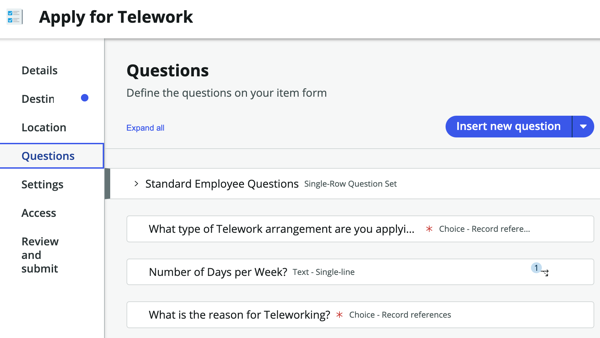

6. Clique em Save.

## Recapitulação do Exercício

O formulário **Record Producer** agora possui os campos e comportamentos necessários adicionados. Você conseguiu aproveitar um 'Question set' para não ter que recriar as Perguntas Padrão dos Funcionários.
