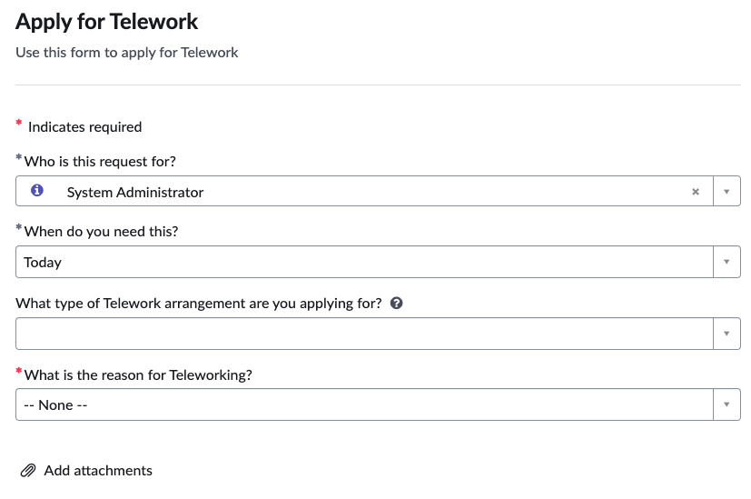
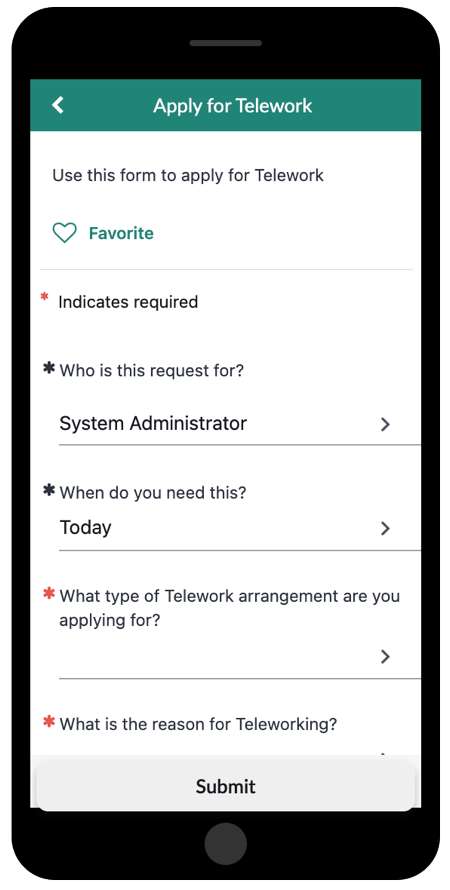
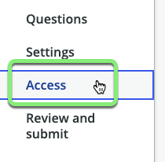
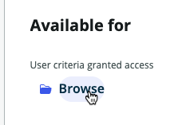
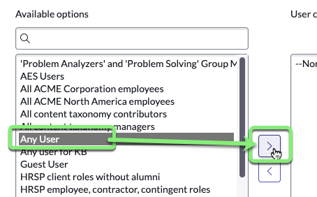
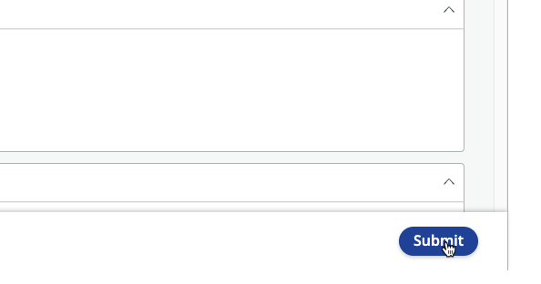

## Visão Geral

Visualize o formulário no App Engine Studio antes de publicá-lo e confirme se os campos do formulário estão funcionando como esperado.

## Instruções

1. Clique em Preview.

2. A página **Preview** permite visualizar como nosso formulário ficará em diferentes experiências.  (Você pode interagir com o item, mas não enviá-lo.)

    |**Portal Preview** |
    |---|
    | |

    |**Now Mobile Preview**|
    |---|
    ||

3. Feche a Visualização clicando no X no canto superior direito.

4. **Configure quem pode acessar o formulário de Record Producer para encomendá-lo.**
    1. Clique em **Access** na barra lateral.
    
    2. Sob **Available for**, clique em **Browse**.
    
    3. Mova 'Any User' para a caixa da direita.
    
    4. Clique em Save Selections.

5. Clique em Continue to Review and submit.

6. Clique em Submit.

7. Clique em Return to my application.

## Recapitulação do Exercício

**Parabéns!**

O formulário está publicado no aplicativo. Os usuários poderão usá-lo para enviar solicitações de Teletrabalho quando o aplicativo for promovido para o ambiente de Produção do ServiceNow.
