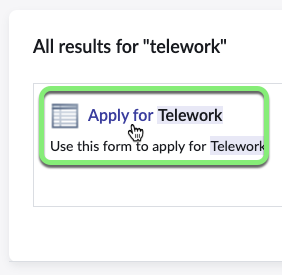
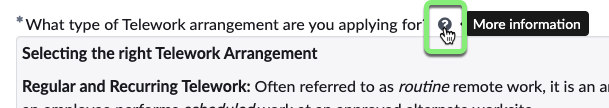

## Visão Geral

Os **usuários requisitantes** acessam o ServiceNow através de portais. O principal portal padrão oferecido pelo ServiceNow é chamado **Employee Center**.

_Para mais informações: [Documentos do Produto ServiceNow Employee Center](https://docs.servicenow.com/csh?topicname=employee-center-landing-page.html&version=latest)_

Neste exercício, você visualizará o 'Apply for Telework' Record Producer no portal Employee Center.

## Instruções

1. Vá para a aba do navegador que diz 'Home - Creator Workshops'.

2. **Abra o Employee Center.**
    1. Clique em All.
    2. Digite `employee center`.
    3. Clique em **Employee Center**.
    

3. **Procure o formulário 'Apply for Telework' Record Producer.**
   1. Digite `telework` na caixa de pesquisa.
   2. Pressione ENTER no teclado.
   

4. Clique em 'Apply for Telework' nos resultados da pesquisa.

:::tip
Clique no ícone de interrogação para ver a anotação que você colou do documento do Word.

Clique novamente para fechar a anotação.

:::

5. Preencha o formulário com os seguintes valores: (💡 clique duas vezes, copie e cole no formulário).

    |Passo |Nome do Campo                      | Valor do Campo
    |--|----------------------------------|--------------
    |1 | Who is this request for?   | David Loo
    |2 | When do you need this?         | This Week
    |3 | What type of Telework arrangement are you applying for? | Situational Telework
    |4 | Number of Days per Week?         | 3
    |5 | What is the reason for Teleworking? | Dependent Care
    |6 | Clique em Submit.
    
    

## Recapitulação do Exercício

Neste exercício, você aprendeu como usar o Employee Center para enviar uma solicitação de Caso de Teletrabalho em nome de um usuário diferente de você.
