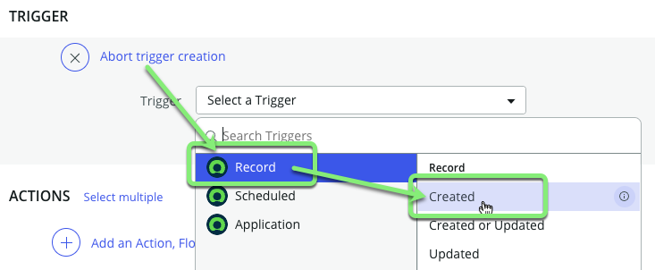
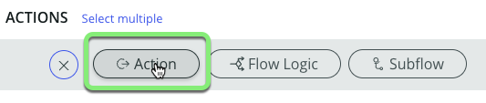
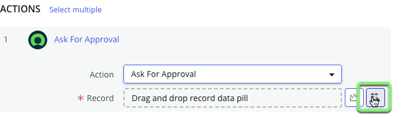
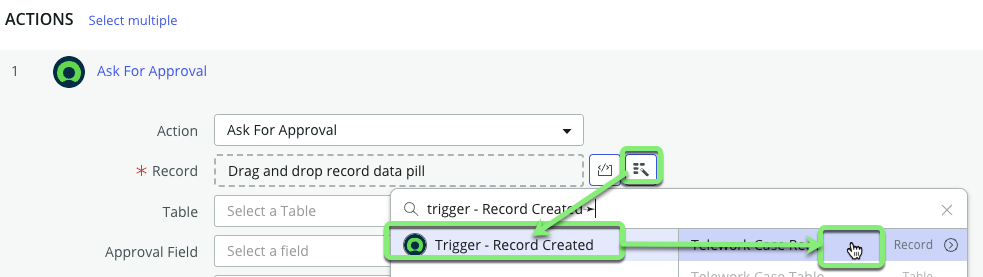
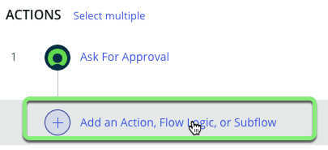
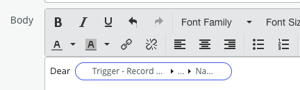
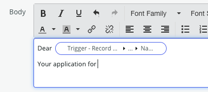
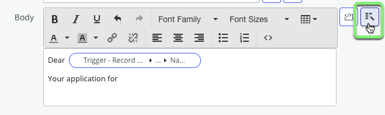
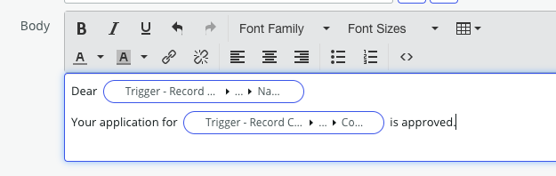

## Visão Geral

Um fluxo representa uma sequência de etapas que são automatizadas para alcançar um resultado de negócios específico. Cada fluxo pode incluir os seguintes componentes:
- **Gatilho**: O evento ou condição que, quando atendido, inicia automaticamente um fluxo.
- **Condições**: Permite fornecer condições sob as quais o fluxo será executado. Por exemplo, execute o fluxo apenas se um campo estiver acima de um determinado valor.
- **Ações**: As tarefas realizadas pelo Fluxo, como atualizar dados, solicitar aprovações ou enviar notificações.

## Objetivo: Fluxo de Aprovação de Solicitação de Teletrabalho
O objetivo aqui é projetar um fluxo de trabalho que automatize o processo de aprovação de solicitações de teletrabalho.

## Visão Geral do Fluxo
- O fluxo precisa começar assim que uma nova solicitação de teletrabalho for criada.
- A primeira coisa que o fluxo de trabalho precisa fazer é entrar em contato com o gerente da pessoa que está pedindo para trabalhar de casa, solicitando sua aprovação.
- Uma vez que tenhamos a aprovação do gerente, o fluxo de trabalho prossegue para duas etapas críticas.
- Primeiro, ele gera automaticamente um ticket para nosso departamento de TI para configurar o acesso VPN para o funcionário.
- Em seguida, precisamos notificar por e-mail o funcionário que solicitou trabalhar de casa, informando-o de que sua solicitação foi aprovada.

## Visão Geral da Configuração do Fluxo

**Gatilho:**
- O fluxo começa quando um novo registro de Caso de Teletrabalho é criado.

**Processo:**

1. **Solicitação de Aprovação:**
   - Enviar automaticamente uma solicitação de aprovação para o gerente do usuário que submeteu o Caso de Teletrabalho.

2. **Após Aprovação do Gerente:**
   - **Criação de Ticket de TI:**
     - Gerar um ticket para o departamento de TI para configurar o acesso remoto VPN para o solicitante.
   - **Notificação de Aprovação:**
     - Enviar um e-mail ao solicitante informando que sua solicitação de teletrabalho foi aprovada.

## Resultado Final
Seu fluxo ficará assim:

:::caution
* Seu fluxo só existe no seu navegador até você clicar no botão Save. 
* É recomendável clicar no botão Save com frequência para garantir que você não perca nenhum progresso. 

:::

## Instruções

1. Na aba Página Inicial do App, na seção "Lógica e automação", **clique em Add**.

2. Clique em **Flow**.

3. Clique em **Build from scratch** para criar um novo fluxo de trabalho.

4. Crie o fluxo com as seguintes informações:

    |**Campo** | **Valor** |
    |-|-|
    |**Name** | Telework Case Approval |
    |**Description** | Approve and fulfill new Telework Cases.

    

    Clique no botão Continue.

5. **Clique** no botão **Edit this flow** para iniciar o processo de configuração.
    

6. Você pode ver um popup de tour. Vamos pular o tour por agora, clicando no botão **Skip tour**.

7. **Adicione um gatilho para determinar quando e como o Fluxo será executado.**
    1. Clique em **Add a trigger** no canto superior esquerdo da tela do designer de fluxos.
    
    2. Selecione **Created** na seção Registro.
    
    3. Clique no drop-down 'Table'.
    
    4. Digite `telework case` e clique na tabela **Telework Case**.
    
    5. Clique em Done para fechar o gatilho.

8. **Solicite uma aprovação do gerente do usuário 'Opened by' com a Ação 'Ask For Approval'.**
    1. Clique em **Add an Action, Flow Logic, or Subflow**.
    
    2. Clique em **Action**.
    
    3. Clique em **Ask For Approval**.
    
     **Adicione o registro que o gerente está aprovando.**
    4. Clique no **Data Pill Picker**.
    
    5. Selecione **Trigger – Record Created**.
    6. Selecione **Telework Case Record**.
    

:::info
* Você notou que o **Approval Field** e o **Journal Field** foram preenchidos automaticamente?

* Isso ocorreu porque esses campos já existiam na tabela **Task** da qual estendemos o **Telework Case**. 
* **LEMBRE-SE:**
  * Se você está rastreando qualquer tipo de trabalho (tickets, solicitações, etc.), é _sempre_ uma boa ideia estender a partir de **Task**, a menos que você tenha uma boa razão para não fazer isso.
:::

9.  **Configure as Regras para quando este registro for aprovado.**
    1. Clique no drop-down '-Choose approval rule'.
    
    2. Escolha **Anyone approves**.
    
    **A seguir, você precisa especificar para qual pessoa a aprovação será enviada.**
    3. Clique no **Data Pill Picker** para procurar dados no registro 'Telework Case' que acionou este fluxo. 
    
    4. Clique em **Trigger - Record Created**.
    
    5. Clique na seta para acessar a lista de campos no registro 'Telework Case'. 
    
    6. Role para baixo para localizar o campo **Opened by** e clique na seta ao lado dele.
    
    7. Role para baixo para localizar o campo **Manager** e clique nele. 
    
    8. Clique em Done para concluir a configuração da Ação 'Ask for Approval'. 
    

:::info
Ir de Registro para Registro para encontrar um campo específico no ServiceNow é chamado de "Dot-Walking".
:::

10. **Adicione Lógica ao Fluxo para _Se o gerente aprovar_...**
    1. Sob a Ação 'Ask for Approval', **clique** em **Add an Action. Flow Logic, or Subflow**.
    
    2. Clique em **Flow Logic**.
    3. Clique em **If**.
    
    4. No campo **Condition Label**, digite "Manager approves".
    
    5. Clique no **Data Pill Picker** ao lado de 'Condition 1'.
    6. Clique em **1 – Ask for Approval**.
    7. Clique em **Approval State**.
    
    8. Clique no drop-down 'Select a choice'.
    9. Clique em 'Approved'.
    
    10. Clique em Done.

:::info
Adicionar o **Condition Label** de 'Manager Approves' é como adicionar um comentário ao nosso código.

Isso facilitará qualquer solução de problemas mais tarde, pois você pode ver o que a Lógica do Fluxo faz sem abri-la.
:::

Em seguida, se o gerente aprovar, uma tarefa deve ser enviada para a TI configurar o acesso VPN para a pessoa.

11. **Adicione a Ação Criar um Ticket.**
    1. Sob _If Manager approves_, clique ⊕ ao lado de 'then'.
    
    2. Selecione **Action** > **ServiceNow Core** > **Create Task**.
    
    3. Para a Tabela, selecione "Ticket".
    
    4. Clique em **Add a field value**.
    
    5. Clique em 'Select a field'.
    6. Procure por 'Parent' no drop-down e clique nele. 
    
    **Defina o campo 'Parent' no novo registro 'Ticket' para ser o registro 'Telework Case' que acionou este Fluxo.**
    7. Clique no **Data Pill Picker**.
    8. Selecione **Trigger - Record created** > **Telework Case Record**.
    
    **Resultado:**
    
    9. Clique em **+ Add field value** e adicione dois outros campos:
    

    |Nome do Campo            | Valor do Campo
    |-------------------------| --------------
    |**Short description**   | VPN Access |
    |**Assigned to**         | System administrator (_Normalmente você não especificaria um usuário aqui, mas isso facilitará o laboratório._)|

    10. Se os Valores dos Campos estiverem como abaixo, clique em Done.
    
    11. Clique no botão **Add Annotation** à direita da Ação **Create Task**.
    
    12. Digite `Request VPN Access` e pressione ENTER.
    

:::info
Adicionar Anotações torna o Fluxo mais fácil de ler.

:::

**Envie um e-mail para o usuário 'Opened by' e informe-o de que sua solicitação de Teletrabalho foi aprovada.**

12. **Adicione e configure a Ação 'Send Email'.**
    1. Clique ⊕ sob **Create Task**.
    
    2. Selecione **Action** > **ServiceNow Core** > **Send Email**.
    
    3. Clique no botão **Add Annotation**.
    4. Digite `Notify Opened By` no campo e pressione ENTER. 
    
    **Os e-mails precisam estar associados a um registro alvo para rastreamento.**
    5. Clique no **Data Pill Picker** ao lado de **Target Record**.
    6. Selecione **Trigger - Record created** > **Telework Case Record**.
    
    7. Clique no **Data Pill Picker** ao lado do campo **To**.
    8. Clique em **Trigger - Record created**. 
    9. Clique na seta ao lado de 'Telework Case Record'.
    10. Clique na seta ao lado de 'Opened by'.
    11. Clique em 'Email'.
    

    12. Para o **Subject**, insira:  
    `Your Telework application is approved`  

    ### Defina o Corpo do e-mail.

    13. No campo **Body**, digite `Dear ` _(Certifique-se de incluir o espaço extra no final)_.
    
    14. Clique no **Data Pill Picker** à direita do campo **Body**. 
    
    15. Dot-walk para e clique no campo **Trigger - Record Created** >> **Telework Case Record** >> **Opened by** >> **Name**.
    

    :::info
    Se você soltar o Data Pill antes da palavra 'Dear ', você pode arrastá-lo e soltá-lo no local correto.

    

    :::
    
    **RESULTADO:**
    

    16. No campo **Body**, pressione Enter para mover o cursor para a próxima linha.
    17. Digite `Your application for ` _(Certifique-se de incluir o espaço extra no final)_.
    
    18. Clique no **Data Pill Picker** à direita do campo **Body**. 
    
    19. Dot-walk para e clique no campo **Trigger - Record Created** >> **Telework Case Record** >> **Arrangement** >> **Code**.
    
    20. Digite `<space>is approved.` após o Data Pill. _(Certifique-se de incluir um espaço extra antes das palavras)_.
    
    21. Clique em Done.

13. Seu fluxo deve se parecer com isso:

14. Clique na visualização Toggle para visualizar o fluxo como um Diagrama.

15. No canto superior direito da tela, clique em Save.

16. Clique em Activate à esquerda do botão Save. Isso torna o Fluxo 'ativo' no aplicativo.  

17. Na caixa de Confirmação, clique no botão Activate.

18. Feche a aba do Fluxo no App Engine Studio.

## Recapitulação do Exercício

Você construiu um Fluxo que cuida da gestão de tarefas e comunicações entre vários departamentos.

A seguir, você irá testar o Fluxo para vê-lo em ação.
