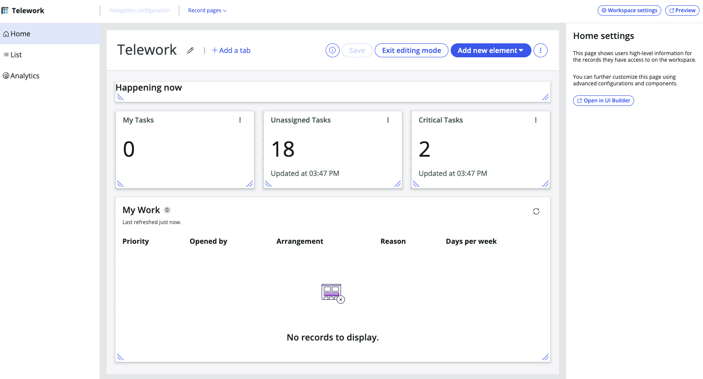

## Visão Geral

A seguir, você criará uma experiência de Workspace para os usuários Fulfillers da aplicação.

## Instruções

1. Retorne para a aba do **App Engine Studio** no navegador.

2. Na página inicial do aplicativo, clique na aba **Experience**.

3. Clique em +Add.

4. Clique na peça de **Workspace** para criar um workspace que ajude os usuários a gerenciar e cumprir solicitações enviadas a eles.

5. Clique no botão Begin para começar o assistente do Workspace Builder.

6. Mantenha os valores padrão e clique em Continue.

7. Defina **Tabela Primária** e **Tabelas Secundárias** conforme abaixo e clique no botão Continue.

    |**Nome do Campo**           | **Valor do Campo**
    |---------------------| --------------
    | **Tabela Primária**    | Telework Case
    | **Tabelas Secundárias** | Arrangement, Justification

    

    

8. Sua nova experiência de Workspace está concluída. Clique no botão Edit.

9. Você será direcionado ao Workspace Builder. Clique no botão Get started.

10. Sua visualização do Workspace Builder deve ser semelhante à abaixo.
:::note
_A visualização abaixo pode parecer um pouco diferente dependendo da resolução da sua tela._
:::

:::info
O Workspace Builder para App Engine permite gerenciar painéis, construir listas e personalizar páginas de registro para workspaces criados no App Engine Studio. Clientes com licença App Engine têm acesso exclusivo a essa funcionalidade premium.
:::

## Recapitulando o Exercício

Neste exercício, você foi capaz de construir rapidamente um Workspace para gerenciar o trabalho em sua aplicação.
