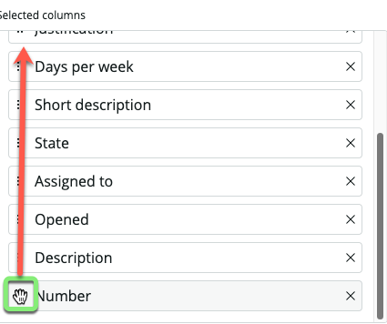

## Visão Geral

Muito já foi pré-configurado no Workspace, mas a equipe de Amanda ainda tem algumas coisas que gostariam de alterar antes de colocá-lo em operação.

## Instruções

### Você deve estar na seção **Home** do Workspace Builder.

1. Passe o mouse sobre e clique na palavra **List** na barra lateral esquerda.

### O Workspace Builder fez um ótimo trabalho organizando o menu List para o workspace de Telework Case.

### Revise as colunas para Telework Cases para ver se estão em uma boa ordem para que os fulfillers possam realizar o trabalho.

3. Na categoria de Lista 'Telework Case', clique na palavra 'Open'.

### A equipe de Amanda gostaria que as colunas na lista 'Open' fossem organizadas de maneira diferente do que o sistema construiu abaixo.

4. Clique em 'Manage columns' na barra lateral direita.

5. Pesquise por `number` e clique em 'Number' nos resultados da pesquisa.

6. Clique na seta para a direita para mover 'Number' para a lista 'Selected columns'.

7. Clique no ícone de alça ao lado de 'Number' na lista 'Selected columns' e arraste-o para o topo da lista.

8. Remova as linhas:
   * Arrangement
   * Justification
   * Days per week
   

9. Faça as alterações necessárias para que as 'Selected columns' fiquem assim:
    * Number
    * Short Description
    * Opened by
    * Assigned to
    * State
    * Priority
    

10. Clique em Apply.

11. Clique em Save no canto inferior direito.

12. Clique no link 'Home' na barra lateral esquerda.

## Recapitulando o Exercício

Neste exercício, você aprendeu a configurar as listas disponíveis em um workspace configurável.
