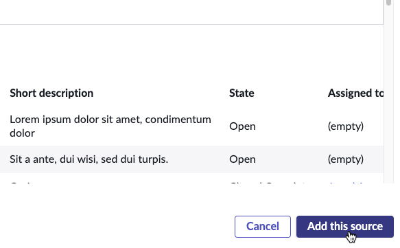

## Visão Geral

Amanda e sua equipe gostariam de visualizar rapidamente os casos por prioridade.

Neste exercício, você abrirá a Experiência do Workspace e configurará o dashboard principal para ajudar nisso.

## Instruções

1. Clique no botão **Preview** no canto superior direito para abrir o workspace em uma nova aba do navegador.

2. Entre no Modo de Edição clicando no botão **Edit**.

### Adicione uma nova Visualização de Dados de um gráfico de barras verticais mostrando os Telework Cases por Prioridade.

3. 
   1. Clique na visualização de dados **My Work**.
   2. Clique no ícone de mais preto no centro superior da visualização de dados **My Work**.
   
   3. Clique em **Data Visualization**.
   
   4. Clique em **New Visualization**.
   
   5. Clique no canto inferior direito da nova **Visualization** e arraste-a pela página.
   

4. **Configure o tipo de Visualização.**
   1. Clique no menu suspenso **Visualization type**.
   2. Role para baixo e clique em **Vertical bar**.
   

5. **Defina o Título do Gráfico.**
   1. Clique em **Header and border** para expandir essa seção.
   2. Digite `Cases by Priority` no campo **Chart Title**.
   

6. **Adicione uma fonte de dados.**
   1. Na seção **Data** >> **Data sources**, clique em + Add data source.
   
   2. Digite **Telework Case** no campo "Select a source".
   3. Clique em **Telework Case** nos resultados da pesquisa.
   4. Clique em **+ Add custom conditions**.
   

   ### A equipe de Amanda deseja ver apenas os casos não encerrados.
   5. Defina **State is one of Pending, Open, Work in Progress**.
   
   6. Clique em Add this source no canto inferior direito.
   

9. **Defina o agrupamento da visualização de dados.**
    1. Na seção **Data** >> **Group by**,
    
    2. Clique no ícone de lápis ao lado de **Active**.
    3. Defina **Priority** para o Group by.
    4. Clique em **Apply**.
    
    ### RESULTADO
    

10. **Salve as alterações no dashboard.**
    * No canto superior direito, clique em Exit Editing Mode.
    
    * Clique em Save.
    

### Seu workspace deve se parecer com a imagem abaixo.

## Recapitulando o Exercício

Neste exercício, aprendemos a criar um workspace personalizado e usamos o Workspace Builder para exibir indicadores-chave de desempenho e organizar informações de maneiras que beneficiem nossos usuários.

Para mais informações, consulte [Product Documentation: Dashboards in configurable workspaces](https://docs.servicenow.com/csh?topicname=analytics-center-dashboards.html&version=latest)
