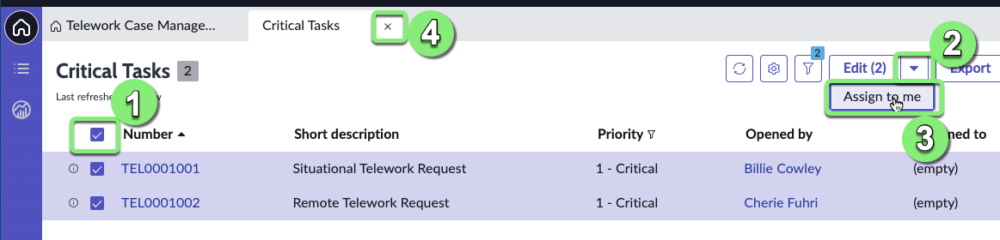
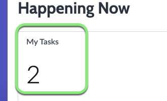
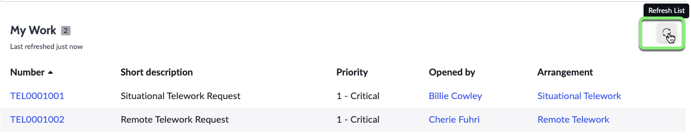
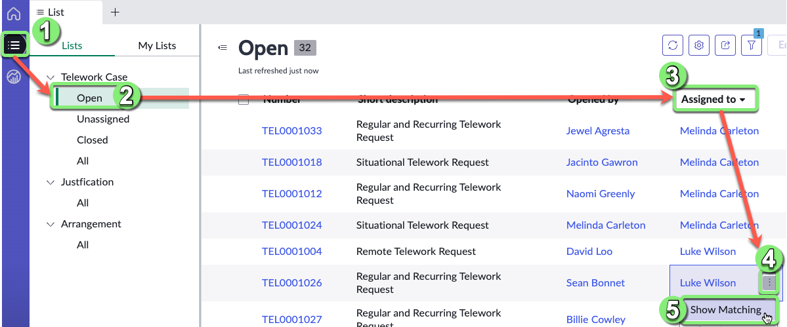
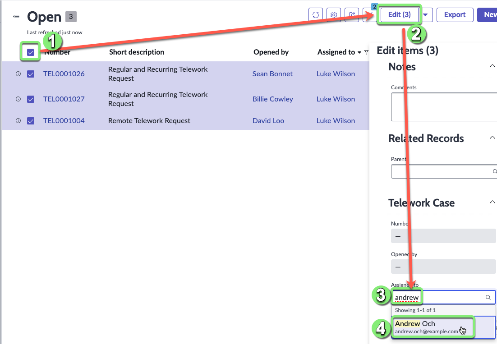
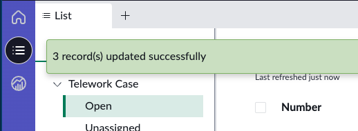
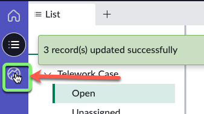
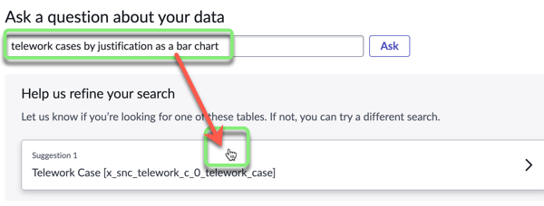

## Visão Geral

Neste exercício, você aprenderá algumas habilidades de navegação para se movimentar pelo Workspace.

Há algumas Tarefas Críticas que precisam ser atribuídas.

Amanda também deseja explorar como reatribuir tarefas em massa.

## Instruções

1. Clique no **Critical Tasks** score ou no gráfico de barras '1 - Critical'.

:::note
Você pode clicar em qualquer visualização de dados, pois ambas apontam para os mesmos dados: dois casos de Telework com prioridade "1 - Critical".
:::

2. ### Atribua as Tarefas Críticas a você mesmo.
   1. Selecione todas as linhas.
   2. Clique na seta suspensa ao lado de **Edit**.
   3. Selecione **Assign to me**.
   4. Feche a aba.
   

### A **My Tasks** Data Visualization deve agora ser 2.

3. Na lista **My Work**, clique no ícone de Refresh para atualizar a lista.

## Atribuição em Massa

Agora vamos ver como lidar com uma emergência ⚠️.

Nosso membro da equipe _Luke Wilson_ está doente hoje.

Precisamos reatribuir seu trabalho a outro trabalhador de casos. (_É difícil fazer isso quando o trabalho é gerenciado por e-mails e planilhas!_)

4. Vamos encontrar todos os casos abertos atribuídos a Luke Wilson.

    1. Clique no ícone de List.
    2. Clique em **Open** na seção Telework Case.
    3. Classifique os casos por **Assigned to** clicando no cabeçalho.
    4. Clique no botão ao lado de "Luke Wilson".
    5. Clique em "Show Matching".
    

5. Vamos atribuir os casos de Luke a Andrew Och.

    1. Selecione todas as linhas.
    2. Clique em **Edit**.
    3. Encontre o campo **Assigned to** e digite **and**.
    4. Selecione "Andrew Och".
    5. Clique em Update.
    
    
    Você deve ver esta mensagem:
    

## Encontrando Respostas com o Analytics Center

7. Agora vamos verificar o Analytics Center para encontrar rapidamente os dados que precisamos.

8. Clique no botão Analytics Center.

9. Vamos fazer algumas perguntas sobre nossos dados.
   1. Digite a seguinte consulta:

   * `telework cases by justification as bar chart`

   2. Clique em Ask.
   3. Clique em **Telework Case**.
   
   4. E aqui está a resposta:
   

:::info
À medida que você digita uma consulta, o Analytics Q&A sugere pesquisas recentes, indicadores, tabelas e colunas que correspondem ao que você digitou até agora. Apenas as tabelas e colunas às quais você tem acesso são exibidas.
:::

## Recapitulando o Exercício

Neste exercício, aprendemos a usar as capacidades padrão para gerenciar o trabalho e encontrar rapidamente respostas para perguntas sobre nossos dados.
